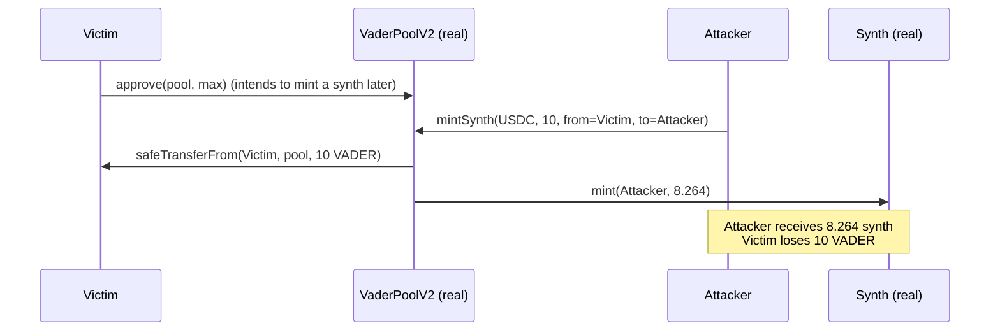

# VaderPoolV2 `mintSynth` mints a victim's deposit to an attacker (arbitrary `from`)

> **Vulnerability classes:** vuln/access-control/missing-auth · vuln/defi/frontrun · fake-account-substitution
>
> **Reproduction:** the test deploys the REAL, unmodified audited Vader dex-v2 contracts (`VaderPoolV2`, `BasePoolV2`, `SynthFactory`, `Synth`, `LPWrapper`, `LPToken`, `VaderMath`) vendored under `src/vader/` and runs the actual `mintSynth` exploit end to end. Only the opaque native/foreign ERC20s are minimal real tokens.

<!-- date: 2021-11 -->

## Root cause

`VaderPoolV2.mintSynth` is `external` and permissionless, yet it takes a caller-supplied `from` and pulls the native deposit from it:

```solidity
function mintSynth(IERC20 foreignAsset, uint256 nativeDeposit, address from, address to)
    external override nonReentrant supportedToken(foreignAsset) returns (uint256 amountSynth)
{
    nativeAsset.safeTransferFrom(from, address(this), nativeDeposit); // @> pulls from an ATTACKER-chosen address
    ...
    synth.mint(to, amountSynth);                                     // @> mints the synth to an ATTACKER-chosen address
}
```

The protocol intends users to interact through the router, so a user first `approve`s the pool and then calls `mintSynth` for themselves. Because `from` is unauthenticated, any account can watch the mempool for a pool approval and front-run the victim, calling `mintSynth(foreignAsset, nativeDeposit, from = victim, to = attacker)`. The victim's approved native is spent and the resulting synth is minted to the attacker. The fix (per the finding) is to remove `from` and transfer from `msg.sender`.

The exact audited source is vendored at [`src/vader/contracts/dex-v2/pool/VaderPoolV2.sol`](src/vader/contracts/dex-v2/pool/VaderPoolV2.sol) (`mintSynth`, L126-167).

## Exploit walkthrough (real numbers)

1. A legitimate LP seeds the `USDC` pair with 100 native / 100 foreign via the real `mintFungible`, so the synth price is non-zero.
2. The victim holds 10 VADER and `approve`s the pool (intending to mint a synth for themselves).
3. The attacker calls `mintSynth(USDC, 10e18, from = victim, to = attacker)`.
4. Result: the victim's **10 VADER** is pulled into the pool and **8.264 synth** (`calculateSwap(10, 100, 100)`) is minted to the attacker for free. The victim ends with 0 native and 0 synth.



## Reproduction

```bash
_shared/run-poc/run_poc.sh 42335-h-13-anyone-can-arbitrarily-mint-synthetic-assets-in-vaderpo_exp -vvvvv
```

Expected: `1 passed`. The assertions in [`test/42335-h-13-anyone-can-arbitrarily-mint-synthetic-assets-in-vaderpo_exp.sol`](test/42335-h-13-anyone-can-arbitrarily-mint-synthetic-assets-in-vaderpo_exp.sol) verify the victim's native drops to 0 and the attacker receives the full minted synth amount.

## Sources

- [AuditVault finding #42335](https://github.com/Auditware/AuditVault/blob/main/findings/42335-h-13-anyone-can-arbitrarily-mint-synthetic-assets-in-vaderpo.md)
- [code-423n4/2021-11-vader `VaderPoolV2.sol` (commit 607d2b9)](https://github.com/code-423n4/2021-11-vader/blob/607d2b9e253d59c782e921bfc2951184d3f65825/contracts/dex-v2/pool/VaderPoolV2.sol#L126-L167)
