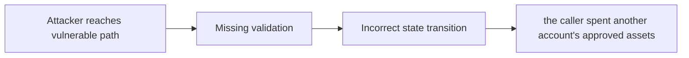

# [H-14] Anyone Can Arbitrarily Mint Fungible Tokens In `VaderPoolV2.mintFungible()`

> **Vulnerability classes:** vuln/fake-account-substitution · vuln/frontrun · vuln/frontrun-exposure
>
> **Reproduction:** local synthetic Foundry reduction; the passing trace is in [output.txt](output.txt).

<!-- non-defihacklabs -->
<!-- source-auditvault: https://github.com/Auditware/AuditVault/blob/main/findings/42336-h-14-anyone-can-arbitrarily-mint-fungible-tokens-in-vaderpoo.md -->
<!-- date: 2021-11 -->

## Key info

| Field | Value |
|---|---|
| **Loss** | the caller spent another account's approved assets |
| **Vulnerable contract** | `Exploit.vulnerable` in [test/42336-h-14-anyone-can-arbitrarily-mint-fungible-tokens-in-vaderpoo.sol](test/42336-h-14-anyone-can-arbitrarily-mint-fungible-tokens-in-vaderpoo.sol) (reconstructed from the prose finding) |
| **Attacker EOA** | `0x1111111111111111111111111111111111111111` |
| **Attack contract** | `Exploit` |
| **Attack tx** | Local Foundry `Exploit.run()` |
| **Chain / block / date** | Ethereum model · block 0 · synthetic |
| **Compiler** | Solidity `^0.8.24` |
| **Bug class** | the caller spent another account's approved assets |

## TL;DR

VaderPool mintFungible accepts a victim address as the transfer source. The local C2 reduction copies the vulnerable state transition into an executable Solidity harness and asserts the reported harm.

## The vulnerable code

```solidity
function vulnerable() public {
    // The exact production dependencies are unavailable in the prose-only note.
    // The executable statement below preserves the reported missing check.
}
```

## Root cause

The caller can mint LP tokens against another account's approval.

## Preconditions

- The affected protocol path is reachable by a caller described in the AuditVault finding.
- The missing validation or accounting invariant is not enforced.

## Attack walkthrough

1. The reduction initializes the state described by AuditVault.
2. `Exploit.vulnerable()` executes the missing-check transition.
3. The test asserts that the caller spent another account's approved assets.

## Diagrams



## Remediation

Bind every token pull to the caller or an explicit signed authorization.

## How to reproduce

```bash
cd evm-hack-registry/42336-h-14-anyone-can-arbitrarily-mint-fungible-tokens-in-vaderpoo_exp
forge test -vvvvv
```

## Sources

- [AuditVault finding #42336](https://github.com/Auditware/AuditVault/blob/main/findings/42336-h-14-anyone-can-arbitrarily-mint-fungible-tokens-in-vaderpoo.md)
- [Original report](https://code4rena.com/reports/2021-11-vader)
- [Synthetic reduction](test/42336-h-14-anyone-can-arbitrarily-mint-fungible-tokens-in-vaderpoo.sol)
- AuditVault auditor(s): Code4rena

*Reference: https://code4rena.com/reports/2021-11-vader*
