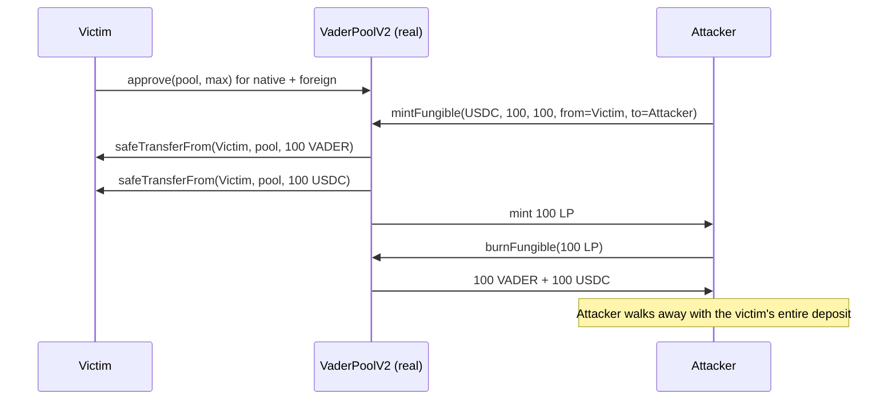

# VaderPoolV2 `mintFungible` steals a victim's deposit to an attacker (arbitrary `from`)

> **Vulnerability classes:** vuln/access-control/missing-auth · vuln/defi/frontrun · fake-account-substitution
>
> **Reproduction:** the test deploys the REAL, unmodified audited Vader dex-v2 contracts (`VaderPoolV2`, `BasePoolV2`, `SynthFactory`, `LPWrapper`, `LPToken`, `VaderMath`) vendored under `src/vader/` and runs the actual `mintFungible` + `burnFungible` exploit. Only the opaque native/foreign ERC20s are minimal real tokens.

<!-- date: 2021-11 -->

## Root cause

`VaderPoolV2.mintFungible` is `external` and permissionless, yet it takes a caller-supplied `from` and pulls BOTH deposits from it:

```solidity
function mintFungible(IERC20 foreignAsset, uint256 nativeDeposit, uint256 foreignDeposit, address from, address to)
    external override nonReentrant returns (uint256 liquidity)
{
    ...
    nativeAsset.safeTransferFrom(from, address(this), nativeDeposit);   // @> pulls from an ATTACKER-chosen address
    foreignAsset.safeTransferFrom(from, address(this), foreignDeposit); // @> pulls from an ATTACKER-chosen address
    ...
    lp.mint(to, liquidity);                                             // @> mints LP to an ATTACKER-chosen address
}
```

A user first `approve`s the pool for both assets, then calls `mintFungible` for themselves. Because `from` is unauthenticated, any account can front-run the victim, calling `mintFungible(foreignAsset, nativeDeposit, foreignDeposit, from = victim, to = attacker)`. The victim's approved native+foreign are pulled into the pool and the LP tokens are minted to the attacker — who then burns them to withdraw the victim's assets. The Vader team confirmed these mint functions should have carried `onlyRouter`. The fix is to remove `from` and transfer from `msg.sender`.

The exact audited source is vendored at [`src/vader/contracts/dex-v2/pool/VaderPoolV2.sol`](src/vader/contracts/dex-v2/pool/VaderPoolV2.sol) (`mintFungible`, L284-335).

## Exploit walkthrough (real numbers)

1. The victim holds 100 VADER + 100 USDC and `approve`s the pool for both (intending to add liquidity themselves).
2. The attacker calls `mintFungible(USDC, 100e18, 100e18, from = victim, to = attacker)`.
3. The victim's **100 VADER + 100 USDC** are pulled into the pool (first mint → `liquidity = nativeDeposit = 100e18`), and 100 LP is minted to the attacker.
4. The attacker `burnFungible`s the 100 LP and receives **100 VADER + 100 USDC** — the victim's entire deposit. The victim ends with 0 / 0.



## Reproduction

```bash
_shared/run-poc/run_poc.sh 42336-h-14-anyone-can-arbitrarily-mint-fungible-tokens-in-vaderpoo_exp -vvvvv
```

Expected: `1 passed`. The assertions in [`test/42336-h-14-anyone-can-arbitrarily-mint-fungible-tokens-in-vaderpoo_exp.sol`](test/42336-h-14-anyone-can-arbitrarily-mint-fungible-tokens-in-vaderpoo_exp.sol) verify the victim's native and foreign both drop to 0 and the attacker recovers 100 of each.

## Sources

- [AuditVault finding #42336](https://github.com/Auditware/AuditVault/blob/main/findings/42336-h-14-anyone-can-arbitrarily-mint-fungible-tokens-in-vaderpoo.md)
- [code-423n4/2021-11-vader `VaderPoolV2.sol` (commit 607d2b9)](https://github.com/code-423n4/2021-11-vader/blob/607d2b9e253d59c782e921bfc2951184d3f65825/contracts/dex-v2/pool/VaderPoolV2.sol#L284-L335)
