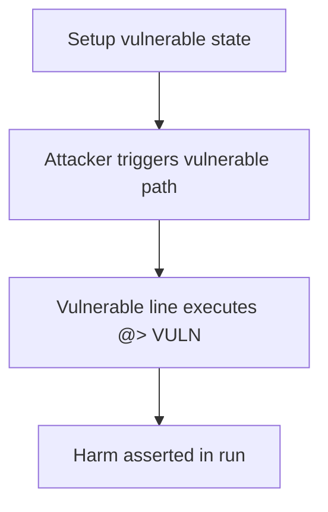

# Streaming — recoverTokens steals rewards when depositToken == rewardToken

> **Vulnerability classes:** vuln/accounting/same-token-double-count · vuln/access-control/privileged-drain

> **Reproduction:** a self-contained Foundry PoC that compiles & runs in an
> isolated project with **only `forge-std`** — no fork, no RPC, no `anvil_state`.
> Full trace: [output.txt](output.txt). PoC:
> [test/42394-h-02-tokens-can-be-stolen-when-deposittoken-rewardtoken-code_exp.sol](test/42394-h-02-tokens-can-be-stolen-when-deposittoken-rewardtoken-code_exp.sol).

<!-- non-defihacklabs -->
<!-- source-auditvault: https://github.com/Auditware/AuditVault/blob/main/findings/42394-h-02-tokens-can-be-stolen-when-deposittoken-rewardtoken-code.md -->
<!-- date: 2021-11 -->

**AuditVault taxonomy:** `lang/solidity` · `sector/token` · `platform/code4rena` · `severity/high` · genome: `wrong-condition` · `direct-drain` · `reward-accounting`

---

## Key info

| | |
|---|---|
| **Impact** | **HIGH** — When deposit and reward tokens are the same, recoverTokens' deposit excess formula includes the reward inventory and the creator drains user rewards |
| **Protocol** | Streaming Protocol |
| **Finding** | Code4rena — Streaming Protocol, 2021-11 · #42394 |
| **Report** | [2021-11-streaming](https://code4rena.com/reports/2021-11-streaming) |
| **Source** | [AuditVault](https://github.com/Auditware/AuditVault/blob/main/findings/42394-h-02-tokens-can-be-stolen-when-deposittoken-rewardtoken-code.md) |
| **Status** | Audit finding — reproduced as a standalone local synthetic PoC. |
| **Compiler** | `^0.8.24` (PoC) |

---

## TL;DR

When deposit and reward tokens are the same, recoverTokens' deposit excess formula includes the reward inventory and the creator drains user rewards

See the vulnerable line marked `// @> VULN` in `test/42394-h-02-tokens-can-be-stolen-when-deposittoken-rewardtoken-code.sol` and the
end-to-end `Exploit.run()` that asserts the harm.

---

## Diagrams

---

## Impact

When deposit and reward tokens are the same, recoverTokens' deposit excess formula includes the reward inventory and the creator drains user rewards

---

## Sources

- [AuditVault finding](https://github.com/Auditware/AuditVault/blob/main/findings/42394-h-02-tokens-can-be-stolen-when-deposittoken-rewardtoken-code.md)
- [Code4rena report](https://code4rena.com/reports/2021-11-streaming)
- Reduced source: synthetic reconstruction of the blamed functions from the contest repo (see finding for verbatim snippets).
