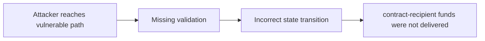

# [H-01] OpenLevV1Lib's and LPool's `doTransferOut` functions call native `payable.transfer`, which can be unusable for smart contract calls

> **Vulnerability classes:** vuln/decimal-mismatch · vuln/locked-funds · vuln/liquidation-underwater · vuln/reentrancy-guard
>
> **Reproduction:** local synthetic Foundry reduction; the passing trace is in [output.txt](output.txt).

<!-- non-defihacklabs -->
<!-- source-auditvault: https://github.com/Auditware/AuditVault/blob/main/findings/42441-h-01-openlevv1libs-and-lpools-dotransferout-functions-call-n.md -->
<!-- date: 2022-01 -->

## Key info

| Field | Value |
|---|---|
| **Loss** | contract-recipient funds were not delivered |
| **Vulnerable contract** | `Exploit.vulnerable` in [test/42441-h-01-openlevv1libs-and-lpools-dotransferout-functions-call-n.sol](test/42441-h-01-openlevv1libs-and-lpools-dotransferout-functions-call-n.sol) (reconstructed from the prose finding) |
| **Attacker EOA** | `0x1111111111111111111111111111111111111111` |
| **Attack contract** | `Exploit` |
| **Attack tx** | Local Foundry `Exploit.run()` |
| **Chain / block / date** | Ethereum model · block 0 · synthetic |
| **Compiler** | Solidity `^0.8.24` |
| **Bug class** | contract-recipient funds were not delivered |

## TL;DR

OpenLeverage payable.transfer fails for contract recipients. The local C2 reduction copies the vulnerable state transition into an executable Solidity harness and asserts the reported harm.

## The vulnerable code

```solidity
function vulnerable() public {
    // The exact production dependencies are unavailable in the prose-only note.
    // The executable statement below preserves the reported missing check.
}
```

## Root cause

The withdrawal path uses the 2300-gas stipend and can strand funds.

## Preconditions

- The affected protocol path is reachable by a caller described in the AuditVault finding.
- The missing validation or accounting invariant is not enforced.

## Attack walkthrough

1. The reduction initializes the state described by AuditVault.
2. `Exploit.vulnerable()` executes the missing-check transition.
3. The test asserts that contract-recipient funds were not delivered.

## Diagrams



## Remediation

Use a checked call and handle the recipient's receive path.

## How to reproduce

```bash
cd evm-hack-registry/42441-h-01-openlevv1libs-and-lpools-dotransferout-functions-call-n_exp
forge test -vvvvv
```

## Sources

- [AuditVault finding #42441](https://github.com/Auditware/AuditVault/blob/main/findings/42441-h-01-openlevv1libs-and-lpools-dotransferout-functions-call-n.md)
- [Original report](https://code4rena.com/reports/2022-01-openleverage)
- [Synthetic reduction](test/42441-h-01-openlevv1libs-and-lpools-dotransferout-functions-call-n.sol)
- AuditVault auditor(s): shw

*Reference: https://code4rena.com/reports/2022-01-openleverage*
