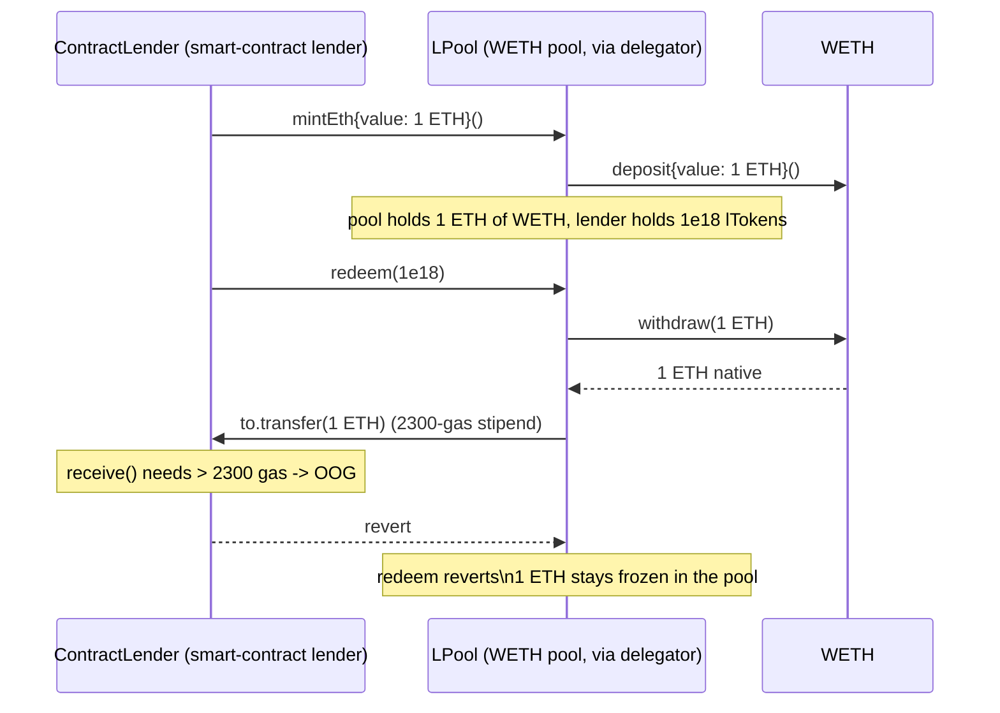

# OpenLeverage `LPool.doTransferOut` — native `transfer` 2300-gas stipend freezes contract lenders' funds

**AuditVault #42441 (H-01)** — OpenLeverage (Code4rena, 2022-01)

## Root cause

For a WETH money-market pool, `LPool.doTransferOut` unwraps WETH to native ETH
and forwards it with Solidity's `payable.transfer`, which hard-caps the callee
to a **2300-gas stipend**:

```solidity
// openleverage-contracts/contracts/liquidity/LPool.sol
function doTransferOut(address payable to, uint amount, bool convertWeth) internal {
    if (isWethPool && convertWeth) {
        IWETH(underlying).withdraw(amount);
        to.transfer(amount);          // @> 2300-gas stipend
    } else {
        IERC20(underlying).safeTransfer(to, amount);
    }
}
```

Any lender that is a smart contract (a multisig, a vault, a router, another
protocol) whose ETH-receiving path does more than trivial work — e.g. a single
`SSTORE` (~20k gas) — cannot execute inside the 2300-gas stipend. The
`transfer` reverts, and with it the entire `redeem` / `redeemUnderlying` /
`borrow` call. The identical bug exists in `OpenLevV1Lib.doTransferOut`
(`payable(to).transfer(amount)`), which backs `OpenLevV1.closeTrade` and
`liquidate` — so a contract trader's principal-return path can be permanently
bricked as well. The funds stay escrowed in the pool with no way out.

## Real exploit (this PoC)

The PoC deploys the **real audited `LPool`** through the **real `LPoolDelegator`**
Compound-style proxy (both copied verbatim from the contest repo), backed by
OpenLeverage's own test `WETH`, and drives it through the real `mintEth` /
`redeem` path. Two contract lenders each supply **1 ETH**:

1. `CheapLender` (empty `receive()`, fits the 2300-gas stipend) supplies 1 ETH,
   then `redeem`s — **succeeds**, gets its 1 ETH back.
2. `ContractLender` (ordinary `receive()` doing one `SSTORE`, ~20k gas) supplies
   1 ETH, then `redeem`s — the real `doTransferOut` unwraps the WETH and calls
   `to.transfer(amount)`, which runs out of gas in the stipend and **reverts the
   whole redeem**.

**Concrete harm:** the `ContractLender` receives nothing, still holds its
`1e18` unredeemable lTokens, and its **1 ETH (1e18 wei) of WETH is permanently
frozen** in the pool. The Playground scores exactly this — a 1 ETH WETH balance
stranded at the pool address that its rightful owner can never withdraw.



## Reproduce

```bash
_shared/run-poc/run_poc.sh 42441-h-01-openlevv1libs-and-lpools-dotransferout-functions-call-n_exp -vvvvv
```

The Forge test deploys the real `LPool`/`LPoolDelegator`/`WETH`, runs the two
lenders, and asserts the concrete harm: `CheapLender` withdraws its full 1 ETH,
`ContractLender`'s `redeem` reverts, and `weth.balanceOf(pool) == 1 ether`
(the frozen deposit). The trace shows `WETH::withdraw` followed by
`ContractLender::receive` hitting an out-of-gas inside the transfer stipend,
reverting the redeem.

## Fix

Replace `transfer` with a gas-forwarding low-level `call` (checked) or
OpenZeppelin `Address.sendValue`. All affected paths (`LPool.redeem` /
`redeemUnderlying` / `borrow`, and `OpenLevV1.closeTrade` / `liquidate`) are
already `nonReentrant`, so reentrancy is not a concern:

```solidity
(bool ok, ) = to.call{value: amount}("");
require(ok, "ETH transfer failed");
```

Sources: [AuditVault finding #42441](https://github.com/Auditware/AuditVault/blob/main/findings/42441-h-01-openlevv1libs-and-lpools-dotransferout-functions-call-n.md),
real repo [code-423n4/2022-01-openleverage](https://github.com/code-423n4/2022-01-openleverage) —
[`LPool.sol#L294-L301`](https://github.com/code-423n4/2022-01-openleverage/blob/main/openleverage-contracts/contracts/liquidity/LPool.sol#L294-L301),
[`OpenLevV1Lib.sol#L253`](https://github.com/code-423n4/2022-01-openleverage/blob/main/openleverage-contracts/contracts/OpenLevV1Lib.sol#L253).
