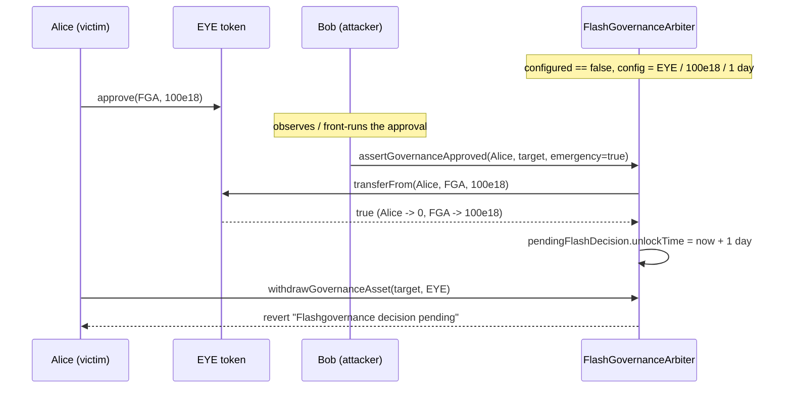

# Behodler / LimboDAO — `assertGovernanceApproved` has no access control (anyone can lock a user's funds)

> **Vulnerability classes:** vuln/access-control/missing-check · vuln/dos/frozen-funds · impact/loss-of-funds/locked-funds · impact/mev/frontrun
>
> **Reproduction:** the test deploys the ACTUAL audited `FlashGovernanceArbiter` (vendored from the Code4rena 2022-01-behodler repo) and shows an unauthorized third party force-pulling and time-locking an approving user's EYE deposit.

<!-- source-auditvault: https://github.com/Auditware/AuditVault/blob/main/findings/42453-h-01-lack-of-access-control-on-assertgovernanceapproved-can.md -->
<!-- date: 2022-01 -->

## Root cause

`FlashGovernanceArbiter.assertGovernanceApproved` is declared `public` with **no access control** and trusts its `sender` argument as the `transferFrom` source:

```solidity
function assertGovernanceApproved(address sender, address target, bool emergency) public {
    if (
        IERC20(flashGovernanceConfig.asset).transferFrom(sender, address(this), flashGovernanceConfig.amount) &&
        pendingFlashDecision[target][sender].unlockTime < block.timestamp
    ) {
        require(emergency || (block.timestamp - security.lastFlashGovernanceAct > security.epochSize), "...");
        pendingFlashDecision[target][sender] = flashGovernanceConfig;
        pendingFlashDecision[target][sender].unlockTime += block.timestamp; // locked into the future
        ...
    } else {
        revert("LIMBO: governance decision rejected.");
    }
}
```

The function never checks that `msg.sender == sender`. Any address can pass a **victim** as `sender`. As soon as that victim has approved the arbiter for `flashGovernanceConfig.amount` of `flashGovernanceConfig.asset` (EYE) — the legitimate precondition for making a flash-governance decision — an attacker who front-runs (or simply observes) that approval can invoke `assertGovernanceApproved(victim, anyTarget, true)`. The victim's deposit is pulled into the arbiter and its `unlockTime` is pushed `flashGovernanceConfig.unlockTime` into the future, so the victim cannot `withdrawGovernanceAsset` until the lock expires. As the C4 judge noted, *"a `transferFrom()` with `from` not being hard-coded as `msg.sender` is evil."*

The audited contract is vendored verbatim at [`src/behodler/contracts/DAO/FlashGovernanceArbiter.sol`](src/behodler/contracts/DAO/FlashGovernanceArbiter.sol) (with its real `Governable` base and facades under `src/behodler/contracts/DAO/` and `src/behodler/contracts/facades/`).

## Reproduction

The test deploys the real `FlashGovernanceArbiter` (its `LimboDAO` dependency — used only in the constructor for `getFlashGoverner()`, never in the exploit path — is a stub; EYE is a minimal ERC20, the opaque deposit token the arbiter treats via `IERC20`). Flash governance is configured during the protocol's `configured == false` setup phase (deposit = 100 EYE, unlock = 1 day). Alice approves the arbiter and Bob then locks her funds:

```bash
cd 42453-h-01-lack-of-access-control-on-assertgovernanceapproved-can_exp
../_shared/run-poc/run_poc.sh 42453-h-01-lack-of-access-control-on-assertgovernanceapproved-can_exp -vvvvv
```

Expected result: `1 passed`. The assertions in [`test/42453-h-01-lack-of-access-control-on-assertgovernanceapproved-can_exp.sol`](test/42453-h-01-lack-of-access-control-on-assertgovernanceapproved-can_exp.sol) prove the concrete harm with numbers:

- `asset.balanceOf(alice)` goes from `100e18` → **0** (Alice's EYE force-pulled).
- `asset.balanceOf(arbiter)` becomes **100e18** (deposit captured by the arbiter).
- `pendingFlashDecision[target][alice].unlockTime` = `86401` > `block.timestamp` — the deposit is time-locked.
- Alice's own `withdrawGovernanceAsset` **reverts** with `"Limbo: Flashgovernance decision pending."` — she cannot recover her funds until the lock expires.

Bob spent no EYE and had no allowance of his own; the entire loss falls on Alice, and any user with an outstanding approval can be hit at once.

## Attack sequence



## Sources

- [AuditVault finding #42453](https://github.com/Auditware/AuditVault/blob/main/findings/42453-h-01-lack-of-access-control-on-assertgovernanceapproved-can.md)
- [Code4rena report — 2022-01 Behodler](https://code4rena.com/reports/2022-01-behodler)
- [Vulnerable source `contracts/DAO/FlashGovernanceArbiter.sol` @ `ce1e789`](https://github.com/code-423n4/2022-01-behodler/blob/main/contracts/DAO/FlashGovernanceArbiter.sol#L60-L81)
