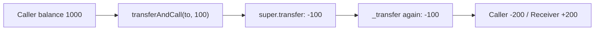

# Behodler — Double transfer in ERC677 `transferAndCall`

> **Vulnerability classes:** wrong-condition · direct-drain
>
> **Reproduction:** self-contained Foundry PoC with **only `forge-std`** — no fork.
> Full trace: [output.txt](output.txt).

<!-- non-defihacklabs -->
<!-- source-auditvault: https://github.com/Auditware/AuditVault/blob/main/findings/42454-h-03-double-transfer-in-the-transferandcall-function-of-erc6.md -->
<!-- date: 2022-01 -->

---

## Key info

| | |
|---|---|
| **Impact** | **HIGH** — callers lose 2× the intended amount on every `transferAndCall` |
| **Protocol** | [Behodler](https://behodler.io/) — Flan / ERC677 |
| **Vulnerable code** | `ERC677.transferAndCall` — dual transfer |
| **Finding** | Code4rena — Behodler, 2022-01 · #42454 · [H-03] |
| **Report** | [code4rena.com/reports/2022-01-behodler](https://code4rena.com/reports/2022-01-behodler) |
| **Source** | [AuditVault](https://github.com/Auditware/AuditVault/blob/main/findings/42454-h-03-double-transfer-in-the-transferandcall-function-of-erc6.md) |
| **Compiler** | `^0.8.24` (PoC) |

## TL;DR

`transferAndCall` calls `super.transfer` and then `_transfer` again for the same `_value`, so the sender is debited twice and the receiver is credited twice.

## The vulnerable code

```solidity
function transferAndCall(address _to, uint256 _value, bytes memory _data) public returns (bool success) {
  super.transfer(_to, _value);
  _transfer(msg.sender, _to, _value); // @> VULN
  if (isContract(_to)) {
      contractFallback(_to, _value, _data);
  }
  return true;
}
```

## Root cause

Redundant transfer after the ERC20 base transfer already moved the tokens. Flan inherits ERC677, so all `transferAndCall` users are affected.

## Diagrams



## Impact

Direct double debit on every Flan `transferAndCall`.

## Sources

- AuditVault: https://github.com/Auditware/AuditVault/blob/main/findings/42454-h-03-double-transfer-in-the-transferandcall-function-of-erc6.md
- Report: https://code4rena.com/reports/2022-01-behodler
- Repo: code-423n4/2022-01-behodler `contracts/ERC677/ERC677.sol`

Taxonomy: `[[wrong-condition]]` · `[[direct-drain]]` · `severity/high` · `sector/dex`
