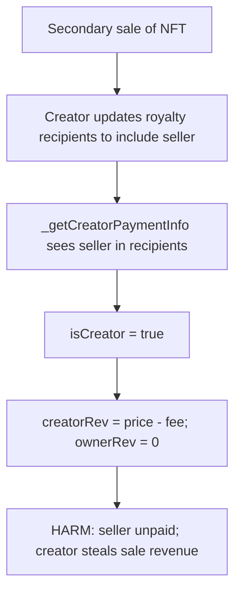
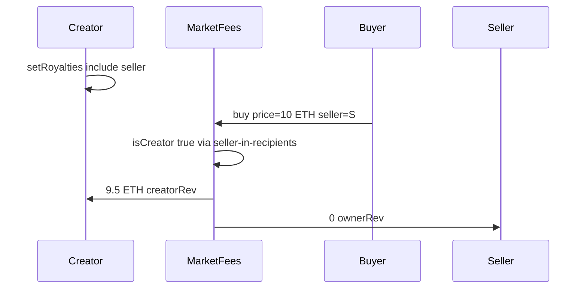

# Foundation — Creators can steal sale revenue from owners' sales

> **Vulnerability classes:** impact/loss-of-funds/direct-drain · genome/royalty-edge-cases · spot-price

> **Reproduction:** a self-contained Foundry PoC that compiles & runs in an
> isolated project with **only `forge-std`** — no fork, no RPC, no `anvil_state`.
> Full trace: [output.txt](output.txt). PoC:
> [test/42485-h-02-creators-can-steal-sale-revenue-from-owners-sales-code4_exp.sol](test/42485-h-02-creators-can-steal-sale-revenue-from-owners-sales-code4_exp.sol).

<!-- non-defihacklabs -->
<!-- source-auditvault: https://github.com/Auditware/AuditVault/blob/main/findings/42485-h-02-creators-can-steal-sale-revenue-from-owners-sales-code4.md -->
<!-- date: 2022-02 -->

**AuditVault taxonomy:** `lang/solidity` · `platform/code4rena` · `has/github` · `has/poc` · `severity/high` · `sector/nft` · `sector/nft-marketplace` · genome: `spot-price` · `direct-drain` · `integer-bounds` · `oracle-manipulation-resistance` · `royalty-edge-cases`

---

## Key info

| | |
|---|---|
| **Impact** | **HIGH** — on a secondary sale, if the seller is listed as a royalty recipient, `isCreator=true` and **ownerRev=0**; creator takes `price − fee` |
| **Protocol** | [Foundation](https://code4rena.com/reports/2022-02-foundation) — `NFTMarketCreators` / `NFTMarketFees` |
| **Vulnerable code** | `_getCreatorPaymentInfo` seller-in-recipients short-circuit; `_getFees` creator-sale branch |
| **Bug class** | Incorrect creator detection via mutable royalty registry |
| **Finding** | Code4rena — Foundation, 2022-02 · #42485 (H-02) · reporter **jmak** / IllIllI |
| **Report** | [2022-02-foundation](https://code4rena.com/reports/2022-02-foundation) |
| **Source** | [AuditVault](https://github.com/Auditware/AuditVault/blob/main/findings/42485-h-02-creators-can-steal-sale-revenue-from-owners-sales-code4.md) |
| **Status** | Audit finding — confirmed by Foundation; fixed by decoupling `isCreator` from royalty overrides. |
| **Compiler** | `^0.8.24` (PoC) |

---

## TL;DR

1. Secondary sales should pay ~10% royalty to creators and the rest to the seller.
2. If `getRoyalties` lists the **seller** as a recipient, the market treats the sale as a **creator sale** (`isCreator=true`).
3. Creator-sale branch sets `creatorRev = price - fee` and leaves `ownerRev = 0`.
4. Creator updates the Royalty Registry right before settlement.
5. HARM in the PoC: **10 ETH** sale → seller gets **0**, creator receives **9.5 ETH** (after 5% secondary fee).

---

## The vulnerable code

From `code-423n4/2022-02-foundation` `NFTMarketCreators.sol` / `NFTMarketFees.sol`:

```solidity
if (_recipients[i] == seller) {
    return (_recipients, recipientBasisPoints, true); // @> VULN: isCreator
}

if (isCreator) {
    creatorRev = price - foundationFee; // @> VULN: ownerRev stays 0
} else {
    creatorRev = (price * CREATOR_ROYALTY_BASIS_POINTS) / BASIS_POINTS;
    ownerRevTo = seller;
    ownerRev = price - foundationFee - creatorRev;
}
```

**Fix (shipped):** determine `isCreator` via `tokenCreator` (or similar), not royalty-recipient membership; always compute owner revenue separately from royalties.

---

## Root cause

`isCreator` was overloaded to mean both "seller is the creator" and "seller appears in royalty recipients" (needed for split primary sales). The Royalty Registry makes recipient lists mutable post-mint, so a creator can flip a secondary sale into the creator-sale payout path on demand.

---

## Preconditions

- NFT has mutable royalty info (Royalty Registry / `IGetRoyalties`).
- Secondary sale of a token the creator does not own.
- Creator (or bribed party) can update recipients before settlement.

---

## Attack walkthrough

1. Baseline secondary split: fee 5%, royalty 10%, owner 85%.
2. Creator sets royalties to include the seller address.
3. `_getCreatorPaymentInfo` returns `isCreator=true`.
4. `_getFees` assigns all post-fee revenue to creator; ownerRev=0.
5. Buyer pays 10 ETH; creator receives 9.5 ETH; seller receives 0.

---

## Diagrams





## Remediation

```diff
- (creatorRecipients, creatorShares, isCreator) = _getCreatorPaymentInfo(..., seller);
+ bool isCreator = (tokenCreator(nft, tokenId) == seller);
+ (creatorRecipients, creatorShares) = _getCreatorPaymentInfo(nft, tokenId); // no seller short-circuit
```

## How to reproduce

```bash
cd ~/RustroverProjects/audits/evm-hack-registry/42485-h-02-creators-can-steal-sale-revenue-from-owners-sales-code4_exp
forge test -vvv
# Fully local -- payable run() supplies the 10 ETH sale.
```

## Sources

- AuditVault finding: [42485-h-02-creators-can-steal-sale-revenue-from-owners-sales-code4.md](https://github.com/Auditware/AuditVault/blob/main/findings/42485-h-02-creators-can-steal-sale-revenue-from-owners-sales-code4.md)
- Code4rena report: [2022-02-foundation](https://code4rena.com/reports/2022-02-foundation)
- Vulnerable repo: [code-423n4/2022-02-foundation@a03a7e1](https://github.com/code-423n4/2022-02-foundation/blob/a03a7e198c1dfffb1021c0e8ec91ba4194b8aa12/contracts/mixins/NFTMarketCreators.sol)
