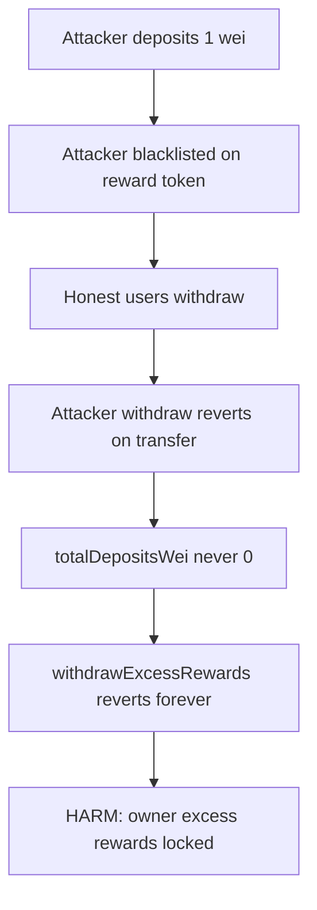
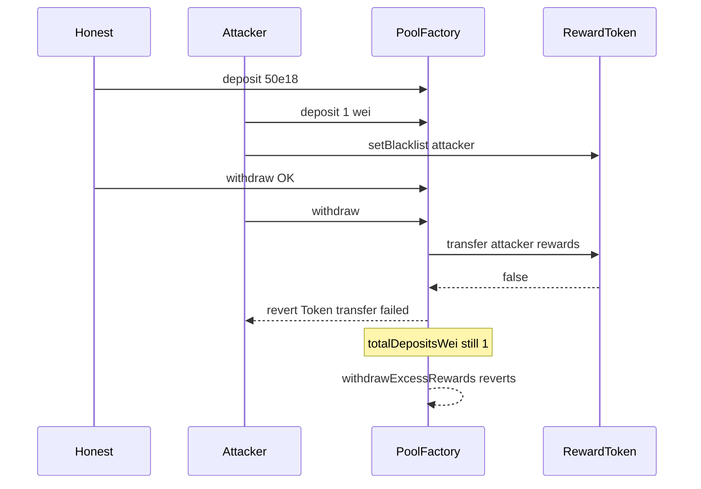

# FactoryDAO — Blacklisted user may permanently block `withdrawExcessRewards`

> **Vulnerability classes:** impact/frozen-funds · impact/dos · genome/reward-accounting · dos-resistance

> **Reproduction:** a self-contained Foundry PoC that compiles & runs in an
> isolated project with **only `forge-std`** — no fork, no RPC, no `anvil_state`.
> Full trace: [output.txt](output.txt). PoC:
> [test/42551-h-02-dos-blacklisted-user-may-prevent-withdrawexcessrewards_exp.sol](test/42551-h-02-dos-blacklisted-user-may-prevent-withdrawexcessrewards_exp.sol).

<!-- non-defihacklabs -->
<!-- source-auditvault: https://github.com/Auditware/AuditVault/blob/main/findings/42551-h-02-dos-blacklisted-user-may-prevent-withdrawexcessrewards.md -->
<!-- date: 2022-05 -->

**AuditVault taxonomy:** `lang/solidity` · `platform/code4rena` · `has/github` · `has/poc` · `severity/high` · `sector/token` · genome: `frozen-funds` · `locked-funds` · `dos-resistance` · `reward-accounting`

---

## Key info

| | |
|---|---|
| **Impact** | **HIGH** — one non-receivable depositor (e.g. blacklisted) can never `withdraw()`, so `totalDepositsWei` never hits 0 and **owner excess rewards lock forever** |
| **Protocol** | [FactoryDAO](https://code4rena.com/reports/2022-05-factorydao) — `PermissionlessBasicPoolFactory` |
| **Vulnerable code** | `withdraw` transfer loop + `withdrawExcessRewards` `totalDepositsWei == 0` gate |
| **Bug class** | Push-payment DoS coupled to global excess-reward gate |
| **Finding** | Code4rena — FactoryDAO, 2022-05 · #42551 (H-02) · reporter **IllIllI** / AuditsAreUS |
| **Report** | [2022-05-factorydao](https://code4rena.com/reports/2022-05-factorydao) |
| **Source** | [AuditVault](https://github.com/Auditware/AuditVault/blob/main/findings/42551-h-02-dos-blacklisted-user-may-prevent-withdrawexcessrewards.md) |
| **Status** | Audit finding — confirmed and fixed. Local synthetic reproduces the lock. |
| **Compiler** | `^0.8.24` (PoC) |

---

## TL;DR

1. `withdraw` AND-chains every ERC20 transfer and reverts if any fails.
2. A blacklisted (or paused-token) user can never clear their deposit.
3. `withdrawExcessRewards` requires `totalDepositsWei == 0`.
4. HARM in the PoC: attacker deposits **1 wei**, gets blacklisted; after honest users leave, owner excess rewards remain locked in the factory.

---

## The vulnerable code

From `code-423n4/2022-05-factorydao@db41580` `PermissionlessBasicPoolFactory.sol`:

```solidity
for (uint i = 0; i < rewards.length; i++) {
    ...
    success = success && IERC20(pool.rewardTokens[i]).transfer(receipt.owner, transferAmount); // @> VULN
}
success = success && IERC20(pool.depositToken).transfer(receipt.owner, receipt.amountDepositedWei);
require(success, 'Token transfer failed');

// withdrawExcessRewards:
require(pool.totalDepositsWei == 0, 'Cannot withdraw until all deposits are withdrawn'); // @> VULN
```

**Fix:** allow excess withdrawal after pool end / timeout, or use try/catch + pull payments so one bad recipient cannot brick the pool.

---

## Root cause

A local per-user transfer failure is coupled to a **global** owner withdrawal precondition. The cost to an attacker is negligible (1 wei deposit + becoming non-receivable).

---

## Preconditions

- Pool with deposit + reward tokens that can blacklist or fail transfers.
- Attacker can deposit a tiny amount and become non-receivable on at least one transferred token.

---

## Attack walkthrough

1. Honest user deposits 50e18; attacker deposits 1 wei; rewards funded.
2. Attacker is blacklisted on the reward token.
3. Honest withdraw succeeds; attacker withdraw reverts on failed transfer.
4. `totalDepositsWei == 1` forever → `withdrawExcessRewards` reverts → excess rewards stuck.

---

## Diagrams





## Remediation

```diff
- require(pool.totalDepositsWei == 0, 'Cannot withdraw until all deposits are withdrawn');
+ // allow after pool end timestamp, or skip failed recipients via try/catch pull pattern
```

## How to reproduce

```bash
cd ~/RustroverProjects/audits/evm-hack-registry/42551-h-02-dos-blacklisted-user-may-prevent-withdrawexcessrewards_exp
forge test -vvv
```

## Sources

- AuditVault finding: [42551-h-02-dos-blacklisted-user-may-prevent-withdrawexcessrewards.md](https://github.com/Auditware/AuditVault/blob/main/findings/42551-h-02-dos-blacklisted-user-may-prevent-withdrawexcessrewards.md)
- Code4rena report: [2022-05-factorydao](https://code4rena.com/reports/2022-05-factorydao)
- Vulnerable repo: [code-423n4/2022-05-factorydao@db41580](https://github.com/code-423n4/2022-05-factorydao/blob/db415804c06143d8af6880bc4cda7222e5463c0e/contracts/PermissionlessBasicPoolFactory.sol)
