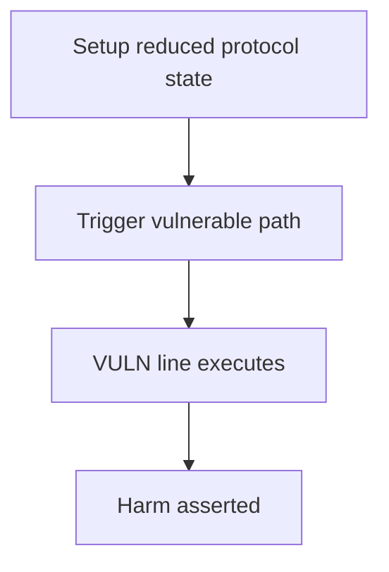

# Putty — acceptCounterOffer may result in both orders being filled

> **Vulnerability classes:** wrong-condition · frontrun · frontrun-exposure

> **Reproduction:** a self-contained Foundry PoC that compiles & runs in an
> isolated project with **only `forge-std`** — no fork, no RPC, no `anvil_state`.
> Full trace: [output.txt](output.txt). PoC:
> [test/42730-h-02-acceptcounteroffer-may-result-in-both-orders-being-fill_exp.sol](test/42730-h-02-acceptcounteroffer-may-result-in-both-orders-being-fill_exp.sol).

<!-- non-defihacklabs -->
<!-- source-auditvault: https://github.com/Auditware/AuditVault/blob/main/findings/42730-h-02-acceptcounteroffer-may-result-in-both-orders-being-fill.md -->
<!-- date: 2022-06 -->

---

## Key info

| | |
|---|---|
| **Impact** | **HIGH — frontrun fill of original order + acceptCounterOffer fills both → double leverage** |
| **Protocol** | Putty |
| **Vulnerable code** | `PuttyV2` |
| **Bug class** | wrong-condition |
| **Finding** | Code4rena — Putty, 2022-06 · #42730 · reporter **hyh / kirk-baird et al.** |
| **Report** | [code4rena.com/reports/2022-06-putty](https://code4rena.com/reports/2022-06-putty) |
| **Source** | [AuditVault](https://github.com/Auditware/AuditVault/blob/main/findings/42730-h-02-acceptcounteroffer-may-result-in-both-orders-being-fill.md) |
| **Status** | Audit finding — caught in review, not exploited on-chain. Reproduced as a standalone local PoC. |
| **Compiler** | `^0.8.24` (PoC) |

This is an **audit finding**, not a historical on-chain incident. The PoC keeps
the vulnerable logic **verbatim** (marked `@> VULN`) and reduces dependencies
to the minimum needed to show the claimed harm.

---

## TL;DR

1. acceptCounterOffer cancels originalOrder then fills the counter order.
2. cancel() does not revert if the order was already filled.
3. Frontrunner fills original first; cancel is a no-op; counter still fills.
4. Maker ends twice leveraged with both order collaterals locked.

---

## The vulnerable code

See `test/42730-h-02-acceptcounteroffer-may-result-in-both-orders-being-fill.sol` — the `@> VULN` marker is on the blamed line (line 79 in the synthetic).

## Root cause

cancel marks cancelled without requiring the order is unfilled.

## Preconditions

Protocol operating conditions that make the path reachable (see finding report). No exotic privileges beyond those the real call path requires.

## Attack walkthrough

From [output.txt](output.txt): the `Exploit.run()` path executes the attack end-to-end and `require`s the harm.

## Diagrams

## Impact

Both orders fill; maker posts 2× collateral / 2× leverage.

## Sources

- [AuditVault finding](https://github.com/Auditware/AuditVault/blob/main/findings/42730-h-02-acceptcounteroffer-may-result-in-both-orders-being-fill.md)
- [Code4rena report](https://code4rena.com/reports/2022-06-putty)
- Protocol source: https://github.com/code-423n4/2022-06-putty
