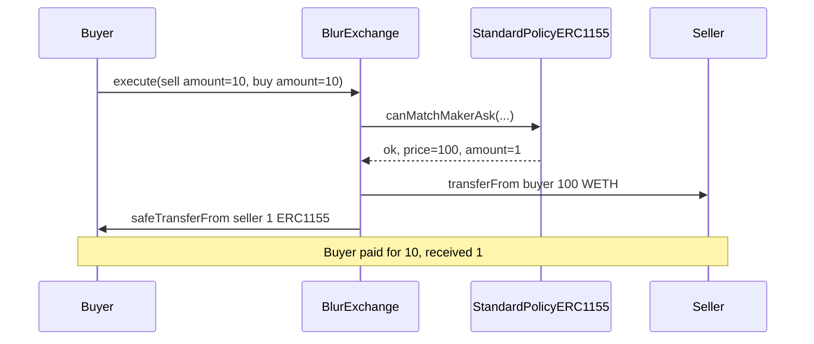

# Blur — StandardPolicyERC1155 hardcodes matched amount to 1

> **Vulnerability classes:** vuln/logic/wrong-condition · vuln/nft/amount-mismatch · genome: wrong-condition · direct-drain

> **Reproduction:** a self-contained Foundry PoC that compiles & runs in an
> isolated project with **only `forge-std`** — no fork, no RPC, no `anvil_state`.
> Full trace: [output.txt](output.txt). PoC:
> [test/42876-h-01-standardpolicyerc1155sol-returns-amount-1-instead-of-am_exp.sol](test/42876-h-01-standardpolicyerc1155sol-returns-amount-1-instead-of-am_exp.sol).

<!-- non-defihacklabs -->
<!-- source-auditvault: https://github.com/Auditware/AuditVault/blob/main/findings/42876-h-01-standardpolicyerc1155sol-returns-amount-1-instead-of-am.md -->
<!-- date: 2022-10 -->

**AuditVault taxonomy:** `lang/solidity` · `platform/code4rena` · `has/github` · `has/poc` · `severity/high` · `sector/nft` · `sector/nft-marketplace` · genome: `wrong-condition` · `direct-drain` · `access-roles`

---

## Key info

| | |
|---|---|
| **Impact** | **HIGH** — ERC1155 buyer pays full order price but receives only 1 unit |
| **Protocol** | [Blur Exchange](https://code4rena.com/reports/2022-10-blur) |
| **Vulnerable code** | `StandardPolicyERC1155.canMatchMakerAsk` — returns hardcoded `1` as amount |
| **Bug class** | Wrong match amount / under-delivery of ERC1155 |
| **Finding** | Code4rena 2022-10-blur · H-01 · #42876 |
| **Report** | [code4rena.com/reports/2022-10-blur](https://code4rena.com/reports/2022-10-blur) |
| **Source** | [AuditVault](https://github.com/Auditware/AuditVault/blob/main/findings/42876-h-01-standardpolicyerc1155sol-returns-amount-1-instead-of-am.md) |
| **Status** | Acknowledged (sponsor: ERC1155 policy not intended for production deploy). Reproduced as standalone local PoC. |
| **Compiler** | `^0.8.24` (PoC) |

---

## TL;DR

1. `canMatchMakerAsk` / `canMatchMakerBid` return `1` instead of `order.amount`.
2. `BlurExchange` uses that amount in `_executeTokenTransfer` / ERC1155 transfer.
3. Settlement still uses the full `order.price`.
4. HARM: buyer of amount=10 pays 100 WETH and receives only 1 ERC1155 unit.

---

## The vulnerable code

```solidity
return (
    (makerAsk.side != takerBid.side) &&
    /* … match checks … */
    (makerAsk.price == takerBid.price),
    makerAsk.price,
    makerAsk.tokenId,
    1, // @> VULN: hardcoded amount 1 instead of makerAsk.amount
    AssetType.ERC1155
);
```

**Fix:** return `makerAsk.amount` (and enforce consistency with the taker order amount).

---

## Root cause

The ERC1155 matching policy was written as a transfer smoke-test and never wired the order’s `amount` field into the match result. Downstream execution trusts the policy’s amount for the NFT leg while still settling the quoted price.

---

## Preconditions

- Orders use `StandardPolicyERC1155` as `matchingPolicy`.
- Sell/buy `amount > 1` with a price set for that full amount.

---

## Attack walkthrough

1. Seller lists 10 ERC1155 units at price 100 WETH; buyer matches amount=10.
2. Policy returns amount `1`.
3. Exchange pulls 100 WETH from buyer → seller, transfers 1 ERC1155 unit to buyer.
4. **HARM:** buyer under-delivered by 9 units after paying full price.

---

## Diagrams



---

## Impact

Buyers of multi-unit ERC1155 orders overpay; sellers retain residual inventory after receiving the full listed price. Sponsor acknowledged the policy was not production-ready.

---

## How to reproduce

```bash
cd evm-hack-registry/42876-h-01-standardpolicyerc1155sol-returns-amount-1-instead-of-am_exp
forge test -vvv
```

---

## Sources

- [AuditVault finding #42876](https://github.com/Auditware/AuditVault/blob/main/findings/42876-h-01-standardpolicyerc1155sol-returns-amount-1-instead-of-am.md)
- [Code4rena report 2022-10-blur](https://code4rena.com/reports/2022-10-blur)
- Reduced from [code-423n4/2022-10-blur](https://github.com/code-423n4/2022-10-blur) `contracts/matchingPolicies/StandardPolicyERC1155.sol` (contest main)
