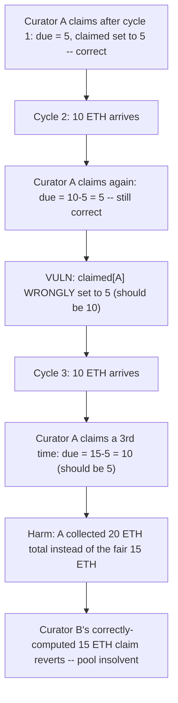
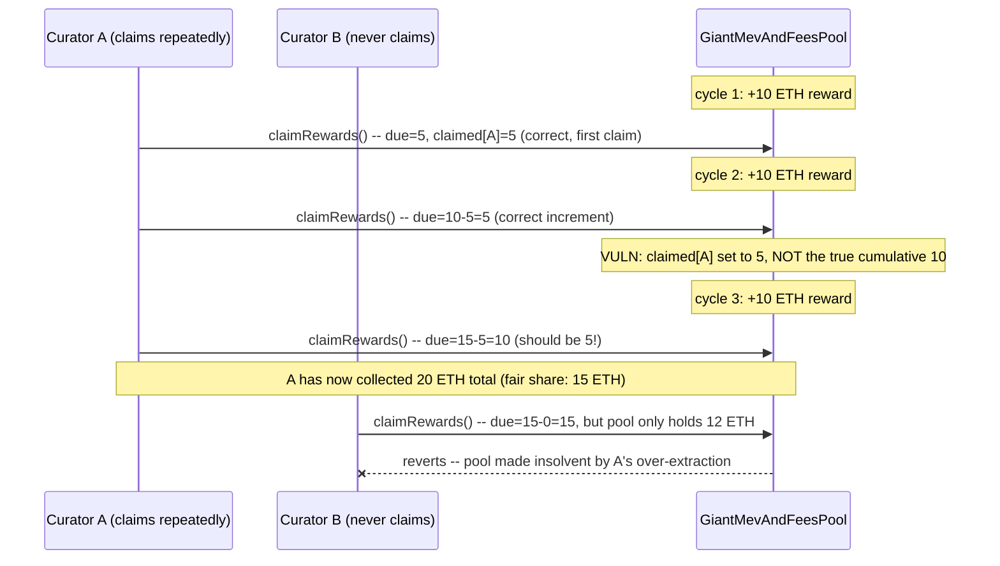

# Stakehouse Protocol — repeated reward claims drift, letting a curator extract more than their fair share

> **Vulnerability classes:** vuln/accounting/incorrect-checkpoint-update · vuln/economic/reward-drift · vuln/logic/insolvency-risk

> **Reproduction:** a self-contained Foundry PoC that compiles & runs in an
> isolated project with **only `forge-std`** — no fork, no RPC, no `anvil_state`.
> Full trace: [output.txt](output.txt). PoC:
> [test/43025-h-01-any-user-being-the-first-to-claim-rewards-from-giantmev_exp.sol](test/43025-h-01-any-user-being-the-first-to-claim-rewards-from-giantmev_exp.sol).

<!-- non-defihacklabs -->
<!-- source-auditvault: https://github.com/Auditware/AuditVault/blob/main/findings/43025-h-01-any-user-being-the-first-to-claim-rewards-from-giantmev.md -->
<!-- date: 2022-11 -->

**AuditVault taxonomy:** `lang/solidity` · `platform/code4rena` · `has/github` · `has/poc` · `severity/high` · `sector/staking` · genome: `reward-calculation` · `reward-theft` · `reward-accounting`

---

## Key info

| | |
|---|---|
| **Impact** | **HIGH** — a curator who claims their rewards repeatedly across multiple accrual cycles is paid MORE than their fair pro-rata share on each claim after the first, draining what other LP holders are owed and risking pool insolvency |
| **Protocol** | [Stakehouse Protocol](https://code4rena.com/reports/2022-11-stakehouse) — `SyndicateRewardsProcessor` / `GiantMevAndFeesPool` |
| **Vulnerable code** | `SyndicateRewardsProcessor._distributeETHRewardsToUserForToken` — sets `claimed` to the amount just paid instead of the running total |
| **Bug class** | Incorrect checkpoint update: a per-user "claimed so far" baseline is overwritten with the wrong value |
| **Finding** | Code4rena — Stakehouse Protocol, 2022-11 · #43025 (H-01) · reporter **clems4ever** |
| **Report** | [2022-11-stakehouse](https://code4rena.com/reports/2022-11-stakehouse) |
| **Source** | [AuditVault](https://github.com/Auditware/AuditVault/blob/main/findings/43025-h-01-any-user-being-the-first-to-claim-rewards-from-giantmev.md) |
| **Status** | Audit finding — caught in review (not exploited on-chain). Reproduced here as a standalone local PoC. |
| **Compiler** | `^0.8.24` (PoC) |

This is an **audit finding**, not a historical on-chain incident. The PoC keeps
`SyndicateRewardsProcessor._distributeETHRewardsToUserForToken`'s exact
checkpoint bug verbatim, alongside a faithful reduction of
`GiantMevAndFeesPool`'s deposit-time `_setClaimedToMax` baseline and the
`totalRewardsReceived` idle-ETH exclusion.

---

## TL;DR

1. `_distributeETHRewardsToUserForToken` computes `due` — the ETH newly owed
   to a user — as `accumulatedETHPerLPShare * balance / PRECISION -
   claimed[user][token]`, and pays it out.
2. It then does `claimed[user][token] = due` — the amount **just paid** —
   instead of adding `due` to the running cumulative total (or setting
   `claimed` to the new full entitlement).
3. On a user's **first-ever** claim this happens to be correct, since
   `claimed` started at `0` and `due` equals the full entitlement at that
   point — masking the bug.
4. On **every claim after the first**, this under-writes the user's true
   lifetime-claimed total, so the **next** claim's `due` is computed against
   a too-low baseline and pays out more than the fair incremental share.
5. HARM in the PoC: two curators hold equal (50/50) shares. Curator A claims
   after each of three 10-ETH reward cycles while curator B never claims. A's
   **third** claim alone pays out double the fair share (10 ETH instead of 5
   ETH) — A collects 20 ETH total instead of the fair 15 ETH, and the pool is
   left unable to pay curator B's own (correctly-computed) 15 ETH claim.

---

## The vulnerable code

Faithful reduction (`_distributeETHRewardsToUserForToken`):

```solidity
function claimRewards(address _recipient) external {
    updateAccumulatedETHPerLP();
    uint256 balance = balanceOf[msg.sender];
    require(balance > 0, "no balance");

    // @> real SyndicateRewardsProcessor.sol#L61
    uint256 due = ((accumulatedETHPerLPShare * balance) / PRECISION) - claimed[msg.sender][LP_TOKEN];
    if (due > 0) {
        // @> VULN (real SyndicateRewardsProcessor.sol#L63): sets `claimed` to the
        // amount JUST PAID, not the cumulative running total.
        // FIX: claimed[msg.sender][LP_TOKEN] += due;
        claimed[msg.sender][LP_TOKEN] = due;
        totalClaimed += due;
        (bool ok,) = _recipient.call{ value: due }("");
        require(ok, "transfer failed");
    }
}
```

---

## Root cause

`claimed[user][token]` is meant to be a **monotonically growing checkpoint**
of everything a user has ever been paid, so that `due` always represents only
the *newly accrued* portion since their last claim. Writing `claimed = due`
instead of `claimed += due` conflates "the amount of THIS payout" with "the
cumulative total ever paid" — two different quantities that only coincide on
a user's very first claim. Every subsequent claim inherits a checkpoint that
is too low, so the protocol effectively "forgets" part of what it already
paid out.

## Preconditions

- A cred/pool has more than one LP holder with real accrued rewards.
- A user calls `claimRewards`/`distribute` more than once across separate
  reward-accrual cycles (completely normal usage — no special access or
  timing is required).

## Attack walkthrough

From [output.txt](output.txt):

1. Curators A and B each stake 1 ETH (50/50 shares).
2. Cycle 1: 10 ETH of rewards arrive. A claims — correctly gets 5 ETH (their
   first-ever claim; `claimed[A]` is set to 5 ETH, which happens to be right).
3. Cycle 2: another 10 ETH arrives. A claims again — still correctly gets 5
   ETH (the fair increment). But `claimed[A]` is now WRONGLY set to 5 ETH
   (the amount just paid) instead of 10 ETH (A's true cumulative total).
4. Cycle 3: another 10 ETH arrives. A claims a third time: `due = 15 - 5 = 10
   ETH` — double the fair 5 ETH share of this cycle, because the baseline
   used is 5 ETH too low.
5. **HARM:** A has now collected 20 ETH total across three claims (5+5+10)
   instead of the fair 15 ETH. When B finally claims their own (correctly
   computed) 15 ETH fair share, the pool holds only 12 ETH — B's claim
   reverts entirely. A's repeated claiming has both stolen from B and made
   the pool insolvent for B's rightful share.

## Diagrams





## Remediation

Per the report, track the cumulative claimed total correctly instead of
overwriting it with the last payout amount:

```diff
    uint256 due = ((accumulatedETHPerLPShare * balance) / PRECISION) - claimed[msg.sender][LP_TOKEN];
    if (due > 0) {
-       claimed[msg.sender][LP_TOKEN] = due;
+       claimed[msg.sender][LP_TOKEN] += due;
        totalClaimed += due;
        (bool ok,) = _recipient.call{ value: due }("");
        require(ok, "transfer failed");
    }
```

## How to reproduce

```bash
cd ~/RustroverProjects/audits/evm-hack-registry/43025-h-01-any-user-being-the-first-to-claim-rewards-from-giantmev_exp
forge test -vvv
# Fully local -- no fork, no RPC, no anvil_state required.
# Expected: all three tests PASS:
#   test_exploit                          (self-contained Exploit: A over-extracts, B's claim reverts)
#   test_repeatedClaimsDrainOtherHolder    (isolates the exact drift across 3 claims)
#   test_singleClaimIsCorrect              (control: a single claim is always correct)
```

PoC source: [test/43025-h-01-any-user-being-the-first-to-claim-rewards-from-giantmev_exp.sol](test/43025-h-01-any-user-being-the-first-to-claim-rewards-from-giantmev_exp.sol)
— the verbatim vulnerable checkpoint-update line inside a faithful
`_distributeETHRewardsToUserForToken`/`_updateAccumulatedETHPerLP` reduction,
plus the drift demonstration and a control test.

> Note: this reduction models a single receipt-token pool (`LP_TOKEN` is a
> fixed placeholder key, since the real contract keys `claimed` by
> `(user, token)` across potentially multiple LP tokens) and keeps
> `_setClaimedToMax`'s deposit-time baseline and the `idleETH`-excluding
> `totalRewardsReceived` override faithful to
> `GiantMevAndFeesPool.sol`/`SyndicateRewardsProcessor.sol`. The blamed
> checkpoint-overwrite line and the accumulator update formula are verbatim
> from the finding's cited source lines.

---

*Reference: finding **#43025 (H-01)** by **clems4ever** in the [Code4rena Stakehouse Protocol review (Nov 2022)](https://code4rena.com/reports/2022-11-stakehouse) · curated by [AuditVault](https://github.com/Auditware/AuditVault/blob/main/findings/43025-h-01-any-user-being-the-first-to-claim-rewards-from-giantmev.md)*
