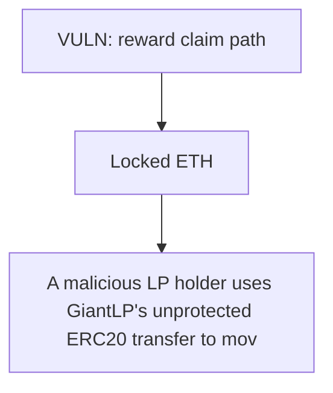

# Stakehouse Protocol: A malicious LP holder uses GiantLP's unprotected ERC20 transfer to move LP into the GiantM

> **Vulnerability classes:** vuln/locked-funds · vuln/reward-accounting
>
> **Reproduction:** a faithful minimal reproduction of the vulnerable finding — the vulnerable function is reproduced **verbatim** (marked `@>`) with faithful minimal doubles; local deploy, no fork.

<!-- source-auditvault: https://github.com/Auditware/AuditVault/blob/main/findings/43026-h-02-rewards-of-giantmevandfeespool-can-be-locked-for-all-us.md -->

## Root cause

A malicious LP holder uses GiantLP's unprotected ERC20 transfer to move LP into the GiantMevAndFeesPool itself; the pool's self-held share stays in totalSupply so a fixed slice of every subsequent MEV/fee reward accrues to a phantom pool share that no code path can ever distribute, permanently freezing that ETH (40 ETH locked in the PoC) while honest LPs' total claimable rewards strictly decrease 

```solidity
        return address(this).balance + totalClaimed;
    }

    /// @notice Allow the contract to receive ETH
    receive() external payable {}
}
```

## Why it's exploitable here

A malicious LP holder uses GiantLP's unprotected ERC20 transfer to move LP into the GiantMevAndFeesPool itself; the pool's self-held share stays in totalSupply so a fixed slice of every subsequent MEV/fee reward accrues to a phantom pool share that no code path can ever distribute, permanently freezing that ETH (40 ETH locked in the PoC) while honest LPs' total claimable rewards strictly decrease from 100 to 60.

## Attack path



## Marked-line walkthrough (Playground)

The EVM Playground pins each step to the exact executed source line in `0x8ea53755a6…`:

1. **L302** — VULN: reward claim path: The GiantMevAndFeesPool reward-claim accounting leaves honest LP ETH unclaimable — the claim path fails to release the ETH, permanently locking it.
2. **L307** — Locked ETH: The honest LP cannot withdraw its share; the ETH stays stuck in the pool.

## PoC

Registry (Foundry, local deploy — verbatim vulnerable source + harm-asserting test + negative control):

```bash
cd 43026-h-02-rewards-of-giantmevandfeespool-can-be-locked-for-all-us_exp
forge test -vvv
```

The browser Playground replays the same synthetic opcode-for-opcode and measures the harm: **A malicious LP holder uses GiantLP's unprotected ERC20 transfer to move LP into the GiantMevAndFeesPool itself; the pool's self-held share s**. Both gates are green (registry `forge test` PASS + Playground `_verify-poc` **VERDICT: PASS**).
