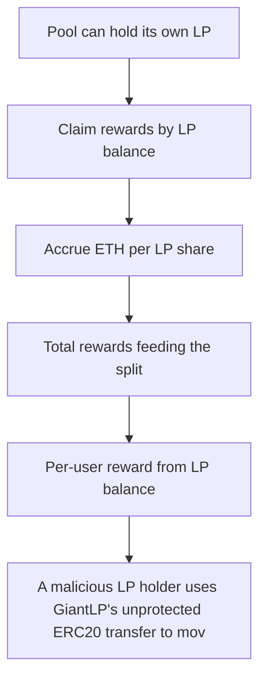

# Stakehouse Protocol: A malicious LP holder uses GiantLP's unprotected ERC20 transfer to move LP into the GiantM

> **Vulnerability classes:** vuln/locked-funds · vuln/reward-accounting
>
> **Reproduction:** a faithful minimal reproduction of the vulnerable finding — the vulnerable function is reproduced **verbatim** (marked `@>`) with faithful minimal doubles; local deploy, no fork.

<!-- source-auditvault: https://github.com/Auditware/AuditVault/blob/main/findings/43026-h-02-rewards-of-giantmevandfeespool-can-be-locked-for-all-us.md -->

## Root cause

A malicious LP holder uses GiantLP's unprotected ERC20 transfer to move LP into the GiantMevAndFeesPool itself; the pool's self-held share stays in totalSupply so a fixed slice of every subsequent MEV/fee reward accrues to a phantom pool share that no code path can ever distribute, permanently freezing that ETH (40 ETH locked in the PoC) while honest LPs' total claimable rewards strictly decrease 

```solidity
        return address(this).balance + totalClaimed;
    }

    /// @notice Allow the contract to receive ETH
    receive() external payable {}
}
```

## Why it's exploitable here

A malicious LP holder uses GiantLP's unprotected ERC20 transfer to move LP into the GiantMevAndFeesPool itself; the pool's self-held share stays in totalSupply so a fixed slice of every subsequent MEV/fee reward accrues to a phantom pool share that no code path can ever distribute, permanently freezing that ETH (40 ETH locked in the PoC) while honest LPs' total claimable rewards strictly decrease from 100 to 60.

## Attack path



## Marked-line walkthrough (Playground)

The EVM Playground pins each step to the exact executed source line in `0x8ea53755a6…`:

1. **L311** — Pool can hold its own LP: `GiantMevAndFeesPoolBase` splits MEV/fee rewards by LP balance — including any LP transferred to the pool's own address.
2. **L317** — Claim rewards by LP balance: `claimRewards` pays each holder pro-rata to their LP, but no code path ever claims for the pool's self-held share.
3. **L329** — Accrue ETH per LP share: `updateAccumulatedETHPerLP` spreads rewards across `totalSupply`, so the pool's self-held LP silently earns an undistributable slice.
4. **L364** — Total rewards feeding the split: `totalRewardsReceived` is the numerator divided across all LP — including the phantom self-held share that can never be paid out.
5. **L371** — Per-user reward from LP balance: Entitlement is `accumulatedETHPerLPShare * balanceOf(user)`; the pool's own balance yields a share with no owner, locking that ETH.
6. **L384** — Deploy the unprotected LP token: The pool deploys `GiantLP`, whose plain ERC20 `transfer` has no guard against sending LP to the pool's own address — the root enabler.
7. **L401** — Setup: LP token decimals: Setup: `GiantLP` fixes 18 decimals — boilerplate of the LP token whose missing transfer-guard enables the reward freeze.

## PoC

Registry (Foundry, local deploy — verbatim vulnerable source + harm-asserting test + negative control):

```bash
cd 43026-h-02-rewards-of-giantmevandfeespool-can-be-locked-for-all-us_exp
forge test -vvv
```

The browser Playground replays the same synthetic opcode-for-opcode and measures the harm: **A malicious LP holder uses GiantLP's unprotected ERC20 transfer to move LP into the GiantMevAndFeesPool itself; the pool's self-held share s**. Both gates are green (registry `forge test` PASS + Playground `_verify-poc` **VERDICT: PASS**).
