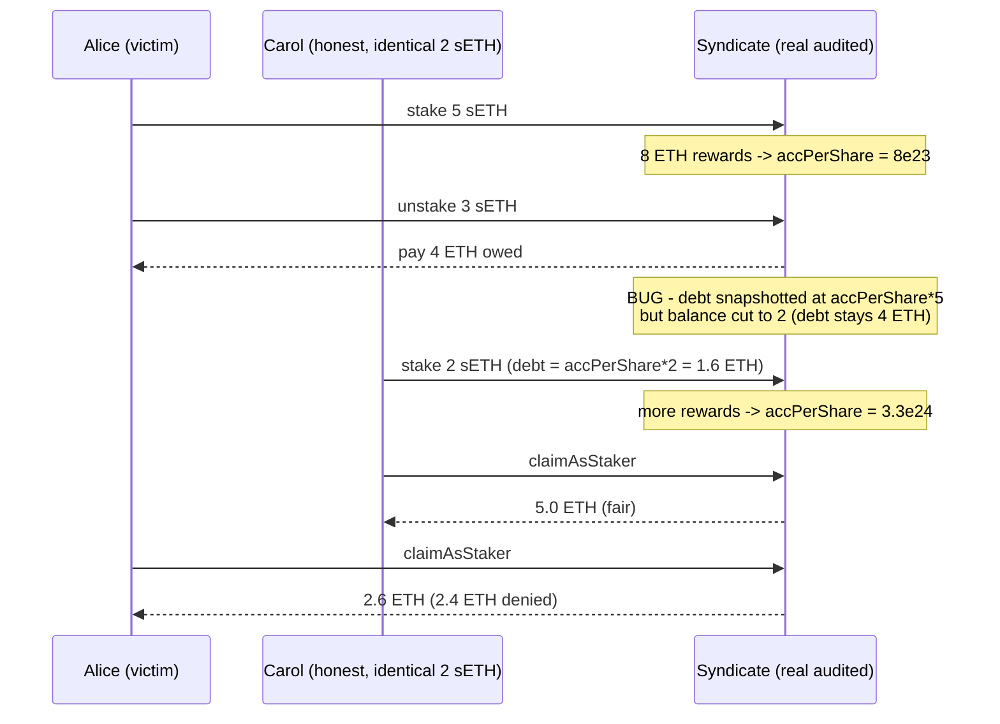

# Stakehouse `Syndicate.unstake` leaves the reward claim-debt snapshotted at the pre-unstake balance

> **Vulnerability classes:** vuln/wrong-condition · vuln/reward-accounting · vuln/direct-drain
>
> **Reproduction:** deploys the REAL audited `Syndicate.sol` (imported unmodified from the Code4rena snapshot) behind a thin getter-override harness — identical in spirit to the audited repo's own `SyndicateMock` — with the repo's own `MockStakeHouseUniverse` / `MockSlotRegistry` / `MockERC20` standing in for the external Stakehouse core. A staker deposits 5 sETH, partially unstakes 3, and is then paid **2.4 ETH less** than an identically-positioned honest staker over the same reward window.

<!-- source-auditvault: https://github.com/Auditware/AuditVault/blob/main/findings/43027-h-04-unstaking-does-not-update-the-mapping-sethuserclaimfork.md -->
<!-- date: 2022-11 -->

## Root cause

`Syndicate` uses the standard MasterChef-style reward-debt accounting:

```
unclaimed(user) = accumulatedETHPerFreeFloatingShare * sETHStakedBalanceForKnot[knot][user] / PRECISION
                  - sETHUserClaimForKnot[knot][user]
```

`sETHUserClaimForKnot` is the "already-credited" debt. It is re-snapshotted on
every stake/claim to `accPerShare * currentStakedBalance`.

In [`unstake`](src/syndicate/Syndicate.sol#L245-L280) the order of operations is:

1. `_claimAsStaker(...)` (line 257) pays out the ETH owed **and snapshots the
   debt at `accPerShare * the full pre-unstake balance`**.
2. `sETHStakedBalanceForKnot[knot][msg.sender] -= amount` (line 273) reduces the
   balance — **but `sETHUserClaimForKnot` is never recomputed for the smaller
   remaining balance.**

So after a partial unstake the debt is anchored to the *old, larger* balance
while the position is *smaller*. On every subsequent reward round the remaining
stake is under-credited by exactly `accPerShare_at_unstake * unstakedShares / PRECISION`.
When that stale debt exceeds the fresh entitlement, `calculateUnclaimedFreeFloatingETHShare`
underflows (Solidity 0.8 checked math) and the remaining position — plus its
future rewards — is permanently **frozen** (both `claimAsStaker` and `unstake`
revert).

The audited fix (finding H-04) is to add, after line 273:

```solidity
sETHUserClaimForKnot[_blsPubKey][msg.sender] =
    (accumulatedETHPerShare * sETHStakedBalanceForKnot[_blsPubKey][msg.sender]) / PRECISION;
```

Real source vendored at [`src/syndicate/Syndicate.sol`](src/syndicate/Syndicate.sol),
byte-identical (body lines 34-681) to commit
[`4b6828e9c807f2f7c569e6d721ca1289f7cf7112`](https://github.com/code-423n4/2022-11-stakehouse/blob/4b6828e9c807f2f7c569e6d721ca1289f7cf7112/contracts/syndicate/Syndicate.sol)
of `code-423n4/2022-11-stakehouse`. The external Stakehouse core is provided by
the real npm `@blockswaplab/stakehouse-solidity-api` (`StakehouseAPI`) plus the
audited repo's own `MockStakeHouseUniverse` / `MockSlotRegistry` / `MockERC20`.

## Exploit walkthrough (concrete numbers, `PRECISION = 1e24`)

Two stakers end up holding the **identical 2 sETH** position against the same
knot, over the same reward window — yet are paid unequally.

| Step | Action | Effect |
|------|--------|--------|
| 0 | Alice stakes **5 sETH** (accumulator 0) | `debt = 0`, `bal = 5` |
| 1 | **8 ETH** rewards arrive (free-floating half = 4 ETH) | `accPerShare = 8e23` |
| 1 | Alice unstakes **3 sETH** | paid 4 ETH; **stale `debt = accPerShare*5 = 4 ETH`**; `bal = 2` |
| 1b | Carol stakes a fresh **2 sETH** | correct `debt = accPerShare*2 = 1.6 ETH`; `bal = 2` |
| 2 | **more rewards** (pool balance → 24 ETH) | `accPerShare = 3.3e24` |
| 2 | Carol claims | `3.3e24*2/1e24 − 1.6 = ` **5.0 ETH** |
| 2 | Alice claims | `3.3e24*2/1e24 − 4.0 = ` **2.6 ETH** |

Both hold 2 sETH; a correct implementation pays them equally. Alice is shorted
by exactly `accPerShare_at_unstake * 3 shares / PRECISION = 8e23 * 3e18 / 1e24 =`
**2.4 ETH** — the rewards attributable to the 3 shares she already unstaked and
was already paid for. In the extreme (small next round) her remaining position
is frozen by underflow.



## Assertions proven

`testUnstakerIsShortedRelativeToHonestStaker`:
- Alice's stale `sETHUserClaimForKnot == 4 ETH` (should be 1.6 ETH) after unstaking to 2 sETH.
- Carol's correct `sETHUserClaimForKnot == 1.6 ETH`.
- Both hold `sETHStakedBalanceForKnot == 2 ETH` (identical position).
- Phase-2 real ETH paid: **Alice 2.6 ETH vs Carol 5.0 ETH** → **`carol − alice == 2.4 ETH`** shortfall.

`testStaleDebtBricksRemainingPosition`:
- After a partial unstake, `calculateUnclaimedFreeFloatingETHShare` **reverts** (underflow) for the victim.
- A fresh honest staker at the same accumulator is unaffected.
- The victim's follow-up `unstake` of the remaining 2 sETH also reverts — funds + rewards frozen.

## Reproduction

```bash
cd 43027-h-04-unstaking-does-not-update-the-mapping-sethuserclaimfork_exp
../_shared/run-poc/run_poc.sh 43027-h-04-unstaking-does-not-update-the-mapping-sethuserclaimfork_exp -vvvvv
```

Expected: `2 passed; 0 failed`. See [`output.txt`](output.txt) for the full trace.
