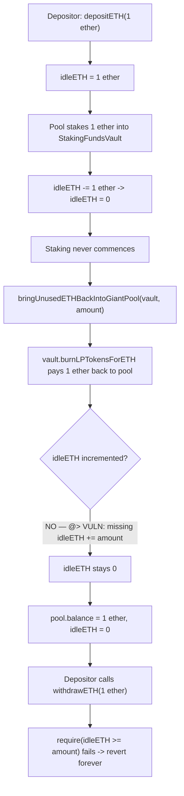
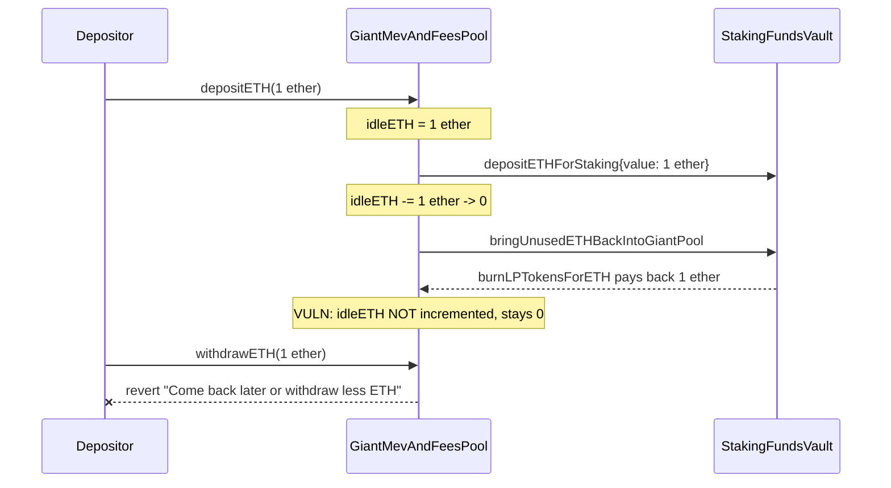

# Stakehouse Protocol — `bringUnusedETHBackIntoGiantPool` can cause stuck ether funds in the Giant Pool

> **Vulnerability classes:** vuln/accounting/missing-state-update · vuln/liveness/frozen-funds · vuln/logic/asymmetric-operations

> **Reproduction:** a self-contained Foundry PoC that compiles & runs in an
> isolated project with **only `forge-std`** — no fork, no RPC, no `anvil_state`.
> Full trace: [output.txt](output.txt). PoC:
> [test/43029-h-06-bringunusedethbackintogiantpool-can-cause-stuck-ether-f_exp.sol](test/43029-h-06-bringunusedethbackintogiantpool-can-cause-stuck-ether-f_exp.sol).

<!-- non-defihacklabs -->
<!-- source-auditvault: https://github.com/Auditware/AuditVault/blob/main/findings/43029-h-06-bringunusedethbackintogiantpool-can-cause-stuck-ether-f.md -->
<!-- date: 2022-11 -->

**AuditVault taxonomy:** `lang/solidity` · `sector/staking` · `platform/code4rena` · `has/github` · `has/poc` · `severity/high` · genome: `frozen-funds` · `locked-funds` · `integer-bounds` · `timestamp-dependence`

---

## Key info

| | |
|---|---|
| **Impact** | **HIGH** — ETH returned from a staking funds vault via `bringUnusedETHBackIntoGiantPool` is physically held by the Giant Pool but never accounted in `idleETH`, so it becomes permanently unwithdrawable |
| **Protocol** | [Stakehouse Protocol](https://code4rena.com/reports/2022-11-stakehouse) — `GiantMevAndFeesPool` / `GiantPoolBase` (liquid staking, "Giant Pool" aggregator) |
| **Vulnerable code** | `GiantMevAndFeesPool.bringUnusedETHBackIntoGiantPool` (contracts/liquid-staking/GiantMevAndFeesPool.sol#L126-L138) — never increments `idleETH` |
| **Bug class** | Missing state update: an asymmetric operation (stake decrements `idleETH`, bring-back should re-increment it, but doesn't) |
| **Finding** | Code4rena — Stakehouse Protocol, 2022-11 · #43029 (H-06) · reporter **koxuan** |
| **Report** | [2022-11-stakehouse](https://code4rena.com/reports/2022-11-stakehouse) |
| **Source** | [AuditVault](https://github.com/Auditware/AuditVault/blob/main/findings/43029-h-06-bringunusedethbackintogiantpool-can-cause-stuck-ether-f.md) |
| **Status** | Audit finding — confirmed by the Stakehouse team. Reproduced here as a standalone local PoC. |
| **Compiler** | `^0.8.24` (PoC); real code `^0.8.13` |

This is an **audit finding**, not a historical on-chain incident. The real
`GiantMevAndFeesPool` inherits `GiantPoolBase` (idle-ETH accounting) and
`SyndicateRewardsProcessor` (reward accounting, unrelated to this bug); the PoC
keeps the vulnerable `bringUnusedETHBackIntoGiantPool` body **verbatim** (the
loop body is the exact, unmodified call — the bug is what's *missing* after
it), alongside the real `depositETH`/`withdrawETH`/idle-ETH bookkeeping from
`GiantPoolBase`.

---

## TL;DR

1. A depositor supplies ETH to the Giant Pool via `depositETH`. `idleETH`
   tracks "ETH available for withdrawal or staking" and is incremented.
2. The pool stakes that ETH into a `StakingFundsVault` for a specific BLS key.
   `idleETH` is decremented (the ETH is no longer idle — it's deployed).
3. If staking never commences, the pool can pull the ETH back via
   `bringUnusedETHBackIntoGiantPool`, which calls the vault's
   `burnLPTokensForETH` — the vault pays the ETH straight back into the Giant
   Pool's own balance.
4. **Bug:** `bringUnusedETHBackIntoGiantPool` never re-increments `idleETH`.
   The ETH is physically back in the contract, but `idleETH` still reflects
   the lower, "staked" value.
5. HARM: `withdrawETH`'s only gate is `require(idleETH >= _amount, ...)`. The
   depositor's own ETH — sitting right there in the contract balance — is
   permanently unwithdrawable.

---

## The vulnerable code

The blamed function (verbatim, `GiantMevAndFeesPool.bringUnusedETHBackIntoGiantPool`):

```solidity
function bringUnusedETHBackIntoGiantPool(
    address[] calldata _stakingFundsVaults,
    LPToken[][] calldata _lpTokens,
    uint256[][] calldata _amounts
) external {
    uint256 numOfVaults = _stakingFundsVaults.length;
    require(numOfVaults > 0, "Empty arrays");
    require(numOfVaults == _lpTokens.length, "Inconsistent arrays");
    require(numOfVaults == _amounts.length, "Inconsistent arrays");
    for (uint256 i; i < numOfVaults; ++i) {
        StakingFundsVault(payable(_stakingFundsVaults[i])).burnLPTokensForETH(_lpTokens[i], _amounts[i]);
        // @> VULN: idleETH is NEVER incremented here or anywhere else in this function
    }
}
```

Contrast with the function that moves ETH the *other* direction
(`batchDepositETHForStaking`), which correctly updates the accounting:

```solidity
for (uint256 i; i < numOfVaults; ++i) {
    // As ETH is being deployed to a staking funds vault, it is no longer idle
    idleETH -= _ETHTransactionAmounts[i];
    ...
}
```

And the gate that makes the missing update fatal (`GiantPoolBase.withdrawETH`):

```solidity
function withdrawETH(uint256 _amount) external nonReentrant {
    require(_amount >= MIN_STAKING_AMOUNT, "Invalid amount");
    require(lpTokenETH.balanceOf(msg.sender) >= _amount, "Invalid balance");
    require(idleETH >= _amount, "Come back later or withdraw less ETH");
    idleETH -= _amount;
    lpTokenETH.burn(msg.sender, _amount);
    (bool success,) = msg.sender.call{value: _amount}("");
    require(success, "Failed to transfer ETH");
}
```

---

## Root cause

`idleETH` is meant to mirror "ETH available for withdrawal or re-staking."
Every operation that moves ETH out of the idle pool
(`batchDepositETHForStaking`) correctly decrements it. But the operation that
brings ETH back (`bringUnusedETHBackIntoGiantPool`) is **asymmetric** — it
performs the vault-side burn/payout but omits the corresponding `idleETH`
increment. Since nothing else in the contract ever increments `idleETH` except
a fresh `depositETH` call, the returned ETH is permanently excluded from the
only variable `withdrawETH` checks.

## Preconditions

- A depositor has ETH staked into a `StakingFundsVault` via the Giant Pool.
- Staking has not yet commenced for the underlying BLS key (so
  `burnLPTokensForETH`/`bringUnusedETHBackIntoGiantPool` is a legitimate,
  permissionless path — no attacker role required).

## Attack walkthrough

From [output.txt](output.txt):

1. A depositor supplies 1 ETH to the Giant Pool: `idleETH == 1 ether`.
2. The pool stakes the 1 ETH into a `StakingFundsVault`: `idleETH == 0`, the
   vault now holds the 1 ETH.
3. Staking never commences; `bringUnusedETHBackIntoGiantPool` is called. The
   vault burns the LP claim and pays the 1 ETH back — `address(pool).balance`
   returns to 1 ether.
4. **HARM:** `idleETH` is still `0`. The depositor calls `withdrawETH(1 ether)`
   and it reverts with `"Come back later or withdraw less ETH"` — forever,
   since nothing else can increment `idleETH` for that ETH. A control test
   confirms a depositor who never stakes (no round-trip) withdraws normally,
   isolating the missing increment in `bringUnusedETHBackIntoGiantPool` as the
   defect.

## Impact

Any ETH that is staked and then legitimately brought back (the normal path
when a BLS key's staking is cancelled or delayed) becomes **permanently
frozen** in the Giant Pool. This is not an edge case requiring an attacker —
it is the intended, permissionless "bring funds back" flow itself that bricks
withdrawal. The original report also notes the same missing-update pattern
exists in `GiantSavETHVaultPool`.

## Diagrams





## Remediation

Per the report: update `idleETH` inside `bringUnusedETHBackIntoGiantPool`.

```diff
 for (uint256 i; i < numOfVaults; ++i) {
+    uint256 balanceBefore = address(this).balance;
     StakingFundsVault(payable(_stakingFundsVaults[i])).burnLPTokensForETH(_lpTokens[i], _amounts[i]);
+    idleETH += address(this).balance - balanceBefore;
 }
```

## How to reproduce

```bash
cd ~/RustroverProjects/audits/evm-hack-registry/43029-h-06-bringunusedethbackintogiantpool-can-cause-stuck-ether-f_exp
forge test -vvv
# Fully local — no fork, no RPC, no anvil_state required.
# Expected: all three tests PASS:
#   test_exploit                          (self-contained Exploit: deposit -> stake -> bring-back -> stuck)
#   test_stuckFundsStandalone             (EOA rebuild mirroring the finding's PoC shape)
#   test_control_withdrawWorksBeforeStaking (control: no round-trip -> withdrawal works normally)
```

PoC source: [test/43029-h-06-bringunusedethbackintogiantpool-can-cause-stuck-ether-f_exp.sol](test/43029-h-06-bringunusedethbackintogiantpool-can-cause-stuck-ether-f_exp.sol)
— the verbatim vulnerable `bringUnusedETHBackIntoGiantPool` loop body inside a
faithful reduction of `GiantPoolBase`, plus the deposit/stake/bring-back
orchestration and a control test.

> Note: `StakingFundsVault` here is reduced to only what the Giant Pool needs
> (accept ETH for a BLS key, burn a claim back for ETH) — the real contract's
> knot lifecycle gating and per-BLS-key LP tokens are stubbed/simplified
> because they do not affect the bug. The blamed function body and the
> `idleETH` accounting model are faithful to the finding.

---

*Reference: finding **#43029 (H-06)** by **koxuan** in the [Code4rena Stakehouse Protocol review (Nov 2022)](https://code4rena.com/reports/2022-11-stakehouse) · curated by [AuditVault](https://github.com/Auditware/AuditVault/blob/main/findings/43029-h-06-bringunusedethbackintogiantpool-can-cause-stuck-ether-f.md)*
