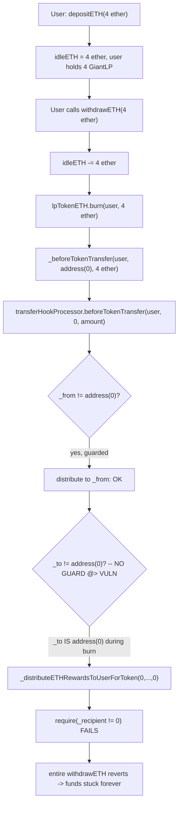
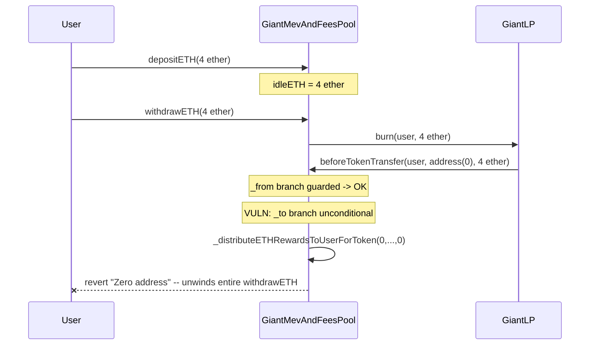

# Stakehouse Protocol — GiantLP with a `transferHookProcessor` can't be burned, users' funds stuck in the Giant Pool

> **Vulnerability classes:** vuln/logic/missing-guard-clause · vuln/liveness/frozen-funds · vuln/logic/asymmetric-branches

> **Reproduction:** a self-contained Foundry PoC that compiles & runs in an
> isolated project with **only `forge-std`** — no fork, no RPC, no `anvil_state`.
> Full trace: [output.txt](output.txt). PoC:
> [test/43030-h-07-giantlp-with-a-transferhookprocessor-cant-be-burned-use_exp.sol](test/43030-h-07-giantlp-with-a-transferhookprocessor-cant-be-burned-use_exp.sol).

<!-- non-defihacklabs -->
<!-- source-auditvault: https://github.com/Auditware/AuditVault/blob/main/findings/43030-h-07-giantlp-with-a-transferhookprocessor-cant-be-burned-use.md -->
<!-- date: 2022-11 -->

**AuditVault taxonomy:** `lang/solidity` · `sector/staking` · `sector/token` · `platform/code4rena` · `has/github` · `has/poc` · `severity/high` · `precondition/specific-token-type` · genome: `frozen-funds` · `locked-funds` · `specific-token-type` · `reward-accounting`

---

## Key info

| | |
|---|---|
| **Impact** | **HIGH** — any Giant Pool that sets a `transferHookProcessor` (e.g. `GiantMevAndFeesPool` itself) can never have its own `GiantLP` burned, so `withdrawETH` permanently reverts for every depositor |
| **Protocol** | [Stakehouse Protocol](https://code4rena.com/reports/2022-11-stakehouse) — `GiantLP` / `GiantMevAndFeesPool` (liquid staking, "Giant Pool" aggregator) |
| **Vulnerable code** | `GiantMevAndFeesPool.beforeTokenTransfer` (contracts/liquid-staking/GiantMevAndFeesPool.sol#L73-L78) — the `_to` branch is missing the `_to != address(0)` guard that the `_from` branch has |
| **Bug class** | Missing guard clause / asymmetric branch handling: a symmetric pair of checks (`_from` vs `_to`) is implemented for only one side |
| **Finding** | Code4rena — Stakehouse Protocol, 2022-11 · #43030 (H-07) · reporter **Trust** |
| **Report** | [2022-11-stakehouse](https://code4rena.com/reports/2022-11-stakehouse) |
| **Source** | [AuditVault](https://github.com/Auditware/AuditVault/blob/main/findings/43030-h-07-giantlp-with-a-transferhookprocessor-cant-be-burned-use.md) |
| **Status** | Audit finding — confirmed as a duplicate of #60 by the Stakehouse team. Reproduced here as a standalone local PoC. |
| **Compiler** | `^0.8.24` (PoC); real code `^0.8.13` |

This is an **audit finding**, not a historical on-chain incident. The real
`GiantLP` is an `ERC20`-derived token whose `_beforeTokenTransfer` forwards to
an optional `transferHookProcessor`; the PoC keeps `GiantLP`'s hook-calling
logic and `GiantMevAndFeesPool.beforeTokenTransfer`'s branch structure
**verbatim**, alongside a faithful reduction of the reward-accounting base
(`SyndicateRewardsProcessor`) whose zero-address check is the actual trigger.

---

## TL;DR

1. `GiantLP` calls `transferHookProcessor.beforeTokenTransfer(_from, _to, amount)`
   on every mint/burn/transfer whenever a hook processor is set.
2. `GiantMevAndFeesPool` (which sets itself as its own `GiantLP`'s hook
   processor) implements `beforeTokenTransfer` with a guard on the `_from`
   side — `if (_from != address(0)) { _distributeETHRewardsToUserForToken(...) }`
   — but calls the exact same function for `_to` **unconditionally**.
3. A `burn` (as `ERC20._burn` always does) calls the hook with `_to == address(0)`.
4. The unconditional call for `_to` hits `_distributeETHRewardsToUserForToken`'s
   first line: `require(_recipient != address(0), "Zero address")` — which
   reverts.
5. `withdrawETH` (the ONLY way to redeem `GiantLP` for ETH) always burns
   `GiantLP`, so it **always** hits this revert. Deposited ETH becomes
   permanently unwithdrawable the moment this hook processor is in place.

---

## The vulnerable code

The blamed branch (verbatim, `GiantMevAndFeesPool.beforeTokenTransfer`):

```solidity
function beforeTokenTransfer(address _from, address _to, uint256) external {
    require(msg.sender == address(lpTokenETH), "Caller is not giant LP");
    updateAccumulatedETHPerLP();

    // Make sure that `_from` gets total accrued before transfer as post transferred anything owed will be wiped
    if (_from != address(0)) {
        _distributeETHRewardsToUserForToken(_from, address(lpTokenETH), lpTokenETH.balanceOf(_from), _from);
    }

    // Make sure that `_to` gets total accrued before transfer as post transferred anything owed will be wiped
    _distributeETHRewardsToUserForToken(_to, address(lpTokenETH), lpTokenETH.balanceOf(_to), _to); // @> VULN: no `_to != address(0)` guard
}
```

The trigger it reaches on any burn (`SyndicateRewardsProcessor._distributeETHRewardsToUserForToken`):

```solidity
function _distributeETHRewardsToUserForToken(address _user, address _token, uint256 _balance, address _recipient) internal {
    require(_recipient != address(0), "Zero address"); // reached with _recipient == address(0) during a burn
    ...
}
```

And the caller that always burns (`GiantPoolBase.withdrawETH`):

```solidity
function withdrawETH(uint256 _amount) external nonReentrant {
    ...
    lpTokenETH.burn(msg.sender, _amount); // ERC20._burn -> _beforeTokenTransfer(from, address(0), amount)
    ...
}
```

---

## Root cause

`beforeTokenTransfer` treats `_from == address(0)` (a mint) as a case to skip,
but never treats `_to == address(0)` (a burn) the same way. The two checks are
supposed to be symmetric — both `_from` and `_to` can legitimately be
`address(0)` (mint vs burn) — but only one side got the guard. Because
`_distributeETHRewardsToUserForToken`'s very first statement is an unconditional
zero-address `require`, the missing guard turns every burn into a guaranteed
revert.

## Preconditions

- The `GiantLP`'s `transferHookProcessor` is set to a contract with this
  `beforeTokenTransfer` shape — true for `GiantMevAndFeesPool`, which wires
  itself as its own hook processor in its constructor.
- No attacker action required: this fires for **any** ordinary depositor
  calling the pool's own `withdrawETH`.

## Attack walkthrough

From [output.txt](output.txt):

1. A user deposits 4 ETH into the Giant Pool: `idleETH == 4 ether`, the user
   holds 4 `GiantLP`.
2. The user calls `withdrawETH(4 ether)`. It decrements `idleETH`, then calls
   `lpTokenETH.burn(user, 4 ether)`.
3. `burn` triggers `_beforeTokenTransfer(user, address(0), 4 ether)` →
   `transferHookProcessor.beforeTokenTransfer(user, address(0), 4 ether)`.
4. The `_from` branch (guarded) runs fine. **HARM:** the unconditional `_to`
   branch calls `_distributeETHRewardsToUserForToken(address(0), ..., address(0))`,
   which reverts with `"Zero address"` — unwinding the entire `withdrawETH`
   call.
5. The user's 4 ETH remains fully idle and un-withdrawable: `idleETH` is
   unchanged and the user still holds their full `GiantLP` balance. A control
   test confirms a plain mint to a real (non-zero) recipient does not revert,
   isolating the missing `_to != address(0)` guard as the defect.

## Impact

Every depositor of a Giant Pool that sets this style of hook processor
(`GiantMevAndFeesPool` sets itself) is **permanently unable to withdraw** —
this is not a rare edge case, it is the *only* redemption path, broken for
100% of users the moment the pool is deployed with the hook wired up. The
report notes this bug also blocks the related theft-of-rewards finding's own
PoC from running (see H-08, `43031`), because withdrawal itself cannot
complete on the unpatched contract.

## Diagrams





## Remediation

Per the report: skip reward distribution for the zero address, mirroring the
existing `_from` guard.

```diff
-        _distributeETHRewardsToUserForToken(
-            _to,
-            address(lpTokenETH),
-            lpTokenETH.balanceOf(_to),
-            _to
-        );
+        if (_to != address(0)) {
+            _distributeETHRewardsToUserForToken(
+                _to,
+                address(lpTokenETH),
+                lpTokenETH.balanceOf(_to),
+                _to
+            );
+        }
```

## How to reproduce

```bash
cd ~/RustroverProjects/audits/evm-hack-registry/43030-h-07-giantlp-with-a-transferhookprocessor-cant-be-burned-use_exp
forge test -vvv
# Fully local — no fork, no RPC, no anvil_state required.
# Expected: all three tests PASS:
#   test_exploit                  (self-contained Exploit: deposit -> withdraw reverts forever)
#   test_withdrawAlwaysReverts    (EOA rebuild mirroring the finding's own PoC shape)
#   test_control_transferWorks    (control: a non-burn mint to a real recipient succeeds)
```

PoC source: [test/43030-h-07-giantlp-with-a-transferhookprocessor-cant-be-burned-use_exp.sol](test/43030-h-07-giantlp-with-a-transferhookprocessor-cant-be-burned-use_exp.sol)
— the verbatim vulnerable `beforeTokenTransfer` branch structure inside a
faithful reduction of `GiantLP` + `GiantMevAndFeesPool` +
`SyndicateRewardsProcessor`, plus the deposit/withdraw orchestration and a
control test.

> Note: `SyndicateRewardsProcessor`'s reward-accrual math (`accumulatedETHPerLPShare`,
> `claimed`) is kept faithful because it is what feeds the unconditional
> `_distributeETHRewardsToUserForToken` call that actually reverts — it is not
> simplified away. The blamed branch structure and the zero-address trigger
> are faithful to the finding.

---

*Reference: finding **#43030 (H-07)** by **Trust** in the [Code4rena Stakehouse Protocol review (Nov 2022)](https://code4rena.com/reports/2022-11-stakehouse) · curated by [AuditVault](https://github.com/Auditware/AuditVault/blob/main/findings/43030-h-07-giantlp-with-a-transferhookprocessor-cant-be-burned-use.md)*
