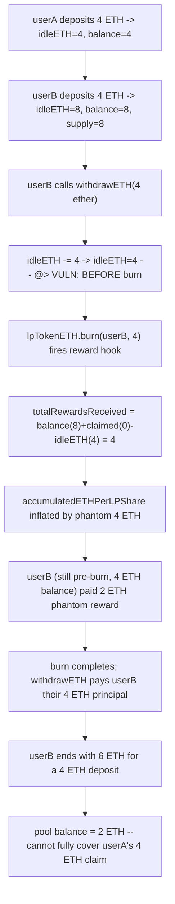
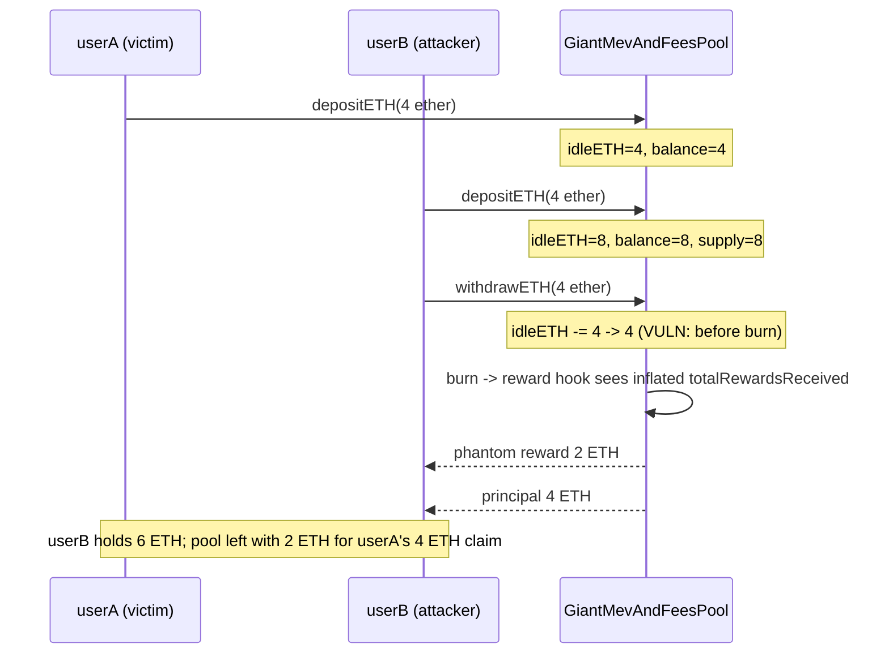

# Stakehouse Protocol — `withdrawETH` from `GiantMevAndFeesPool` can steal most of the ETH because `idleETH` is reduced before burning the LP token

> **Vulnerability classes:** vuln/logic/wrong-condition · vuln/accounting/reward-inflation · vuln/logic/instruction-ordering

> **Reproduction:** a self-contained Foundry PoC that compiles & runs in an
> isolated project with **only `forge-std`** — no fork, no RPC, no `anvil_state`.
> Full trace: [output.txt](output.txt). PoC:
> [test/43031-h-08-function-withdraweth-from-giantmevandfeespool-can-steal_exp.sol](test/43031-h-08-function-withdraweth-from-giantmevandfeespool-can-steal_exp.sol).

<!-- non-defihacklabs -->
<!-- source-auditvault: https://github.com/Auditware/AuditVault/blob/main/findings/43031-h-08-function-withdraweth-from-giantmevandfeespool-can-steal.md -->
<!-- date: 2022-11 -->

**AuditVault taxonomy:** `lang/solidity` · `sector/farm` · `sector/liquid-staking` · `sector/options` · `sector/staking` · `sector/staking-pool` · `platform/code4rena` · `has/github` · `has/poc` · `severity/high` · `novelty/variant` · genome: `wrong-condition` · `locked-funds` · `variant` · `reward-accounting` · `frontrun-exposure`

---

## Key info

| | |
|---|---|
| **Impact** | **HIGH** — any single `withdrawETH` call extracts a phantom reward on top of the withdrawer's own principal, funded from other depositors' still-locked share of the pool |
| **Protocol** | [Stakehouse Protocol](https://code4rena.com/reports/2022-11-stakehouse) — `GiantMevAndFeesPool` / `GiantPoolBase` (liquid staking, "Giant Pool" aggregator) |
| **Vulnerable code** | `GiantPoolBase.withdrawETH` (contracts/liquid-staking/GiantPoolBase.sol#L57-L60) — `idleETH -= _amount` runs BEFORE `lpTokenETH.burn(...)` |
| **Bug class** | Wrong instruction order: an accounting decrement runs before the hook whose formula depends on it |
| **Finding** | Code4rena — Stakehouse Protocol, 2022-11 · #43031 (H-08) · reporter **cccz** |
| **Report** | [2022-11-stakehouse](https://code4rena.com/reports/2022-11-stakehouse) |
| **Source** | [AuditVault](https://github.com/Auditware/AuditVault/blob/main/findings/43031-h-08-function-withdraweth-from-giantmevandfeespool-can-steal.md) |
| **Status** | Audit finding — confirmed by the Stakehouse team. Reproduced here as a standalone local PoC. |
| **Compiler** | `^0.8.24` (PoC); real code `^0.8.13` |

This is an **audit finding**, not a historical on-chain incident. The real
`GiantMevAndFeesPool` inherits `GiantPoolBase` (idle-ETH accounting) and
`SyndicateRewardsProcessor` (reward accrual); the PoC keeps the vulnerable
`withdrawETH` body **verbatim** — including the exact line ORDER that causes
the bug — plus a faithful reduction of the reward-accrual math that turns that
ordering into a real ETH extraction.

The report's own PoC first has to work around a **separate, already-reported**
bug (`#43030`/H-07 — GiantLP with a `transferHookProcessor` can't be burned) by
patching `beforeTokenTransfer`'s `_to` branch with a zero-address guard: *"You
should fix it first... it's a bug needed to be fixed and it's independent of
the current vulnerability."* This synthetic applies the same pre-fix so H-08
can be demonstrated in isolation, exactly as the reporter did.

---

## TL;DR

1. `GiantPoolBase.withdrawETH` does, in this exact order:
   `idleETH -= _amount;` then `lpTokenETH.burn(msg.sender, _amount);` then a
   plain ETH transfer of `_amount` to `msg.sender`.
2. Burning triggers `GiantLP`'s transfer hook, which calls
   `updateAccumulatedETHPerLP()` — and `GiantMevAndFeesPool` overrides
   `totalRewardsReceived()` as `balance + totalClaimed - idleETH`.
3. Because `idleETH` was **already** decremented by `_amount` before this
   formula runs, it reports `_amount` MORE "rewards received" than actually
   arrived — a phantom reward.
4. That phantom reward is distributed to the withdrawer's own (still
   pre-burn) LP balance in the very same call, funded straight out of the
   pool's real ETH balance — i.e., out of the OTHER depositors' still-locked
   principal.
5. `withdrawETH` then pays the withdrawer their real principal too. Net
   result: a single, ordinary withdrawal call extracts principal **plus** a
   phantom reward equal to the withdrawn amount, shared proportionally by LP
   holders — in the two-depositor PoC, exactly half the withdrawn amount is
   stolen from the other depositor.

---

## The vulnerable code

The blamed function (verbatim, `GiantPoolBase.withdrawETH`):

```solidity
function withdrawETH(uint256 _amount) external nonReentrant {
    require(_amount >= MIN_STAKING_AMOUNT, "Invalid amount");
    require(lpTokenETH.balanceOf(msg.sender) >= _amount, "Invalid balance");
    require(idleETH >= _amount, "Come back later or withdraw less ETH");

    idleETH -= _amount; // @> VULN: runs BEFORE the burn below
    lpTokenETH.burn(msg.sender, _amount);
    (bool success,) = msg.sender.call{value: _amount}("");
    require(success, "Failed to transfer ETH");
}
```

The override whose formula this ordering corrupts (`GiantMevAndFeesPool.totalRewardsReceived`):

```solidity
function totalRewardsReceived() public view override returns (uint256) {
    return address(this).balance + totalClaimed - idleETH;
}
```

---

## Root cause

`totalRewardsReceived()` is meant to answer "how much ETH has this contract
received from MEV/fees, excluding depositors' idle principal?" It computes
that by subtracting `idleETH` from the contract's balance. But `withdrawETH`
decrements `idleETH` for the FULL withdrawal amount **before** the burn's
reward-accrual hook (`updateAccumulatedETHPerLP`) reads
`totalRewardsReceived()`. For that one call, the formula sees a balance that
still includes the withdrawn ETH, but an `idleETH` that no longer accounts for
it — the difference (`_amount`) is misread as a freshly-arrived reward and
distributed to whoever is withdrawing, using their pre-burn LP balance.

## Preconditions

- At least one other LP holder shares the pool (their share of the phantom
  reward is what actually gets stolen — see the lone-depositor control test,
  where the pool simply can't cover the double-payment and the whole
  transaction reverts instead of anyone profiting).
- No special role or timing is required: `withdrawETH` is the pool's own
  permissionless redemption function, called exactly as intended.

## Attack walkthrough

From [output.txt](output.txt):

1. `userA` deposits 4 ETH. `idleETH = 4 ether`, pool balance `4 ether`.
2. `userB` deposits 4 ETH. `idleETH = 8 ether`, pool balance `8 ether`, total
   LP supply `8 ether`.
3. `userB` calls `withdrawETH(4 ether)` — redeeming only their own principal,
   nothing more.
4. `idleETH` drops to `4 ether` **before** `lpTokenETH.burn` fires the reward
   hook. `totalRewardsReceived()` reports `4 ether` as a phantom reward;
   `accumulatedETHPerLPShare` is inflated accordingly and `userB` is paid
   `2 ether` against their still-pre-burn 4 ETH balance (half of the 8 ETH
   total supply's inflated share).
5. **HARM:** `userB` ends the call holding `6 ETH` for a `4 ETH` deposit — a
   `2 ETH` profit extracted from a single ordinary withdrawal, paid for by
   `userA`'s now-under-collateralized 4 ETH claim (the pool's real balance
   drops to `2 ETH`). A control test with the recommended fix applied shows
   the same two-depositor scenario settles fairly (`userB` gets back exactly
   their `4 ETH`, the pool retains the full `4 ETH` backing `userA`'s claim).

## Impact

Any depositor can extract more ETH than they put in on their very first
withdrawal, at the expense of every other LP holder in the same Giant Pool —
no special conditions, front-running, or repeated calls required. Left
unpatched, whichever depositor withdraws first captures a share of everyone
else's principal; the last depositor(s) to withdraw may find the pool unable
to fully honor their claim.

## Diagrams





## Remediation

Per the report: move `idleETH -= _amount` to AFTER `lpTokenETH.burn(...)`.

```diff
 function withdrawETH(uint256 _amount) external nonReentrant {
     require(_amount >= MIN_STAKING_AMOUNT, "Invalid amount");
     require(lpTokenETH.balanceOf(msg.sender) >= _amount, "Invalid balance");
     require(idleETH >= _amount, "Come back later or withdraw less ETH");

-    idleETH -= _amount;
     lpTokenETH.burn(msg.sender, _amount);
+    idleETH -= _amount;
     (bool success,) = msg.sender.call{value: _amount}("");
     require(success, "Failed to transfer ETH");
 }
```

## How to reproduce

```bash
cd ~/RustroverProjects/audits/evm-hack-registry/43031-h-08-function-withdraweth-from-giantmevandfeespool-can-steal_exp
forge test -vvv
# Fully local — no fork, no RPC, no anvil_state required.
# Expected: all three tests PASS:
#   test_exploit                          (self-contained Exploit: 2 depositors, 1 withdrawal, phantom reward)
#   test_stealFromOtherDepositor          (EOA rebuild mirroring the finding's own PoC shape)
#   test_control_fixedOrderWithdrawIsFair (control: with the fix applied, withdrawal is fair)
```

PoC source: [test/43031-h-08-function-withdraweth-from-giantmevandfeespool-can-steal_exp.sol](test/43031-h-08-function-withdraweth-from-giantmevandfeespool-can-steal_exp.sol)
— the verbatim vulnerable `withdrawETH` line order inside a faithful reduction
of `GiantPoolBase` + `GiantMevAndFeesPool` + `SyndicateRewardsProcessor`, plus
the two-depositor orchestration and a control test using a fixed-order
variant.

> Note: `beforeTokenTransfer` here guards BOTH the `_from` and `_to` branches
> (the real contract is missing the `_to` guard — a separate, already-reported
> bug, `#43030`/H-07). This mirrors the reporter's own pre-fix so H-08 can be
> demonstrated cleanly, without the two findings entangling. The blamed
> `withdrawETH` line order and the `totalRewardsReceived` formula are faithful
> to the finding.

---

*Reference: finding **#43031 (H-08)** by **cccz** in the [Code4rena Stakehouse Protocol review (Nov 2022)](https://code4rena.com/reports/2022-11-stakehouse) · curated by [AuditVault](https://github.com/Auditware/AuditVault/blob/main/findings/43031-h-08-function-withdraweth-from-giantmevandfeespool-can-steal.md)*
