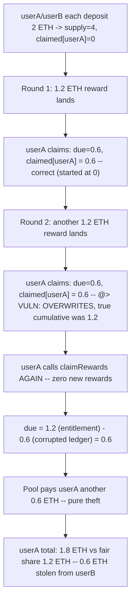
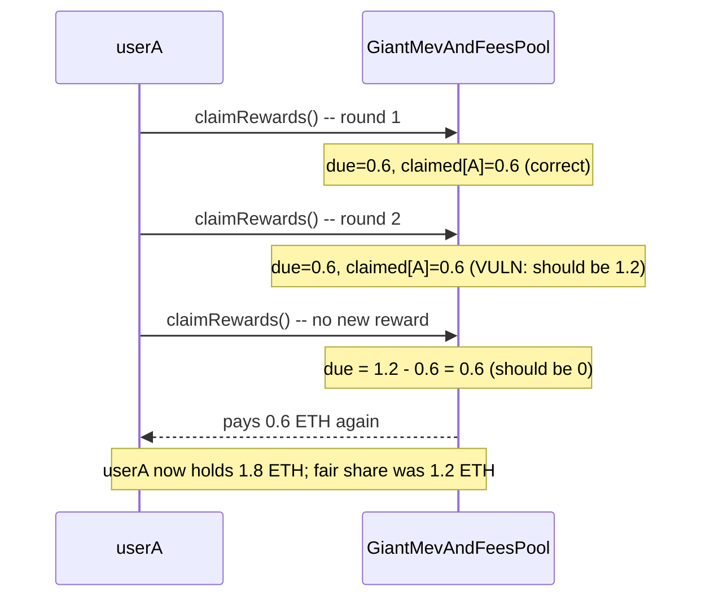

# Stakehouse Protocol — incorrect accounting in `SyndicateRewardsProcessor` lets any LP holder steal others' ETH from the fees and MEV vault

> **Vulnerability classes:** vuln/accounting/ledger-overwrite · vuln/logic/reward-calculation · vuln/logic/direct-drain

> **Reproduction:** a self-contained Foundry PoC that compiles & runs in an
> isolated project with **only `forge-std`** — no fork, no RPC, no `anvil_state`.
> Full trace: [output.txt](output.txt). PoC:
> [test/43032-h-09-incorrect-accounting-in-syndicaterewardsprocessor-resul_exp.sol](test/43032-h-09-incorrect-accounting-in-syndicaterewardsprocessor-resul_exp.sol).

<!-- non-defihacklabs -->
<!-- source-auditvault: https://github.com/Auditware/AuditVault/blob/main/findings/43032-h-09-incorrect-accounting-in-syndicaterewardsprocessor-resul.md -->
<!-- date: 2022-11 -->

**AuditVault taxonomy:** `lang/solidity` · `sector/farm` · `sector/staking` · `platform/code4rena` · `has/github` · `has/poc` · `severity/high` · `novelty/variant` · genome: `reward-calculation` · `direct-drain` · `variant` · `frontrun-exposure` · `reward-accounting` · `timestamp-dependence`

---

## Key info

| | |
|---|---|
| **Impact** | **HIGH** — any LP token holder can repeatedly call `claimRewards` to re-extract ETH they already claimed, draining the fees/MEV vault at the expense of holders who haven't claimed yet |
| **Protocol** | [Stakehouse Protocol](https://code4rena.com/reports/2022-11-stakehouse) — `SyndicateRewardsProcessor` / `StakingFundsVault` / `GiantMevAndFeesPool` (liquid staking reward accrual) |
| **Vulnerable code** | `SyndicateRewardsProcessor._distributeETHRewardsToUserForToken` (contracts/liquid-staking/SyndicateRewardsProcessor.sol#L63) — `claimed[_user][_token] = due;` instead of `+= due` |
| **Bug class** | Ledger overwrite: an accumulator is assigned instead of incremented |
| **Finding** | Code4rena — Stakehouse Protocol, 2022-11 · #43032 (H-09) · reporter **Trust** |
| **Report** | [2022-11-stakehouse](https://code4rena.com/reports/2022-11-stakehouse) |
| **Source** | [AuditVault](https://github.com/Auditware/AuditVault/blob/main/findings/43032-h-09-incorrect-accounting-in-syndicaterewardsprocessor-resul.md) |
| **Status** | Audit finding — confirmed by the Stakehouse team. Reproduced here as a standalone local PoC. |
| **Compiler** | `^0.8.24` (PoC); real code `^0.8.13` (Cyfrin/AuditVault also cite the same function at L63 in commit `4b6828e`) |

This is an **audit finding**, not a historical on-chain incident. The real
`_distributeETHRewardsToUserForToken` is called from both
`GiantMevAndFeesPool.claimRewards` and `StakingFundsVault.claimRewards`; the
PoC keeps the vulnerable body **verbatim** inside a faithful reduction of
`GiantMevAndFeesPool` (the nested `StakingFundsVault[]` loop the real
`claimRewards` performs first is omitted — it does not affect this bug, which
lives entirely in the final distribute call).

---

## TL;DR

1. `_distributeETHRewardsToUserForToken` computes
   `due = (accumulatedETHPerLPShare * balance / PRECISION) - claimed[_user][_token]`
   — the user's total accrued entitlement minus what they've already claimed.
2. It then does `claimed[_user][_token] = due;` — **setting** the ledger to
   the amount it JUST paid, instead of **adding** to the running total.
3. A user's very FIRST claim happens to look correct, because
   `claimed[_user][_token]` starts at `0` — `=` and `+=` agree when the prior
   value is zero.
4. But a user's **second** legitimate claim already corrupts the ledger:
   `claimed[]` is overwritten with just that round's `due`, discarding the
   record of the first round's payout.
5. From then on, calling `claimRewards` again — even with **zero** new
   rewards — recomputes the same (now under-recorded) `due` and pays it out
   **again**. Repeating the call drains the vault at the expense of any LP
   holder who hasn't claimed yet.

---

## The vulnerable code

The blamed line (verbatim, `SyndicateRewardsProcessor._distributeETHRewardsToUserForToken`):

```solidity
function _distributeETHRewardsToUserForToken(
    address _user,
    address _token,
    uint256 _balance,
    address _recipient
) internal {
    require(_recipient != address(0), "Zero address");
    uint256 balance = _balance;
    if (balance > 0) {
        // Calculate how much ETH rewards the address is owed / due
        uint256 due = ((accumulatedETHPerLPShare * balance) / PRECISION) - claimed[_user][_token];
        if (due > 0) {
            claimed[_user][_token] = due; // @> VULN: should be `+= due`
            totalClaimed += due;
            (bool success, ) = _recipient.call{value: due}("");
            require(success, "Failed to transfer");
        }
    }
}
```

---

## Root cause

`claimed[_user][_token]` is meant to be a running total: "how much has this
user claimed for this token, ever?" Every subsequent `due` computation
subtracts it from the user's total lifetime entitlement to find what's newly
owed. But the assignment `claimed[_user][_token] = due` replaces the running
total with just the latest increment. After the second claim, the ledger no
longer reflects reality — it understates the user's true cumulative claim by
everything paid before the most recent round — so every future `due`
computation over-pays.

## Preconditions

- The user has claimed rewards **at least twice** (the second claim is where
  the corruption first has an effect; the first claim always coincidentally
  looks correct because `claimed[]` starts at zero — see the control test).
- No special role or timing required: `claimRewards` is the vault's own
  permissionless reward-claim function, called exactly as intended.

## Attack walkthrough

From [output.txt](output.txt):

1. `userA` and `userB` each deposit 2 ETH (`idleETH = 4 ether`, LP supply
   `4 ether`, `claimed[userA] = claimed[userB] = 0`).
2. Reward round 1: 1.2 ETH lands in the vault. `userA` claims — correctly
   receives `0.6 ether` (half of `1.2 ether`, since `userA` holds half the LP
   supply). `claimed[userA]` is set to `0.6 ether`, which happens to be
   correct (started at `0`).
3. Reward round 2: another 1.2 ETH lands. `userA` claims again — correctly
   receives another `0.6 ether`. **But** `claimed[userA]` is now SET to
   `0.6 ether` again (the delta for round 2), discarding the true cumulative
   total of `1.2 ether`.
4. **HARM:** `userA` calls `claimRewards` a **third** time, with **zero** new
   rewards since round 2. The formula still sees a `0.6 ether` gap it thinks
   is unpaid (`1.2 ether` total entitlement minus the corrupted `0.6 ether`
   ledger) and pays it out — again.
5. `userA` ends with `1.8 ether` total claimed, versus a fair share of
   `1.2 ether` (half of the `2.4 ether` the pool has ever recorded in
   rewards) — `0.6 ether` more than they are owed, taken from `userB`'s
   still-unclaimed share. A control test confirms a **lone** holder's second
   claim (with no intervening reward) correctly pays zero — the bug requires
   at least two real reward rounds to manifest.

## Impact

Any LP holder who claims rewards more than once can simply call
`claimRewards` extra times with no new rewards and keep getting paid — a
direct, repeatable drain of the shared vault. Because the payout comes
straight out of the contract's ETH balance, this can fully deplete funds
other depositors are entitled to, and (per the report) can even leave later
legitimate claims unable to complete once the vault runs dry.

## Diagrams





## Remediation

Per the report: accumulate the ledger instead of overwriting it.

```diff
 uint256 due = ((accumulatedETHPerLPShare * balance) / PRECISION) - claimed[_user][_token];
 if (due > 0) {
-    claimed[_user][_token] = due;
+    claimed[_user][_token] += due;

     totalClaimed += due;
     (bool success, ) = _recipient.call{value: due}("");
     require(success, "Failed to transfer");
 }
```

## How to reproduce

```bash
cd ~/RustroverProjects/audits/evm-hack-registry/43032-h-09-incorrect-accounting-in-syndicaterewardsprocessor-resul_exp
forge test -vvv
# Fully local — no fork, no RPC, no anvil_state required.
# Expected: all three tests PASS:
#   test_exploit                  (self-contained Exploit: 2 rounds + 2 legit claims, then the illegitimate 3rd)
#   test_repeatedClaimDrainsVault (EOA rebuild mirroring the finding's own PoC shape, repeated over-claims)
#   test_control_singleClaimIsFair (control: a lone holder's un-repeated claim, and a no-op repeat, are both fair)
```

PoC source: [test/43032-h-09-incorrect-accounting-in-syndicaterewardsprocessor-resul_exp.sol](test/43032-h-09-incorrect-accounting-in-syndicaterewardsprocessor-resul_exp.sol)
— the verbatim vulnerable `claimed[_user][_token] = due` assignment inside a
faithful reduction of `GiantMevAndFeesPool` + `SyndicateRewardsProcessor`,
plus the two-depositor/two-round orchestration and a control test.

> Note: `claimRewards` here omits the nested `StakingFundsVault[]` loop the
> real `GiantMevAndFeesPool.claimRewards` performs first — that loop pulls
> rewards in from sub-vaults and does not affect this bug, which lives
> entirely in the final `_distributeETHRewardsToUserForToken` call, kept
> verbatim. The blamed assignment and the reward-accrual math around it are
> faithful to the finding.

---

*Reference: finding **#43032 (H-09)** by **Trust** in the [Code4rena Stakehouse Protocol review (Nov 2022)](https://code4rena.com/reports/2022-11-stakehouse) · curated by [AuditVault](https://github.com/Auditware/AuditVault/blob/main/findings/43032-h-09-incorrect-accounting-in-syndicaterewardsprocessor-resul.md)*
