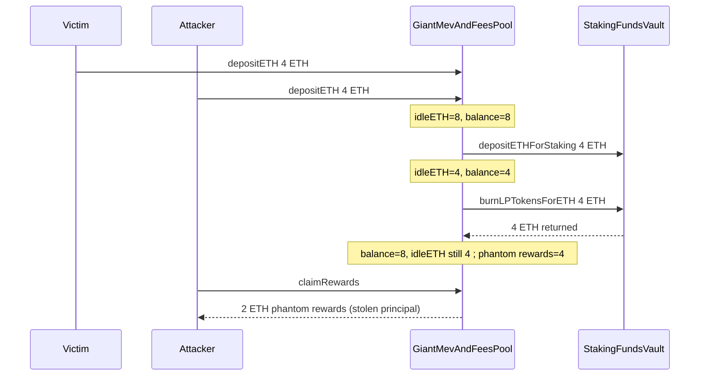
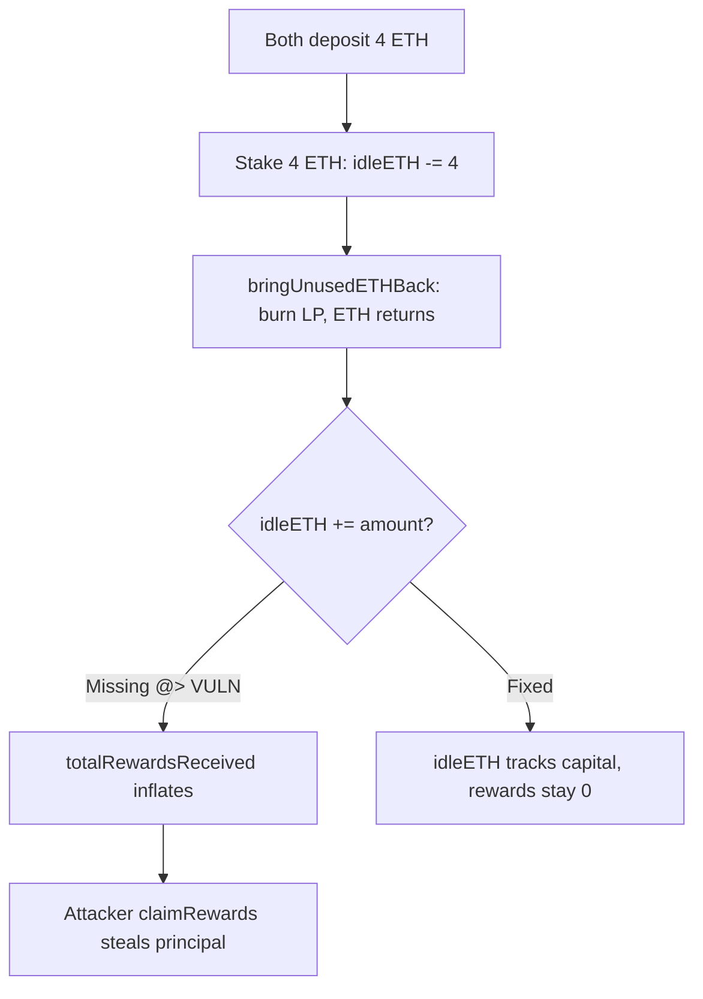

# Stakehouse Protocol — `bringUnusedETHBackIntoGiantPool` loses idleETH addition and lets attackers steal ETH from the Giant Pool

> **Vulnerability classes:** vuln/logic/reward-calculation · vuln/logic/direct-drain · misassumption/math-is-safe

> **Reproduction:** a self-contained Foundry PoC that compiles & runs in an
> isolated project with **only `forge-std`** — no fork, no RPC, no `anvil_state`.
> Full trace: [output.txt](output.txt). PoC:
> [test/43033-h-10-giantmevandfeespoolbringunusedethbackintogiantpool-func_exp.sol](test/43033-h-10-giantmevandfeespoolbringunusedethbackintogiantpool-func_exp.sol).

<!-- non-defihacklabs -->
<!-- source-auditvault: https://github.com/Auditware/AuditVault/blob/main/findings/43033-h-10-giantmevandfeespoolbringunusedethbackintogiantpool-func.md -->
<!-- date: 2022-11 -->

**AuditVault taxonomy:** `lang/solidity` · `sector/staking` · `sector/staking-pool` · `platform/code4rena` · `has/github` · `has/poc` · `severity/high` · `novelty/variant` · genome: `reward-calculation` · `variant` · `direct-drain` · `frontrun-exposure` · `reward-accounting` · `timestamp-dependence`

---

## Key info

| | |
|---|---|
| **Impact** | **HIGH** — after unused ETH is brought back from a staking vault, phantom rewards equal to the returned amount can be claimed by any LP holder, stealing other depositors' principal |
| **Protocol** | [Stakehouse Protocol](https://code4rena.com/reports/2022-11-stakehouse) — `GiantMevAndFeesPool` liquid-staking giant pool |
| **Vulnerable code** | `GiantMevAndFeesPool.bringUnusedETHBackIntoGiantPool` (contracts/liquid-staking/GiantMevAndFeesPool.sol#L126-L138) — missing `idleETH += amount` |
| **Bug class** | Accounting omission: returned capital not re-registered as idle, mis-read as rewards |
| **Finding** | Code4rena — Stakehouse Protocol, 2022-11 · #43033 (H-10) · reporter **Lambda** |
| **Report** | [2022-11-stakehouse](https://code4rena.com/reports/2022-11-stakehouse) |
| **Source** | [AuditVault](https://github.com/Auditware/AuditVault/blob/main/findings/43033-h-10-giantmevandfeespoolbringunusedethbackintogiantpool-func.md) |
| **Status** | Audit finding — confirmed by the Stakehouse team. Reproduced here as a standalone local PoC. |
| **Compiler** | `^0.8.24` (PoC); real code `^0.8.13` |

This is an **audit finding**, not a historical on-chain incident. The PoC keeps
`bringUnusedETHBackIntoGiantPool` and the `totalRewardsReceived` override
**verbatim** inside a faithful reduction of `GiantMevAndFeesPool` (the nested
array loops of the real functions are reduced to a single vault/amount — the
loop body is unchanged; the bug is what's missing after the burn).

---

## TL;DR

1. `totalRewardsReceived()` is `address(this).balance + totalClaimed - idleETH`.
2. `batchDepositETHForStaking` correctly does `idleETH -= amount` when capital leaves.
3. `bringUnusedETHBackIntoGiantPool` burns vault LP and receives ETH back into
   the pool's balance, but **never** does `idleETH += amount`.
4. Balance goes up, idleETH stays low → `totalRewardsReceived` invents phantom
   rewards equal to the returned capital.
5. Any LP holder can `claimRewards` and extract those "rewards" — which are
   really other depositors' principal still sitting in the pool.

---

## The vulnerable code

```solidity
function bringUnusedETHBackIntoGiantPool(StakingFundsVault _vault, uint256 _amount) external {
    _vault.burnLPTokensForETH(_amount);
    // @> VULN: idleETH is NEVER incremented. ETH just returned into
    // address(this).balance, so totalRewardsReceived invents phantom rewards.
    // FIX (per report): idleETH += _amount;
}

function totalRewardsReceived() public view override returns (uint256) {
    return address(this).balance + totalClaimed - idleETH;
}
```

---

## Root cause

`idleETH` is the only bookkeeping variable that distinguishes **idle capital**
from **rewards**. Every path that moves capital in or out of the giant pool must
keep it consistent. Deposit increments it; staking decrements it; bring-back
forgets to re-increment it. The reward formula then treats the re-credited ETH
as unprocessed rewards, and the claim path pays them out.

## Preconditions

- At least two LP holders with deposits in the giant fees/MEV pool.
- Capital was deployed to a staking funds vault and then brought back via
  `bringUnusedETHBackIntoGiantPool` (staking never commenced).
- No special role: `claimRewards` is permissionless.

## Attack walkthrough

From [output.txt](output.txt):

1. Victim and attacker each deposit 4 ETH (`idleETH = 8`, balance = 8).
2. 4 ETH is staked into a vault (`idleETH = 4`, balance = 4, vault holds 4).
3. `bringUnusedETHBackIntoGiantPool` returns the 4 ETH (balance = 8, **idleETH
   still 4**). Phantom rewards = `8 + 0 - 4 = 4 ETH`.
4. Attacker calls `claimRewards` and receives half of the phantom 4 ETH =
   **2 ETH** — stolen principal.
5. Pool balance drops to 6 ETH; victim still holds 4 ETH of LP but only 6 ETH of
   capital remains for both holders.

## Diagrams





## Impact

Any LP holder who claims after a bring-back can extract a share of the returned
capital as if it were rewards. With equal deposits the attacker in the PoC
steals 2 ETH of the other depositor's principal. Larger bring-backs or repeated
cycles amplify the theft. Confirmed by the Stakehouse team
([issue #173](https://github.com/code-423n4/2022-11-stakehouse-findings/issues/173)).

## Sources

- [AuditVault finding #43033](https://github.com/Auditware/AuditVault/blob/main/findings/43033-h-10-giantmevandfeespoolbringunusedethbackintogiantpool-func.md)
- [Code4rena report 2022-11-stakehouse](https://code4rena.com/reports/2022-11-stakehouse)
- Reduced source: [code-423n4/2022-11-stakehouse](https://github.com/code-423n4/2022-11-stakehouse) `contracts/liquid-staking/GiantMevAndFeesPool.sol` (`bringUnusedETHBackIntoGiantPool`, `totalRewardsReceived`)
