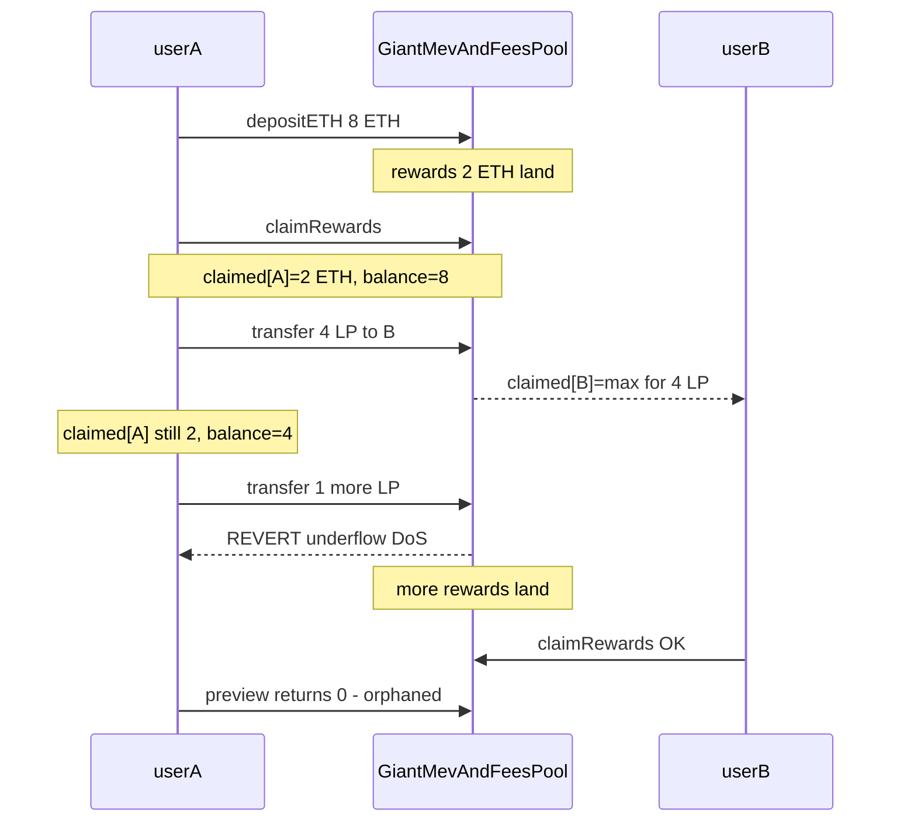
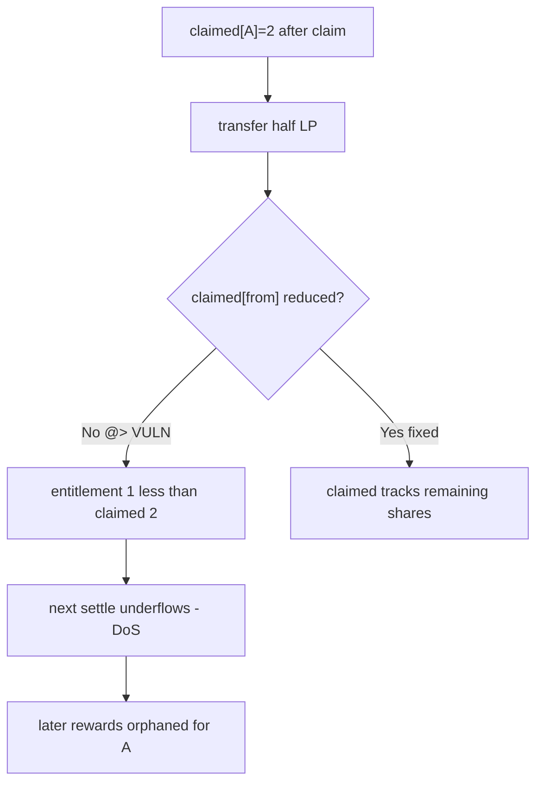

# Stakehouse Protocol — transferring GiantMevAndFeesPool tokens leaves claimed[] high, DoS-ing the sender and orphaning future rewards

> **Vulnerability classes:** vuln/logic/reward-calculation · vuln/logic/dos-resistance · misassumption/math-is-safe

> **Reproduction:** a self-contained Foundry PoC that compiles & runs in an
> isolated project with **only `forge-std`** — no fork, no RPC, no `anvil_state`.
> Full trace: [output.txt](output.txt). PoC:
> [test/43034-h-12-sender-transferring-giantmevandfeespool-tokens-can-afte_exp.sol](test/43034-h-12-sender-transferring-giantmevandfeespool-tokens-can-afte_exp.sol).

<!-- non-defihacklabs -->
<!-- source-auditvault: https://github.com/Auditware/AuditVault/blob/main/findings/43034-h-12-sender-transferring-giantmevandfeespool-tokens-can-afte.md -->
<!-- date: 2022-11 -->

**AuditVault taxonomy:** `lang/solidity` · `sector/staking` · `sector/token` · `platform/code4rena` · `has/github` · `has/poc` · `severity/high` · `novelty/known-pattern` · genome: `reward-calculation` · `known-pattern` · `reward-theft` · `dos-resistance` · `integer-bounds` · `frontrun-exposure` · `reward-accounting` · `timestamp-dependence`

---

## Key info

| | |
|---|---|
| **Impact** | **HIGH** — after transferring away part of their GiantLP, a user can no longer transfer/claim/preview (underflow DoS); later rewards owed to them are permanently orphaned in the pool |
| **Protocol** | [Stakehouse Protocol](https://code4rena.com/reports/2022-11-stakehouse) — `GiantMevAndFeesPool` / GiantLP transfer hooks |
| **Vulnerable code** | `GiantMevAndFeesPool.afterTokenTransfer` — adjusts `claimed[to]` but never reduces `claimed[from]` |
| **Bug class** | Incomplete transfer accounting for cumulative claimed ledger |
| **Finding** | Code4rena — Stakehouse Protocol, 2022-11 · #43034 (H-12) · reporter **JTJabba** |
| **Report** | [2022-11-stakehouse](https://code4rena.com/reports/2022-11-stakehouse) |
| **Source** | [AuditVault](https://github.com/Auditware/AuditVault/blob/main/findings/43034-h-12-sender-transferring-giantmevandfeespool-tokens-can-afte.md) |
| **Status** | Audit finding — confirmed by the Stakehouse team. Reproduced here as a standalone local PoC. |
| **Compiler** | `^0.8.24` (PoC); real code `^0.8.13` |

This is an **audit finding**, not a historical on-chain incident. The PoC keeps
the after-transfer claimed[] policy (only recipient is set to max) that the
report blames, and demonstrates both the immediate underflow DoS and the
subsequent orphaning of rewards.

---

## TL;DR

1. `claimed[user][token]` records how much a user has already been paid for their LP.
2. On GiantLP transfer, rewards are settled for the sender, balances move, then
   `afterTokenTransfer` sets `claimed[to] = max` so the recipient does not
   inherit past rewards.
3. **Nothing reduces `claimed[from]`** to match the sender's new lower balance.
4. After transferring half their LP, `claimed[from]` can exceed the max
   entitlement for remaining shares → next settle underflows (Solidity 0.8) →
   transfer/claim/preview all revert (DoS).
5. When more rewards later arrive and entitlement catches up, the user sees
   `due = 0` for rewards they should have earned — permanently orphaned.

---

## The vulnerable code

```solidity
function afterTokenTransfer(address from, address to, uint256 /* amount */) external {
    require(msg.sender == address(lpTokenETH), "Only LP");
    // @> VULN: only `to` is adjusted - claimed[from] is left unchanged.
    _setClaimedToMax(to);
    // FIX: also scale down claimed[from] proportional to the transferred share
}
```

---

## Root cause

`claimed[]` is a cumulative absolute amount, not a per-share rate. When LP
balance drops, the absolute claimed figure must be scaled down (or the design
must use per-share claimed). Leaving it high makes

```
due = entitlement(balance) - claimed[user]
```

underflow whenever `entitlement(newBalance) < claimed`.

## Preconditions

- User has claimed rewards at least once (so `claimed[] > 0`).
- User then transfers away enough LP that remaining entitlement is below claimed.
- No special role required: any GiantLP transfer triggers the hook.

## Attack walkthrough

From [output.txt](output.txt):

1. userA deposits 8 ETH, receives 8 GiantLP.
2. 2 ETH rewards land; userA claims them (`claimed[userA] = 2 ETH`).
3. userA transfers 4 LP to userB. First transfer succeeds; `claimed[userA]`
   stays **2 ETH** while balance is now 4 LP (max entitlement 1 ETH).
4. Any further transfer/preview for userA reverts (underflow DoS).
5. Another 2 ETH of rewards arrive. userB claims 1 ETH. userA's preview
   returns 0 — their 1 ETH share of round 2 is orphaned.

## Diagrams





## Impact

Affected users cannot transfer remaining tokens or claim rewards until enough
new rewards accumulate that entitlement exceeds the stale claimed[] — and even
then, intermediate rewards are lost forever. Confirmed by the Stakehouse team
([issue #178](https://github.com/code-423n4/2022-11-stakehouse-findings/issues/178)).

## Sources

- [AuditVault finding #43034](https://github.com/Auditware/AuditVault/blob/main/findings/43034-h-12-sender-transferring-giantmevandfeespool-tokens-can-afte.md)
- [Code4rena report 2022-11-stakehouse](https://code4rena.com/reports/2022-11-stakehouse)
- Reduced source: [code-423n4/2022-11-stakehouse](https://github.com/code-423n4/2022-11-stakehouse) `GiantMevAndFeesPool.afterTokenTransfer` / GiantLP transfer hooks
