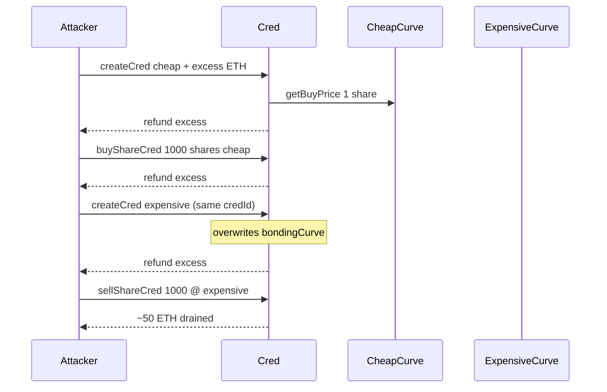
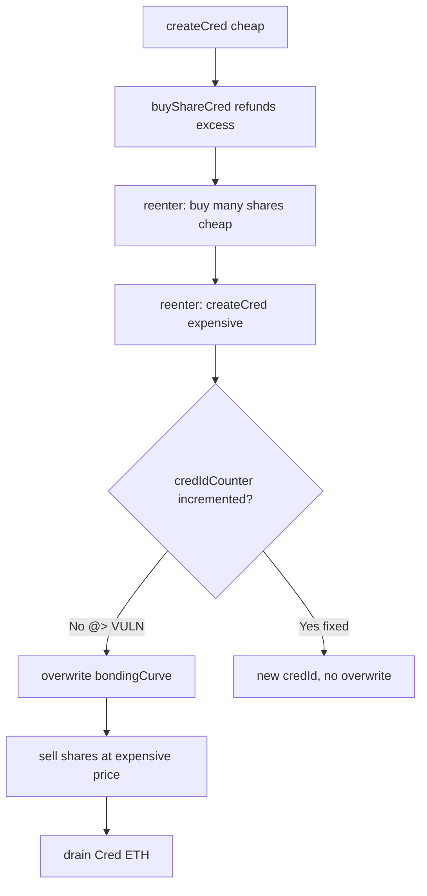

# Phi — Reentrancy in creating Creds allows an attacker to steal all Ether from the Cred contract

> **Vulnerability classes:** vuln/reentrancy/single-function · fix/use-reentrancy-guard · novelty/known-pattern

> **Reproduction:** a self-contained Foundry PoC that compiles & runs in an
> isolated project with **only `forge-std`** — no fork, no RPC, no `anvil_state`.
> Full trace: [output.txt](output.txt). PoC:
> [test/43397-h-06-reentrancy-in-creating-creds-allows-an-attacker-to-stea_exp.sol](test/43397-h-06-reentrancy-in-creating-creds-allows-an-attacker-to-stea_exp.sol).

<!-- non-defihacklabs -->
<!-- source-auditvault: https://github.com/Auditware/AuditVault/blob/main/findings/43397-h-06-reentrancy-in-creating-creds-allows-an-attacker-to-stea.md -->
<!-- date: 2024-08 -->

**AuditVault taxonomy:** `lang/solidity` · `sector/dex` · `sector/launchpad` · `sector/lending` · `platform/code4rena` · `has/github` · `has/poc` · `severity/high` · genome: `single-function` · `use-reentrancy-guard` · `known-pattern` · `direct-drain` · `flashloan-callback-auth` · `reentrancy-guard` · `timestamp-dependence`

---

## Key info

| | |
|---|---|
| **Impact** | **HIGH** — with two or more whitelisted bonding curves, reentrancy during createCred lets an attacker buy shares cheap, overwrite the cred's curve, sell expensive, and drain nearly all Cred ETH |
| **Protocol** | [Phi](https://code4rena.com/reports/2024-08-phi) — `Cred` share trading / cred creation |
| **Vulnerable code** | `Cred._createCredInternal` / `buyShareCred` excess-ETH refund (src/Cred.sol) — no reentrancy guard; counter incremented after refund |
| **Bug class** | Reentrancy + state overwrite before counter increment |
| **Finding** | Code4rena — Phi, 2024-08 · #43397 (H-06) · reporter **rscodes** (public report features CAUsr impact) |
| **Report** | [2024-08-phi](https://code4rena.com/reports/2024-08-phi) |
| **Source** | [AuditVault](https://github.com/Auditware/AuditVault/blob/main/findings/43397-h-06-reentrancy-in-creating-creds-allows-an-attacker-to-stea.md) |
| **Status** | Audit finding — confirmed by Phi. Reproduced here as a standalone local PoC. |
| **Compiler** | `^0.8.24` (PoC) |

This is an **audit finding**, not a historical on-chain incident. The PoC keeps
the create-then-buy-then-increment structure and the excess-ETH refund
reentrancy surface **verbatim in spirit** (signature checks omitted — not
relevant to the reentrancy).

---

## TL;DR

1. `createCred` writes `creds[credIdCounter]`, then `buyShareCred` (auto-buy 1 share).
2. `buyShareCred` refunds excess ETH via an external call **before**
   `credIdCounter` is incremented — and there is no `nonReentrant` guard.
3. On the refund the attacker buys many more shares on the cheap curve, then
   reenters `createCred` with an expensive curve, **overwriting** the same
   `creds[credIdCounter]` slot (counter still unchanged).
4. Attacker sells the cheaply-bought shares against the expensive curve and
   drains protocol ETH.

---

## The vulnerable code

```solidity
function _createCredInternal(address creator_, address bondingCurve_) internal returns (uint256) {
    creds[credIdCounter].creator = creator_;
    creds[credIdCounter].bondingCurve = bondingCurve_;

    buyShareCred(credIdCounter, 1); // may refund excess ETH -> reentrancy

    credIdCounter += 1; // NOT reached during reentrancy
    return credIdCounter - 1;
}

function buyShareCred(uint256 credId_, uint256 amount_) public payable {
    // ...
    uint256 excessPayment = msg.value - price;
    if (excessPayment > 0) {
        // @> VULN: external refund before counter increment / without reentrancy guard
        (bool ok, ) = msg.sender.call{value: excessPayment}("");
        require(ok, "refund failed");
    }
}
```

---

## Root cause

Effects (cred field writes) and interactions (ETH refund) happen before the
critical counter increment, with no reentrancy guard. A second `createCred` on
the same open `credIdCounter` overwrites `bondingCurve`, so shares bought under
one price function are sold under another.

## Preconditions

- At least two whitelisted bonding curves with materially different prices.
- Cred holds ETH from other share buyers (protocol liquidity).
- Attacker can pass createCred checks (signatures omitted in synthetic; real
  attack prepares signed create data for both curves).

## Attack walkthrough

From [output.txt](output.txt):

1. Seed Cred with 50 ETH of protocol liquidity; whitelist cheap (0.001 ETH/share)
   and expensive (0.05 ETH/share) curves.
2. Attacker `createCred(cheap)` with excess ETH → refund reenters.
3. On reentry: buy 1000 shares cheaply (~1 ETH).
4. Nested `createCred(expensive)` overwrites the same credId's bonding curve.
5. Sell ~1000 shares at 0.05 ETH each → ~50 ETH drained from Cred.
6. Proceeds swept to the Exploit contract.

## Diagrams





## Impact

As soon as more than one bonding curve is whitelisted (an expected product
direction), nearly the entire Cred balance can be drained, repeatedly. Confirmed
by Phi; selected for the public report for its severe multi-curve impact.

## Sources

- [AuditVault finding #43397](https://github.com/Auditware/AuditVault/blob/main/findings/43397-h-06-reentrancy-in-creating-creds-allows-an-attacker-to-stea.md)
- [Code4rena report 2024-08-phi](https://code4rena.com/reports/2024-08-phi)
- Reduced source: [code-423n4/2024-08-phi](https://github.com/code-423n4/2024-08-phi) `@ 8c0985f` `src/Cred.sol` (`_createCredInternal`, `buyShareCred`)
