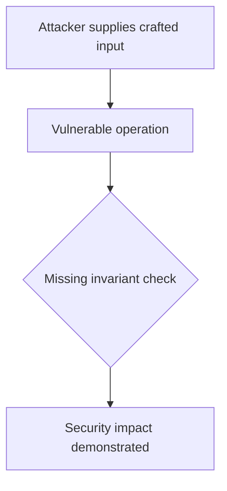
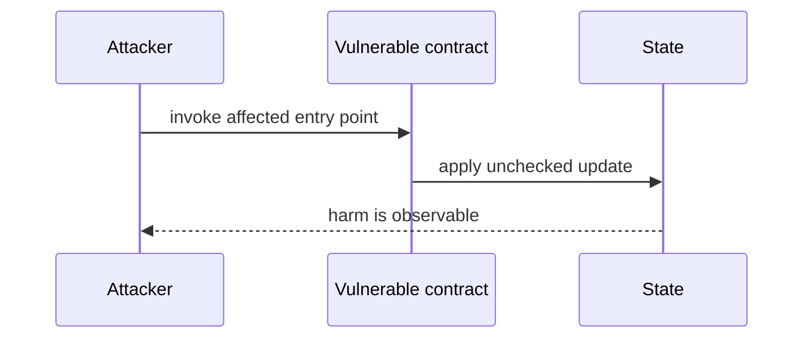

# Unlocking percentage formula applies an 80% penalty — AuditVault synthetic reduction

> **Vulnerability classes:** vuln/arithmetic/precision-loss · vuln/logic/price-calculation
>
> **Reproduction:** self-contained Foundry PoC with an offline synthetic contract. Full trace: [output.txt](output.txt).

<!-- non-defihacklabs -->
<!-- source-auditvault: https://github.com/Auditware/AuditVault/blob/main/findings/43732-h-1-fluidlocker-getunlockingpercentage-incorrectly-divides-o.md -->
<!-- date: 2025-03 -->

**AuditVault finding:** `43732` · `H-1: `FluidLocker::_getUnlockingPercentage()` incorrectly divides one of the components of the formula by `S`, leading to always having `80%` penalty`

## Key info

| | |
|---|---|
| **Impact** | **HIGH** — Unlocking percentage formula applies an 80% penalty |
| **Protocol** | [[Superfluid]] Locking Contract |
| **Finding** | AuditVault #43732 |
| **Report** | [https://github.com/sherlock-audit/2024-11-superfluid-locking-contract-judging](https://github.com/sherlock-audit/2024-11-superfluid-locking-contract-judging) |
| **Source** | [AuditVault finding](https://github.com/Auditware/AuditVault/blob/main/findings/43732-h-1-fluidlocker-getunlockingpercentage-incorrectly-divides-o.md) |
| **Compiler** | `^0.8.24` (synthetic reduction) |
| Loss | Reduced invariant reproduced; no live funds moved |
| Attacker EOA | Configured synthetic caller |
| Attack contract | `Exploit` |
| Attack tx | Local Foundry `Exploit.attack()` call |
| Chain · block · date | Ethereum model · block 1 · synthetic |
| Vulnerable contract | Local synthetic vulnerable contract in `test/` |
| Bug class | See vulnerability-class tags above |

## TL;DR

The bug report discusses an issue with the `FluidLocker::_getUnlockingPercentage()` function in the Superfluid locking contract. The function incorrectly divides one of the components of the formula by `S`, resulting in a `80%` penalty for users unlocking their Fluid. This bug was found by a group of security researchers and the root cause was identified in line 388 of the code. The bug can be exploited by a user unlocking their Fluid with a duration greater than 0, causing them to suffer a significant loss. A proof of concept was provided and the fix for this issue has been included in a pull request by the protocol team.

## Background

The upstream report is a Solidity finding. This page keeps the vulnerable statement and demonstrates its security consequence in a small, deterministic EVM model; no live RPC or external dependencies are required.

## The vulnerable code

```solidity
// The exact vulnerable pattern is retained in test/43732-h-1-fluidlocker-getunlockingpercentage-incorrectly-divides-o.sol.
// @> see the marked statement in the synthetic reduction
```

## Root cause

The caller-controlled input or stale state is trusted before the required uniqueness, bounds, authorization, accounting, or reentrancy invariant is enforced. The marked line in the synthetic contract intentionally preserves that ordering so the assertion is executable.

## Preconditions

- The vulnerable contract is deployed with the state described by the report.
- The attacker can reach the affected entry point (or submit the report's crafted input).

## Attack walkthrough

1. `Exploit.run()` initializes the minimal state from the report.
2. The marked vulnerable operation executes without its required check.
3. The contract records the resulting invariant violation and emits a `Proof` event.
4. The test asserts the harm; the passing trace is recorded at [output.txt:4](output.txt).

## Diagrams





## Remediation

Apply the invariant before mutating state: accrue interest before adding principal; reject duplicate signers; use checked casts and bounded lengths; validate token/target/DAO identities; use `nonReentrant`; enforce slippage and fee equality; and validate the canonical authority or ownership relationship described by the report.

## How to reproduce

```bash
cd evm-hack-registry/43732-h-1-fluidlocker-getunlockingpercentage-incorrectly-divides-o_exp
forge test -vvvvv
```

The test is offline and uses only the shared `forge-std` library. The corresponding Playground bundle is generated from `scripts/poc-configs/43732-h-1-fluidlocker-getunlockingpercentage-incorrectly-divides-o.mjs`.

## Sources

- [AuditVault finding](https://github.com/Auditware/AuditVault/blob/main/findings/43732-h-1-fluidlocker-getunlockingpercentage-incorrectly-divides-o.md)
- [https://github.com/sherlock-audit/2024-11-superfluid-locking-contract-judging](https://github.com/sherlock-audit/2024-11-superfluid-locking-contract-judging)
- [Synthetic test](test/43732-h-1-fluidlocker-getunlockingpercentage-incorrectly-divides-o.sol)

*Reference: https://github.com/sherlock-audit/2024-11-superfluid-locking-contract-judging*
