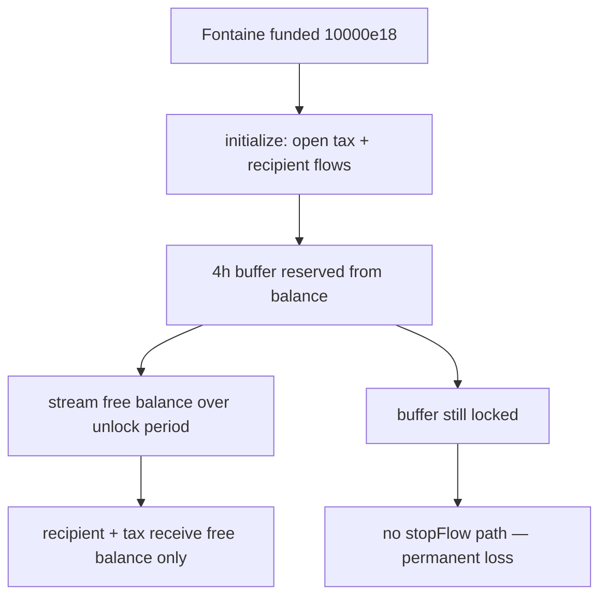

# Superfluid Locking — `Fontaine` never stops flows; deposit buffer is permanently lost

> **Vulnerability classes:** vuln/lifecycle/missing-close · vuln/funds/locked · vuln/streaming/buffer

> **Reproduction:** a self-contained Foundry PoC that compiles & runs in an
> isolated project with **only `forge-std`** — no fork, no RPC, no `anvil_state`.
> Full trace: [output.txt](output.txt). PoC:
> [test/43734-h-3-fontaine-never-stops-the-flows-to-the-tax-and-recipient_exp.sol](test/43734-h-3-fontaine-never-stops-the-flows-to-the-tax-and-recipient_exp.sol).

<!-- non-defihacklabs -->
<!-- source-auditvault: https://github.com/Auditware/AuditVault/blob/main/findings/43734-h-3-fontaine-never-stops-the-flows-to-the-tax-and-recipient.md -->
<!-- date: 2024-11 -->

**AuditVault taxonomy:** `lang/solidity` · `platform/sherlock` · `has/github` · `has/poc` · `severity/high` · `sector/lending` · `sector/perpetuals` · `sector/streaming` · genome: `frozen-funds` · `locked-funds` · `liquidation-underwater`

---

## Key info

| | |
|---|---|
| **Impact** | **HIGH** — Superfluid 4-hour deposit buffer reserved on flow open is never reclaimed; recipient and tax pool are shorted |
| **Protocol** | [Superfluid Locking Contract](https://github.com/sherlock-audit/2024-11-superfluid-locking-contract) — `Fontaine.initialize` |
| **Vulnerable code** | Flows opened in `initialize` with no stop/reclaim path |
| **Bug class** | Missing lifecycle close / permanent buffer lock |
| **Finding** | Sherlock — 2024-11-superfluid-locking-contract · #43734 (H-3) · reporter **0x73696d616f** |
| **Report** | [2024-11-superfluid-locking-contract-judging](https://github.com/sherlock-audit/2024-11-superfluid-locking-contract-judging) |
| **Source** | [AuditVault](https://github.com/Auditware/AuditVault/blob/main/findings/43734-h-3-fontaine-never-stops-the-flows-to-the-tax-and-recipient.md) |
| **Status** | Audit finding. Reproduced here as a standalone local PoC. |
| **Compiler** | `^0.8.24` (PoC) |

---

## TL;DR

1. Superfluid reserves **4 hours of flow rate** as a deposit buffer when a flow opens.
2. `Fontaine.initialize` opens a tax `distributeFlow` and a recipient `createFlow`.
3. There is **no** function to stop those flows and reclaim the buffer.
4. After the unlock period, only the free balance streams out; the buffer is lost forever to recipient/tax.

---

## The vulnerable code

```solidity
FLUID.distributeFlow(address(this), TAX_DISTRIBUTION_POOL, taxFlowRate);
FLUID.createFlow(unlockRecipient, unlockFlowRate); // @> VULN: never stopped / buffer never reclaimed
// no endUnlock / stopFlow path exists on Fontaine
```

**Fix (per report):** add a way to stop the flow and receive the deposit back.

---

## Root cause

Streaming lifecycle is half-implemented: open without close. Superfluid's
solvency buffer is only returned on close; without close it is stranded.

## Preconditions

- User unlocks Fluid via Locker with a **non-null** unlocking period (Fontaine path).

## Attack walkthrough

1. Locker funds Fontaine with 10_000e18 and calls `initialize`.
2. Tax + recipient flows open; ~3.2e18 reserved as buffer (finding's numbers).
3. Unlock period elapses; free balance streams to recipient/tax.
4. Buffer remains locked on Fontaine — permanent shortfall of ~3.2e18.

## Diagrams



## Impact

Recipient and tax distribution pool never receive the buffer component of the
unlock. Material shortfall on every vesting unlock that uses Fontaine flows.

## Sources

- [AuditVault finding #43734](https://github.com/Auditware/AuditVault/blob/main/findings/43734-h-3-fontaine-never-stops-the-flows-to-the-tax-and-recipient.md)
- [Sherlock 2024-11-superfluid-locking-contract judging #36](https://github.com/sherlock-audit/2024-11-superfluid-locking-contract-judging/issues/36)
- Reduced source: [Fontaine.sol](https://github.com/sherlock-audit/2024-11-superfluid-locking-contract/blob/main/fluid/packages/contracts/src/Fontaine.sol#L61) · Superfluid buffer docs
