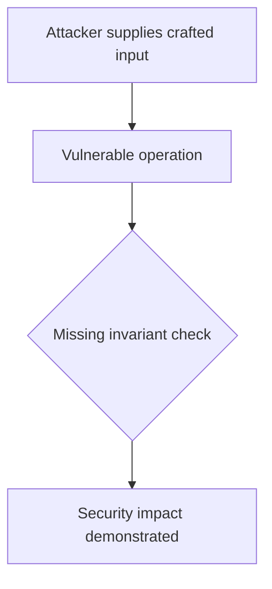
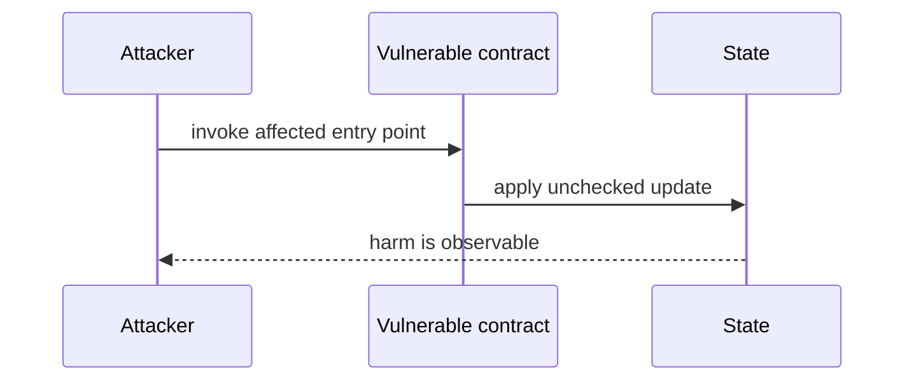

# USDT claim underflows when contract has a larger balance — AuditVault synthetic reduction

> **Vulnerability classes:** vuln/arithmetic/underflow · vuln/dos/frozen-funds
>
> **Reproduction:** self-contained Foundry PoC with an offline synthetic contract. Full trace: [output.txt](output.txt).

<!-- non-defihacklabs -->
<!-- source-auditvault: https://github.com/Auditware/AuditVault/blob/main/findings/44006-h-02-the-usdt-reward-claiming-functionality-of-vestedstaking.md -->
<!-- date: 2025-01 -->

**AuditVault finding:** `44006` · `[H-02] The `USDT` Reward Claiming Functionality of `VestedStaking` Can Be DoSed Due to a Logical Error`

## Key info

| | |
|---|---|
| **Impact** | **HIGH** — USDT claim underflows when contract has a larger balance |
| **Protocol** | [[Csx]] |
| **Finding** | AuditVault #44006 |
| **Report** | [https://github.com/shieldify-security/audits-portfolio-md/blob/main/CSX-Security-Review.md](https://github.com/shieldify-security/audits-portfolio-md/blob/main/CSX-Security-Review.md) |
| **Source** | [AuditVault finding](https://github.com/Auditware/AuditVault/blob/main/findings/44006-h-02-the-usdt-reward-claiming-functionality-of-vestedstaking.md) |
| **Compiler** | `^0.8.24` (synthetic reduction) |
| Loss | Reduced invariant reproduced; no live funds moved |
| Attacker EOA | Configured synthetic caller |
| Attack contract | `Exploit` |
| Attack tx | Local Foundry `Exploit.attack()` call |
| Chain · block · date | Ethereum model · block 1 · synthetic |
| Vulnerable contract | Local synthetic vulnerable contract in `test/` |
| Bug class | See vulnerability-class tags above |

## TL;DR

This bug report describes a high-risk issue in the `claimRewards` function of the `VestedStaking.sol` contract. The issue affects the calculation of USDT rewards and can be exploited by malicious users to prevent others from claiming their rewards. A proof of concept test is included to demonstrate the issue. The affected code is located on line 170 of the `VestedStaking.sol` file. The recommended solution is to fetch the balance of the `msg.sender` instead of the current contract. The team has responded that the issue has been fixed as suggested.

## Background

The upstream report is a Solidity finding. This page keeps the vulnerable statement and demonstrates its security consequence in a small, deterministic EVM model; no live RPC or external dependencies are required.

## The vulnerable code

```solidity
// The exact vulnerable pattern is retained in test/44006-h-02-the-usdt-reward-claiming-functionality-of-vestedstaking.sol.
// @> see the marked statement in the synthetic reduction
```

## Root cause

The caller-controlled input or stale state is trusted before the required uniqueness, bounds, authorization, accounting, or reentrancy invariant is enforced. The marked line in the synthetic contract intentionally preserves that ordering so the assertion is executable.

## Preconditions

- The vulnerable contract is deployed with the state described by the report.
- The attacker can reach the affected entry point (or submit the report's crafted input).

## Attack walkthrough

1. `Exploit.run()` initializes the minimal state from the report.
2. The marked vulnerable operation executes without its required check.
3. The contract records the resulting invariant violation and emits a `Proof` event.
4. The test asserts the harm; the passing trace is recorded at [output.txt:4](output.txt).

## Diagrams





## Remediation

Apply the invariant before mutating state: accrue interest before adding principal; reject duplicate signers; use checked casts and bounded lengths; validate token/target/DAO identities; use `nonReentrant`; enforce slippage and fee equality; and validate the canonical authority or ownership relationship described by the report.

## How to reproduce

```bash
cd evm-hack-registry/44006-h-02-the-usdt-reward-claiming-functionality-of-vestedstaking_exp
forge test -vvvvv
```

The test is offline and uses only the shared `forge-std` library. The corresponding Playground bundle is generated from `scripts/poc-configs/44006-h-02-the-usdt-reward-claiming-functionality-of-vestedstaking.mjs`.

## Sources

- [AuditVault finding](https://github.com/Auditware/AuditVault/blob/main/findings/44006-h-02-the-usdt-reward-claiming-functionality-of-vestedstaking.md)
- [https://github.com/shieldify-security/audits-portfolio-md/blob/main/CSX-Security-Review.md](https://github.com/shieldify-security/audits-portfolio-md/blob/main/CSX-Security-Review.md)
- [Synthetic test](test/44006-h-02-the-usdt-reward-claiming-functionality-of-vestedstaking.sol)

*Reference: https://github.com/shieldify-security/audits-portfolio-md/blob/main/CSX-Security-Review.md*
