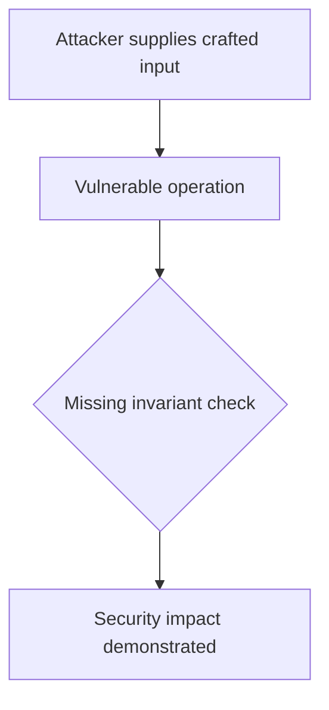
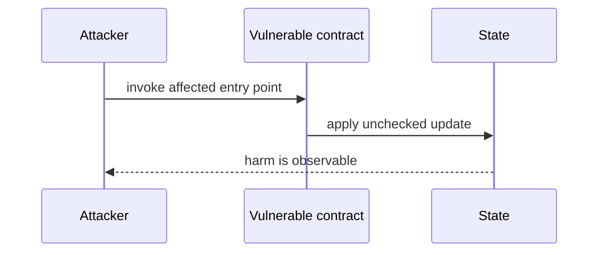

# uint256 amount truncates to uint160 — AuditVault synthetic reduction

> **Vulnerability classes:** vuln/input-validation/wrong-type · vuln/arithmetic/underflow
>
> **Reproduction:** self-contained Foundry PoC with an offline synthetic contract. Full trace: [output.txt](output.txt).

<!-- non-defihacklabs -->
<!-- source-auditvault: https://github.com/Auditware/AuditVault/blob/main/findings/44371-h-1-unsafe-type-casting-in-token-amount-handling-sherlock-ok.md -->
<!-- date: 2024-11 -->

**AuditVault finding:** `44371` · `H-1: Unsafe Type Casting in Token Amount Handling`

## Key info

| | |
|---|---|
| **Impact** | **HIGH** — uint256 amount truncates to uint160 |
| **Protocol** | [[Oku'S New Order Types Contract Contest]] |
| **Finding** | AuditVault #44371 |
| **Report** | [https://github.com/sherlock-audit/2024-11-oku-judging](https://github.com/sherlock-audit/2024-11-oku-judging) |
| **Source** | [AuditVault finding](https://github.com/Auditware/AuditVault/blob/main/findings/44371-h-1-unsafe-type-casting-in-token-amount-handling-sherlock-ok.md) |
| **Compiler** | `^0.8.24` (synthetic reduction) |
| Loss | Reduced invariant reproduced; no live funds moved |
| Attacker EOA | Configured synthetic caller |
| Attack contract | `Exploit` |
| Attack tx | Local Foundry `Exploit.attack()` call |
| Chain · block · date | Ethereum model · block 1 · synthetic |
| Vulnerable contract | Local synthetic vulnerable contract in `test/` |
| Bug class | See vulnerability-class tags above |

## TL;DR

This bug report discusses an issue found in the rotocol's handling of token amounts. The contracts use unsafe type casting from uint256 to uint160, which can lead to silent overflow or underflow conditions. This can potentially allow users to create orders with mismatched amounts, leading to fund loss or manipulation of the system. The root cause of this issue is that Solidity 0.8.x does not protect against data loss during type casting. The contracts perform direct casting without validation in several critical functions. An example of this is the `StopLimit::modifyOrder()` function, which takes `uint256 amountIn` as input and casts it to uint160 inside the `handlePermit` function. This can result in the amount becoming very small and the user being able to drain the contract by modifying their order. The user must have enough tokens and be able to interact with the contract's order cre

## Background

The upstream report is a Solidity finding. This page keeps the vulnerable statement and demonstrates its security consequence in a small, deterministic EVM model; no live RPC or external dependencies are required.

## The vulnerable code

```solidity
// The exact vulnerable pattern is retained in test/44371-h-1-unsafe-type-casting-in-token-amount-handling-sherlock-ok.sol.
// @> see the marked statement in the synthetic reduction
```

## Root cause

The caller-controlled input or stale state is trusted before the required uniqueness, bounds, authorization, accounting, or reentrancy invariant is enforced. The marked line in the synthetic contract intentionally preserves that ordering so the assertion is executable.

## Preconditions

- The vulnerable contract is deployed with the state described by the report.
- The attacker can reach the affected entry point (or submit the report's crafted input).

## Attack walkthrough

1. `Exploit.run()` initializes the minimal state from the report.
2. The marked vulnerable operation executes without its required check.
3. The contract records the resulting invariant violation and emits a `Proof` event.
4. The test asserts the harm; the passing trace is recorded at [output.txt:4](output.txt).

## Diagrams





## Remediation

Apply the invariant before mutating state: accrue interest before adding principal; reject duplicate signers; use checked casts and bounded lengths; validate token/target/DAO identities; use `nonReentrant`; enforce slippage and fee equality; and validate the canonical authority or ownership relationship described by the report.

## How to reproduce

```bash
cd evm-hack-registry/44371-h-1-unsafe-type-casting-in-token-amount-handling-sherlock-ok_exp
forge test -vvvvv
```

The test is offline and uses only the shared `forge-std` library. The corresponding Playground bundle is generated from `scripts/poc-configs/44371-h-1-unsafe-type-casting-in-token-amount-handling-sherlock-ok.mjs`.

## Sources

- [AuditVault finding](https://github.com/Auditware/AuditVault/blob/main/findings/44371-h-1-unsafe-type-casting-in-token-amount-handling-sherlock-ok.md)
- [https://github.com/sherlock-audit/2024-11-oku-judging](https://github.com/sherlock-audit/2024-11-oku-judging)
- [Synthetic test](test/44371-h-1-unsafe-type-casting-in-token-amount-handling-sherlock-ok.sol)

*Reference: https://github.com/sherlock-audit/2024-11-oku-judging*
