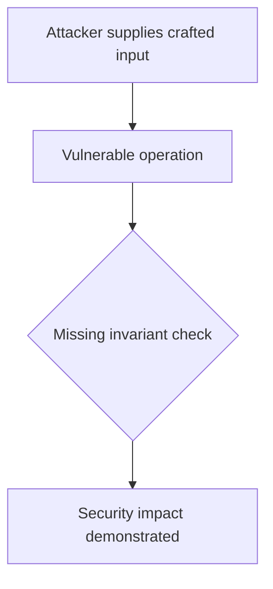
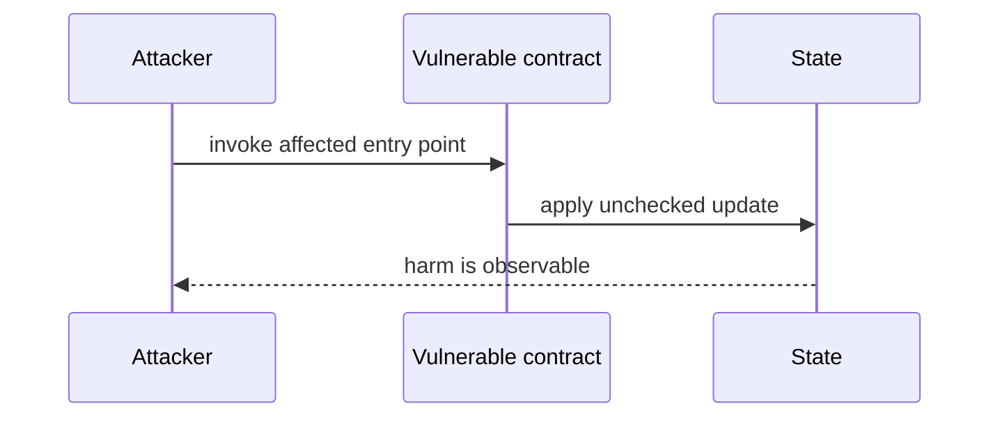

# Order fill/modify reentrancy steals collateral — AuditVault synthetic reduction

> **Vulnerability classes:** vuln/reentrancy/cross-function · vuln/dependency/unsafe-external-call
>
> **Reproduction:** self-contained Foundry PoC with an offline synthetic contract. Full trace: [output.txt](output.txt).

<!-- non-defihacklabs -->
<!-- source-auditvault: https://github.com/Auditware/AuditVault/blob/main/findings/44373-h-3-lack-of-nonreentrant-modifier-in-fillorder-and-modifyord.md -->
<!-- date: 2024-11 -->

**AuditVault finding:** `44373` · `H-3: Lack of nonReentrant modifier in fillOrder() and modifyOrder() allows attacker to steal funds`

## Key info

| | |
|---|---|
| **Impact** | **HIGH** — Order fill/modify reentrancy steals collateral |
| **Protocol** | [[Oku'S New Order Types Contract Contest]] |
| **Finding** | AuditVault #44373 |
| **Report** | [https://github.com/sherlock-audit/2024-11-oku-judging](https://github.com/sherlock-audit/2024-11-oku-judging) |
| **Source** | [AuditVault finding](https://github.com/Auditware/AuditVault/blob/main/findings/44373-h-3-lack-of-nonreentrant-modifier-in-fillorder-and-modifyord.md) |
| **Compiler** | `^0.8.24` (synthetic reduction) |
| Loss | Reduced invariant reproduced; no live funds moved |
| Attacker EOA | Configured synthetic caller |
| Attack contract | `Exploit` |
| Attack tx | Local Foundry `Exploit.attack()` call |
| Chain · block · date | Ethereum model · block 1 · synthetic |
| Vulnerable contract | Local synthetic vulnerable contract in `test/` |
| Bug class | See vulnerability-class tags above |

## TL;DR

This bug report highlights an issue with the lack of a certain modifier in the code, which can allow an attacker to steal funds from the victim. The report explains the root causes and provides a detailed attack path, along with a proof of concept. The impact of this bug is considered to be high, as it can result in the loss of funds for both the victim and the protocol. The report also suggests adding the missing modifier to prevent this type of attack. The issue has been fixed by the protocol team in a recent update.

## Background

The upstream report is a Solidity finding. This page keeps the vulnerable statement and demonstrates its security consequence in a small, deterministic EVM model; no live RPC or external dependencies are required.

## The vulnerable code

```solidity
// The exact vulnerable pattern is retained in test/44373-h-3-lack-of-nonreentrant-modifier-in-fillorder-and-modifyord.sol.
// @> see the marked statement in the synthetic reduction
```

## Root cause

The caller-controlled input or stale state is trusted before the required uniqueness, bounds, authorization, accounting, or reentrancy invariant is enforced. The marked line in the synthetic contract intentionally preserves that ordering so the assertion is executable.

## Preconditions

- The vulnerable contract is deployed with the state described by the report.
- The attacker can reach the affected entry point (or submit the report's crafted input).

## Attack walkthrough

1. `Exploit.run()` initializes the minimal state from the report.
2. The marked vulnerable operation executes without its required check.
3. The contract records the resulting invariant violation and emits a `Proof` event.
4. The test asserts the harm; the passing trace is recorded at [output.txt:4](output.txt).

## Diagrams





## Remediation

Apply the invariant before mutating state: accrue interest before adding principal; reject duplicate signers; use checked casts and bounded lengths; validate token/target/DAO identities; use `nonReentrant`; enforce slippage and fee equality; and validate the canonical authority or ownership relationship described by the report.

## How to reproduce

```bash
cd evm-hack-registry/44373-h-3-lack-of-nonreentrant-modifier-in-fillorder-and-modifyord_exp
forge test -vvvvv
```

The test is offline and uses only the shared `forge-std` library. The corresponding Playground bundle is generated from `scripts/poc-configs/44373-h-3-lack-of-nonreentrant-modifier-in-fillorder-and-modifyord.mjs`.

## Sources

- [AuditVault finding](https://github.com/Auditware/AuditVault/blob/main/findings/44373-h-3-lack-of-nonreentrant-modifier-in-fillorder-and-modifyord.md)
- [https://github.com/sherlock-audit/2024-11-oku-judging](https://github.com/sherlock-audit/2024-11-oku-judging)
- [Synthetic test](test/44373-h-3-lack-of-nonreentrant-modifier-in-fillorder-and-modifyord.sol)

*Reference: https://github.com/sherlock-audit/2024-11-oku-judging*
