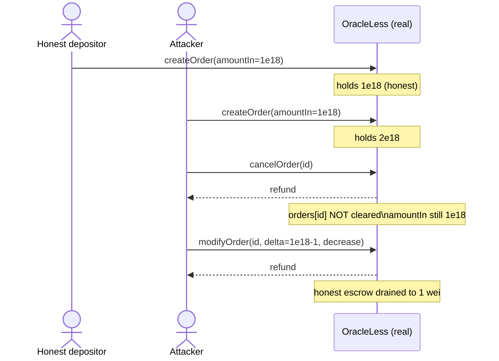

# Oku OracleLess: a cancelled order can be modified to withdraw its escrow twice

> **Vulnerability classes:** vuln/logic/missing-check · vuln/defi/direct-drain · vuln/accounting/double-spend
>
> **Reproduction:** the test deploys the real, unmodified `OracleLess` and `AutomationMaster` from the audited Oku repo (only the opaque order tokens are minimal real ERC20s) and runs the real cancel → modify path to withdraw the same escrow twice, draining a second depositor's funds.

<!-- source-auditvault: https://github.com/Auditware/AuditVault/blob/main/findings/44374-h-4-users-can-modify-a-cancelled-order-withdrawing-the-same.md -->
<!-- date: 2024-11 -->

## Root cause

`OracleLess.cancelOrder` → `_cancelOrder` removes an order's id from `pendingOrderIds` and refunds `order.amountIn` to the recipient, but it **never deletes `orders[orderId]`**. The order struct is left fully populated:

```solidity
function _cancelOrder(Order memory order) internal returns (bool) {
    for (uint96 i = 0; i < pendingOrderIds.length; i++) {
        if (pendingOrderIds[i] == order.orderId) {
            pendingOrderIds = ArrayMutation.removeFromArray(i, pendingOrderIds);
            order.tokenIn.safeTransfer(order.recipient, order.amountIn); // refund #1
            emit OrderCancelled(order.orderId);
            return true;
        }
    }
    return false;
}
```

`modifyOrder` → `_modifyOrder` then re-reads `orders[orderId]` and only checks `msg.sender == order.recipient`. It never checks that the order is still pending/active, so the owner of an already-cancelled order can reduce it and be refunded **again**:

```solidity
uint256 newAmountIn = order.amountIn;          // still 1e18 for a cancelled order
...
} else {
    require(amountInDelta < order.amountIn, "invalid delta");
    newAmountIn -= amountInDelta;
    order.tokenIn.safeTransfer(order.recipient, amountInDelta); // refund #2
}
```

The second refund is paid from the contract's remaining balance, i.e. **other depositors' escrows**. Repeating cancel-then-modify drains the whole contract. The same flaw exists in `Bracket` and `StopLimit`; `OracleLess` is the minimal representative cited by the finding.

The real contract is vendored at [`src/oku/contracts/automatedTrigger/OracleLess.sol`](src/oku/contracts/automatedTrigger/OracleLess.sol).

## Exploit walkthrough (numbers from the test)

1. An honest depositor escrows a real `1e18` order → `OracleLess` holds `1e18`.
2. The attacker escrows their own `1e18` order → `OracleLess` holds `2e18`, attacker holds `0`.
3. `cancelOrder(id)` refunds the attacker `1e18` (withdrawal #1). `orders[id]` still has `amountIn = 1e18`.
4. `modifyOrder(id, …, amountInDelta = 1e18 - 1, increasePosition = false)` refunds the attacker `1e18 - 1` (withdrawal #2) — paid out of the honest depositor's escrow.
5. The attacker deposited `1e18` and walks away with `2e18 - 1`; the pool is left with `1` wei. **Net theft ≈ 1e18 (999999999999999999 wei)**, exactly the honest depositor's escrow.



## Reproduce

```bash
# from the evm-hack-registry root
_shared/run-poc/run_poc.sh 44374-h-4-users-can-modify-a-cancelled-order-withdrawing-the-same_exp -vvvvv
```

Expected: `1 passed`. The test in [`test/44374-…_exp.sol`](test/44374-h-4-users-can-modify-a-cancelled-order-withdrawing-the-same_exp.sol) asserts the attacker's balance rises from `1e18` to `2e18 - 1` while the contract is drained to `1` wei.

## Sources

- [AuditVault finding #44374](https://github.com/Auditware/AuditVault/blob/main/findings/44374-h-4-users-can-modify-a-cancelled-order-withdrawing-the-same.md)
- [Sherlock Oku contest (issue #542)](https://github.com/sherlock-audit/2024-11-oku-judging/issues/542)
- Audited source: [`sherlock-audit/2024-11-oku` @ `ee3f781`](https://github.com/sherlock-audit/2024-11-oku/blob/ee3f781a73d65e33fb452c9a44eb1337c5cfdbd6/oku-custom-order-types/contracts/automatedTrigger/OracleLess.sol#L171-L225)
- Fix: [gfx-labs/oku-custom-order-types PR #1](https://github.com/gfx-labs/oku-custom-order-types/pull/1)
