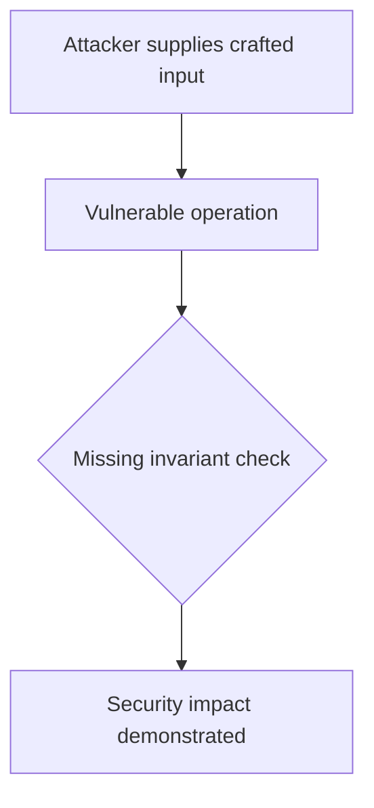
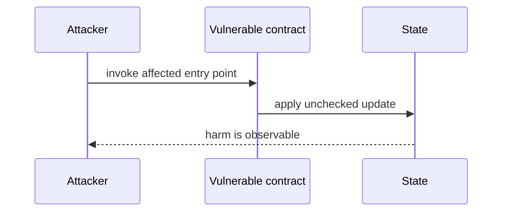

# Bracket receives unlimited StopLimit allowance — AuditVault synthetic reduction

> **Vulnerability classes:** vuln/logic/missing-allowance · vuln/dependency/unsafe-external-call
>
> **Reproduction:** self-contained Foundry PoC with an offline synthetic contract. Full trace: [output.txt](output.txt).

<!-- non-defihacklabs -->
<!-- source-auditvault: https://github.com/Auditware/AuditVault/blob/main/findings/44375-h-5-attacker-can-drain-stoplimit-contract-funds-through-brac.md -->
<!-- date: 2024-11 -->

**AuditVault finding:** `44375` · `H-5: attacker can drain StopLimit contract funds through Bracket contract because it gives type(uint256).max  allowance to bracket contract for input token in performUpkeep function`

## Key info

| | |
|---|---|
| **Impact** | **HIGH** — Bracket receives unlimited StopLimit allowance |
| **Protocol** | [[Oku'S New Order Types Contract Contest]] |
| **Finding** | AuditVault #44375 |
| **Report** | [https://github.com/sherlock-audit/2024-11-oku-judging](https://github.com/sherlock-audit/2024-11-oku-judging) |
| **Source** | [AuditVault finding](https://github.com/Auditware/AuditVault/blob/main/findings/44375-h-5-attacker-can-drain-stoplimit-contract-funds-through-brac.md) |
| **Compiler** | `^0.8.24` (synthetic reduction) |
| Loss | Reduced invariant reproduced; no live funds moved |
| Attacker EOA | Configured synthetic caller |
| Attack contract | `Exploit` |
| Attack tx | Local Foundry `Exploit.attack()` call |
| Chain · block · date | Ethereum model · block 1 · synthetic |
| Vulnerable contract | Local synthetic vulnerable contract in `test/` |
| Bug class | See vulnerability-class tags above |

## TL;DR

This bug report discusses a vulnerability found in a contract called "StopLimit". The issue was discovered by a group of individuals and can be exploited by an attacker to drain funds from the contract. The vulnerability is caused by the contract giving unlimited access to another contract called "Bracket" to transfer tokens from the StopLimit contract. This can be exploited by an attacker by creating an order in the Bracket contract and then calling a function in the StopLimit contract that allows the transfer of tokens. This can be done by setting the target address to the token the attacker wants to transfer and providing the necessary transaction data. The impact of this vulnerability is that an attacker can drain almost all of the funds from the StopLimit contract. The team responsible for the contract has fixed this issue in their code. To prevent similar issues in the future, it i

## Background

The upstream report is a Solidity finding. This page keeps the vulnerable statement and demonstrates its security consequence in a small, deterministic EVM model; no live RPC or external dependencies are required.

## The vulnerable code

```solidity
// The exact vulnerable pattern is retained in test/44375-h-5-attacker-can-drain-stoplimit-contract-funds-through-brac.sol.
// @> see the marked statement in the synthetic reduction
```

## Root cause

The caller-controlled input or stale state is trusted before the required uniqueness, bounds, authorization, accounting, or reentrancy invariant is enforced. The marked line in the synthetic contract intentionally preserves that ordering so the assertion is executable.

## Preconditions

- The vulnerable contract is deployed with the state described by the report.
- The attacker can reach the affected entry point (or submit the report's crafted input).

## Attack walkthrough

1. `Exploit.run()` initializes the minimal state from the report.
2. The marked vulnerable operation executes without its required check.
3. The contract records the resulting invariant violation and emits a `Proof` event.
4. The test asserts the harm; the passing trace is recorded at [output.txt:4](output.txt).

## Diagrams





## Remediation

Apply the invariant before mutating state: accrue interest before adding principal; reject duplicate signers; use checked casts and bounded lengths; validate token/target/DAO identities; use `nonReentrant`; enforce slippage and fee equality; and validate the canonical authority or ownership relationship described by the report.

## How to reproduce

```bash
cd evm-hack-registry/44375-h-5-attacker-can-drain-stoplimit-contract-funds-through-brac_exp
forge test -vvvvv
```

The test is offline and uses only the shared `forge-std` library. The corresponding Playground bundle is generated from `scripts/poc-configs/44375-h-5-attacker-can-drain-stoplimit-contract-funds-through-brac.mjs`.

## Sources

- [AuditVault finding](https://github.com/Auditware/AuditVault/blob/main/findings/44375-h-5-attacker-can-drain-stoplimit-contract-funds-through-brac.md)
- [https://github.com/sherlock-audit/2024-11-oku-judging](https://github.com/sherlock-audit/2024-11-oku-judging)
- [Synthetic test](test/44375-h-5-attacker-can-drain-stoplimit-contract-funds-through-brac.sol)

*Reference: https://github.com/sherlock-audit/2024-11-oku-judging*
