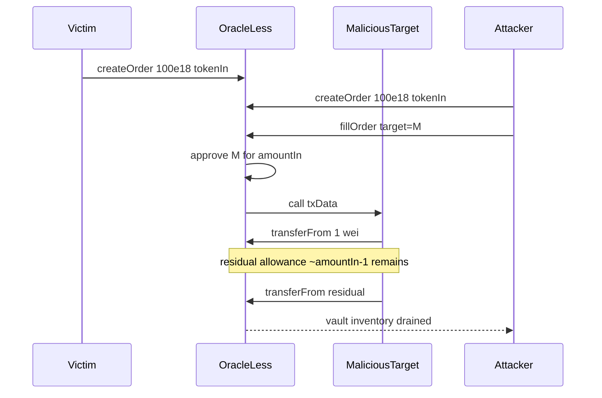

# Oku — Failure to reset unspent approval to the target address wipes the contract balance

> **Vulnerability classes:** vuln/approval/residual · vuln/logic/direct-drain · vuln/access/untrusted-target

> **Reproduction:** a self-contained Foundry PoC that compiles & runs in an
> isolated project with **only `forge-std`** — no fork, no RPC, no `anvil_state`.
> Full trace: [output.txt](output.txt). PoC:
> [test/44376-h-6-failure-to-reset-unspent-approval-to-the-target-address_exp.sol](test/44376-h-6-failure-to-reset-unspent-approval-to-the-target-address_exp.sol).

<!-- non-defihacklabs -->
<!-- source-auditvault: https://github.com/Auditware/AuditVault/blob/main/findings/44376-h-6-failure-to-reset-unspent-approval-to-the-target-address.md -->
<!-- date: 2024-11 -->

**AuditVault taxonomy:** `lang/solidity` · `sector/dex` · `sector/oracle` · `sector/token` · `platform/sherlock` · `has/github` · `has/poc` · `severity/high` · `impact/loss-of-funds/direct-drain` · genome: `wrong-condition` · `direct-drain` · `fot-slippage` · `oracle-freshness`

---

## Key info

| | |
|---|---|
| **Impact** | **HIGH** — residual ERC20 allowance on an untrusted fill target lets an attacker drain other users' pending-order inventory |
| **Protocol** | [Oku Custom Order Types](https://github.com/sherlock-audit/2024-11-oku) — `OracleLess.execute` |
| **Vulnerable code** | `OracleLess.execute` — `order.tokenIn.safeApprove(target, order.amountIn)` with no post-call zeroing |
| **Bug class** | Residual approval / untrusted-target drain |
| **Finding** | Sherlock — 2024-11-oku · #44376 (H-6) · reporter **0x0x0xw3** |
| **Report** | [2024-11-oku-judging](https://github.com/sherlock-audit/2024-11-oku-judging) |
| **Source** | [AuditVault](https://github.com/Auditware/AuditVault/blob/main/findings/44376-h-6-failure-to-reset-unspent-approval-to-the-target-address.md) |
| **Status** | Audit finding. Reproduced here as a standalone local PoC. |
| **Compiler** | `^0.8.24` (PoC) |

---

## TL;DR

1. `execute` approves an arbitrary `target` for the full `order.amountIn`.
2. The target call need only move 1 wei of tokenIn / tokenOut to pass the
   minAmountOut / over-spend checks.
3. Residual allowance is **never** set to zero; the order creator is refunded
   unspent tokenIn, so inventory of *other* orders remains in the vault.
4. The malicious target later `transferFrom`s the residual against the vault,
   wiping pending-order balances.

---

## The vulnerable code

```solidity
//approve
order.tokenIn.approve(target, order.amountIn); // @> VULN: never reset after call

//perform the call
(bool success, bytes memory reason) = target.call(txData);
// MISSING: order.tokenIn.approve(target, 0);
```

**Fix (per report):**

```diff
+      order.tokenIn.safeApprove(target, 0);
```

---

## Root cause

Approvals to untrusted fill targets are not scoped to the amount actually
spent. Combined with refunding unspent tokenIn to the order creator, residual
allowance becomes a free option on the vault's remaining inventory.

## Preconditions

- Pending orders leave tokenIn inventory in the vault.
- Attacker can create an order and choose the fill `target`.

## Attack walkthrough

1. Victim creates a 100e18 tokenIn order (inventory sits in OracleLess).
2. Attacker creates a 100e18 order, fills via malicious target that pulls 1 wei
   and returns 1 wei tokenOut.
3. Residual allowance ≈ 100e18 − 1 remains for the target against the vault.
4. `spendAllowance` drains leftover into the attacker — wiping victim inventory.

## Diagrams



## Impact

Entire vault tokenIn balance (all pending orders of the approved token) can be
stolen by repeating the residual-allowance drain.

## Sources

- [AuditVault finding #44376](https://github.com/Auditware/AuditVault/blob/main/findings/44376-h-6-failure-to-reset-unspent-approval-to-the-target-address.md)
- [Sherlock 2024-11-oku judging](https://github.com/sherlock-audit/2024-11-oku-judging/issues/745)
- Reduced source: [sherlock-audit/2024-11-oku](https://github.com/sherlock-audit/2024-11-oku) `oku-custom-order-types/contracts/automatedTrigger/OracleLess.sol` (execute approval path)
