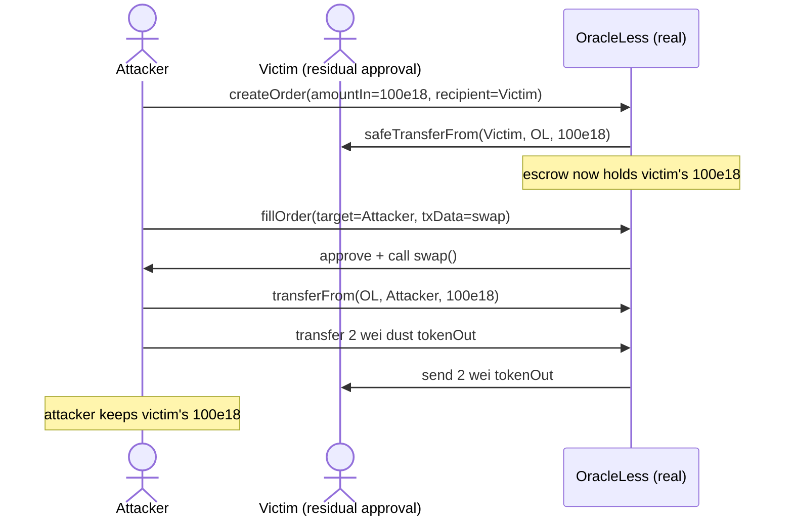

# Oku OracleLess: `procureTokens` pulls from the order recipient, letting an attacker steal a victim's approved tokens

> **Vulnerability classes:** vuln/access-control/missing-check · vuln/defi/direct-drain · vuln/token/transferfrom-source
>
> **Reproduction:** the test deploys the real, unmodified `OracleLess` and `AutomationMaster` from the audited Oku repo (only the opaque tokens are minimal real ERC20s) and runs the real create → fill path, so an attacker turns a victim's leftover approval into a full token theft.

<!-- source-auditvault: https://github.com/Auditware/AuditVault/blob/main/findings/44378-h-8-insecure-calls-to-safetransferfrom-leads-to-users-tokens.md -->
<!-- date: 2024-11 -->

## Root cause

`OracleLess.createOrder` forwards the caller-supplied `recipient` straight into `procureTokens`, which then pulls tokens **from that recipient**, not from `msg.sender`:

```solidity
function createOrder(..., address recipient, ...) external returns (uint96 orderId) {
    procureTokens(tokenIn, amountIn, recipient, permit, permitPayload); // recipient = pull source
    ...
}

function procureTokens(IERC20 token, uint256 amount, address owner, ...) internal {
    ...
    } else {
        token.safeTransferFrom(owner, address(this), amount); // owner == recipient == victim
    }
}
```

Any address with a residual allowance to the protocol can be named as `recipient` by an attacker, and its tokens are pulled into an attacker-crafted order without consent. The attacker then fills their own order through the arbitrary `target`/`txData` call in `fillOrder` → `execute`, keeping the escrowed `tokenIn` and returning only dust `tokenOut`. The same pattern exists in `Bracket.modifyOrder` and `StopLimit`; `OracleLess.procureTokens` is the location cited by the finding.

The real contract is vendored at [`src/oku/contracts/automatedTrigger/OracleLess.sol`](src/oku/contracts/automatedTrigger/OracleLess.sol) (`procureTokens` at L259-282, `execute` at L227-257).

## Exploit walkthrough (numbers from the test)

Precondition: the victim holds `100e18` of a valuable token and has a leftover `100e18` approval to `OracleLess` (e.g. an over-approval from an earlier intended trade).

1. Attacker calls `createOrder(tokenIn, tokenOut, amountIn = 100e18, minAmountOut = 1, recipient = victim, …)`. `procureTokens` pulls `100e18` **from the victim** into `OracleLess`.
2. Attacker calls `fillOrder(0, orderId, target = attacker, txData = swap())`. `execute` approves the attacker's contract for `100e18` of `tokenIn`, then calls it.
3. The attacker's `swap()` does `transferFrom(OracleLess → attacker, 100e18)` and returns `2` wei of the worthless `tokenOut` — enough to clear the `> minAmountOut` and `over spend` checks.
4. `fillOrder` sends the `2` wei `tokenOut` to the recipient (victim). **Result: attacker gains `100e18` of the victim's valuable token; the victim is left with `2` wei of a worthless token.**



## Reproduce

```bash
# from the evm-hack-registry root
_shared/run-poc/run_poc.sh 44378-h-8-insecure-calls-to-safetransferfrom-leads-to-users-tokens_exp -vvvvv
```

Expected: `1 passed`. The test in [`test/44378-…_exp.sol`](test/44378-h-8-insecure-calls-to-safetransferfrom-leads-to-users-tokens_exp.sol) asserts the attacker contract ends holding the victim's `100e18` while the victim is left with only `2` wei of a worthless token.

## Sources

- [AuditVault finding #44378](https://github.com/Auditware/AuditVault/blob/main/findings/44378-h-8-insecure-calls-to-safetransferfrom-leads-to-users-tokens.md)
- [Sherlock Oku contest (issue #789)](https://github.com/sherlock-audit/2024-11-oku-judging/issues/789)
- Audited source: [`sherlock-audit/2024-11-oku` @ `ee3f781`](https://github.com/sherlock-audit/2024-11-oku/blob/ee3f781a73d65e33fb452c9a44eb1337c5cfdbd6/oku-custom-order-types/contracts/automatedTrigger/OracleLess.sol#L280)
- Fix: [gfx-labs/oku-custom-order-types PR #1](https://github.com/gfx-labs/oku-custom-order-types/pull/1)
