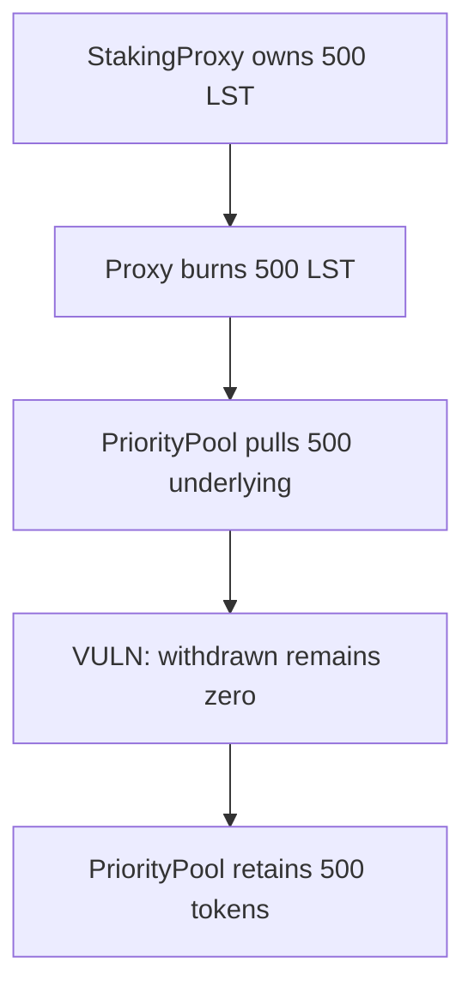

# Stake.Link — instant withdrawals can burn LST while stranding underlying

<!-- non-defihacklabs -->
<!-- source-auditvault: https://github.com/Auditware/AuditVault/blob/main/findings/45292-instant-withdrawals-in-priority-pool-can-result-in-loss-of-f.md -->
<!-- date: 2025-01 -->

> **Vulnerability classes:** vuln/logic/state-update · vuln/dos/frozen-funds

> **Reproduction:** Fully local, cheatcode-free synthetic. Run `forge test -vvv` in this folder.

## Key info

| Field | Value |
| --- | --- |
| Protocol | Stake.Link StakingProxy |
| Finding | AuditVault 45292 |
| Impact | High |
| Reproduction | Local synthetic; no mainnet fork |
| Vulnerable contract | `PriorityPool` |
| Compiler | Solidity 0.8.24 |

## TL;DR

During an instant withdrawal, PriorityPool receives underlying assets from StakingPool and reduces `toWithdraw`, but it never increments `withdrawn`. StakingProxy has already burned the user LST, while the final transfer is skipped and the underlying remains trapped in PriorityPool.

## Vulnerable code

The minimized contract preserves the reported operation with an `@> VULN` marker in [the synthetic](test/45292-instant-withdrawals-in-priority-pool-can-result-in-loss-of-f.sol).

## Root cause

The instant-withdraw branch executes `stakingPool.withdraw` and then only subtracts `fromPool` from `toWithdraw`. It omits `withdrawn += fromPool`, so the subsequent payout condition is false even after liquidity has reached PriorityPool.

## Preconditions

Instant withdrawals are enabled and StakingPool has enough underlying liquidity for the requested redemption.

## Attack walkthrough

The synthetic starts with 500 underlying tokens in StakingPool and 500 LST in StakingProxy. After instant withdrawal, the proxy LST balance is zero, the proxy receives zero underlying, and PriorityPool holds all 500 withdrawn tokens.

## Diagrams



## Impact

A legitimate StakingProxy redemption can permanently destroy the holder LST claim without delivering the corresponding underlying asset. The proof asserts all three post-conditions on chain.

## Remediation

After an instant withdrawal succeeds, add `withdrawn += toWithdrawFromPool` before the final transfer. Keep a regression test that checks both LST burn and underlying receipt.

## How to reproduce

```bash
cd /workspaces/RustroverProjects/audits/evm-hack-registry/45292-instant-withdrawals-in-priority-pool-can-result-in-loss-of-f_exp
forge test -vvv
```

## Sources

- [AuditVault finding](https://github.com/Auditware/AuditVault/blob/main/findings/45292-instant-withdrawals-in-priority-pool-can-result-in-loss-of-f.md)
- [Cyfrin assessment](https://github.com/solodit/solodit_content/blob/main/reports/Cyfrin/2025-01-20-cyfrin-stakedotlink-stakingproxy-v2.0.md)
- Reduced local source: [test/45292-instant-withdrawals-in-priority-pool-can-result-in-loss-of-f.sol](test/45292-instant-withdrawals-in-priority-pool-can-result-in-loss-of-f.sol)
