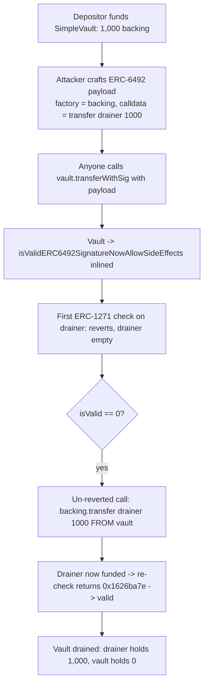
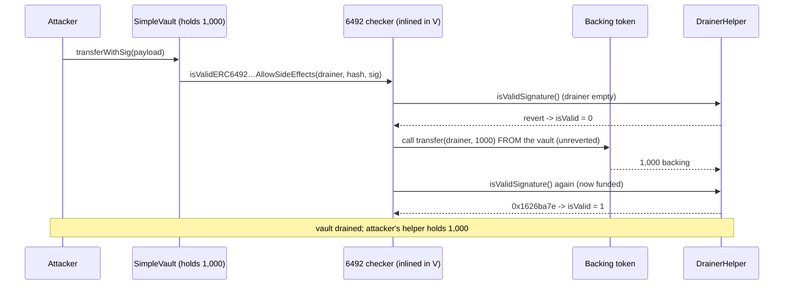

# Solady — `isValidERC6492SignatureNowAllowSideEffects` allows arbitrary calls via a crafted signature

> **Vulnerability classes:** vuln/access-control/signature-validation · vuln/logic/arbitrary-external-call · vuln/loss-of-funds/direct-drain

> **Reproduction:** a self-contained Foundry PoC that compiles & runs in an
> isolated project with **only `forge-std`** — no fork, no RPC, no `anvil_state`.
> The vulnerable Solady function is copied verbatim; everything is deployed
> locally. Full trace: [output.txt](output.txt). PoC:
> [test/45407-isvaliderc6492signaturenowallowsideeffects-allows-arbitrary_exp.sol](test/45407-isvaliderc6492signaturenowallowsideeffects-allows-arbitrary_exp.sol).

<!-- non-defihacklabs -->
<!-- source-auditvault: https://github.com/Auditware/AuditVault/blob/main/findings/45407-isvaliderc6492signaturenowallowsideeffects-allows-arbitrary.md -->
<!-- date: 2024-12 -->

---

## Key info

| | |
|---|---|
| **Impact** | **HIGH** — direct fund loss: any protocol that validates a signature through this Solady helper can be made to execute an arbitrary call from its own context, draining assets it holds |
| **Protocol** | [Solady](https://github.com/Vectorized/solady) `SignatureCheckerLib` (audited in the Coinbase/Spearbit Solady review) |
| **Vulnerable function** | `isValidERC6492SignatureNowAllowSideEffects` (SignatureCheckerLib.sol, v0.0.281 @ L306, pre-PR-1221) |
| **Bug class** | The AllowSideEffects ERC-6492 checker performs a caller-controlled `call(factory, factoryCalldata)` and does **not** revert its side effects |
| **Finding** | Spearbit — Coinbase/Solady review, Dec 2024 · #45407 · reporter **Kaden** |
| **Report** | [Solady-Coinbase-Spearbit-Security-Review-December-2024.pdf](https://github.com/spearbit/portfolio/blob/master/pdfs/Solady-Coinbase-Spearbit-Security-Review-December-2024.pdf) |
| **Source** | [AuditVault](https://github.com/Auditware/AuditVault/blob/main/findings/45407-isvaliderc6492signaturenowallowsideeffects-allows-arbitrary.md) |
| **Status** | Audit finding — fixed by Solady in PR-1221. Reproduced here as a standalone local PoC against the pre-fix version. |
| **Compiler** | `^0.8.19` (PoC) |

This is an **audit finding**, not a historical on-chain incident. The PoC copies
the vulnerable Solady function verbatim and reproduces the finding's own
`SimpleVault` / `DrainerHelper` demonstration locally.

---

## TL;DR

1. ERC-6492 lets a signature be postfixed with a magic suffix so a verifier can
   "prepare" (deploy) a smart-account signer before doing the ERC-1271 check.
2. Solady's **AllowSideEffects** variant does that preparation with a raw
   `call(factory, factoryCalldata)` to **caller-supplied** address + calldata, and
   **never reverts** that call (unlike `isValidERC6492SignatureNow`, which routes
   it through a reverting verifier contract).
3. A protocol (`SimpleVault`) that trusts this helper to validate a signature can
   therefore be tricked into performing an **arbitrary call from its own context**.
4. The attacker crafts a payload whose "factory call" is
   `backing.transfer(drainer, 1000e18)`. The `DrainerHelper`'s `isValidSignature`
   fails while empty, so the un-reverted call fires and drains the vault; the
   drainer is now funded, so the ERC-1271 re-check passes and the signature is
   "valid".
5. The PoC drains the vault's entire **1,000 backing tokens** to the attacker in a
   single permissionless `transferWithSig` call.

---

## The vulnerable code

Copied **verbatim** from Solady `SignatureCheckerLib.sol` v0.0.281. The
side-effecting, un-reverted call:

```solidity
let s := add(o, mload(add(o, 0x40))) // Inner signature.
isValid := callIsValidSignature(signer, hash, s);
if iszero(isValid) {
    // @> arbitrary caller-supplied call, side effects NOT reverted:
    if call(gas(), mload(o), 0, add(d, 0x20), mload(d), codesize(), 0x00) {
        noCode := iszero(extcodesize(signer))
        if iszero(noCode) { isValid := callIsValidSignature(signer, hash, s) }
    }
}
```

The vulnerable consumer trusts it (finding's PoC, verbatim):

```solidity
function transferWithSig(address from, address to, uint256 amount, uint256 nonce, bytes calldata sig) public {
    bytes32 hash = getHash(from, to, amount, nonce);
    require(nonce == nextNonce[from]++, "nonce wrong");
    // @> Trusts the side-effect-allowing 6492 checker to validate the signature.
    require(SignatureCheckerLib.isValidERC6492SignatureNowAllowSideEffects(from, hash, sig), "invalid sig");
    _transfer(from, to, amount);
}
```

Because `SignatureCheckerLib` is an `internal` library, its assembly is **inlined
into the vault** — so the arbitrary `call` executes from the vault's own address.

---

## Root cause

The AllowSideEffects variant treats a **caller-supplied** `(factory, calldata)`
as a trusted "prepare the account" step and performs it with a raw `call` whose
side effects are never rolled back. There is no constraint that the call only
deploys the `signer`, and no revert wrapper. Any consumer that (a) holds assets
and (b) validates signatures with this helper can be made to call anything from
its own context.

## Preconditions

- A protocol uses `isValidERC6492SignatureNowAllowSideEffects` to validate a
  signature over an action it will then perform (`SimpleVault.transferWithSig`).
- The attacker can supply the signature bytes (here, permissionless — anyone can
  call `transferWithSig`).
- The protocol custodies assets (the vault holds a depositor's 1,000 backing tokens).

## Attack walkthrough

From [output.txt](output.txt):

1. A depositor funds `SimpleVault` with **1,000 backing tokens** (asserted).
2. The attacker deploys a `DrainerHelper` and crafts an ERC-6492 payload:
   `abi.encode(factory = backing, factoryCalldata = transfer(drainer, 1000e18), innerSig = "")`
   + the `0x6492…6492` magic suffix.
3. Anyone calls `vault.transferWithSig(drainer, drainer, 0, 0, payload)`.
4. The vault forwards it to the checker (inlined). The signer (`drainer`) has code,
   so the first ERC-1271 check runs — and **reverts** (the drainer holds nothing).
5. `isValid == 0`, so the library executes the un-reverted
   `call(backing, transfer(drainer, 1000e18))` **from the vault**, draining it.
6. The drainer is now funded, so the ERC-1271 re-check returns `0x1626ba7e` and the
   function returns `true`.
7. **HARM:** `backing.balanceOf(drainer) == 1,000e18` and `backing.balanceOf(vault) == 0` —
   the depositor's entire balance is stolen.

## Diagrams





## Remediation

Solady's fix (PR-1221) routes the ERC-6492 preparation call through a
side-effect-free path / reverting verifier so a failed check cannot leave state
changes behind. Consumers should prefer `isValidERC6492SignatureNow` (which
reverts side effects) and never validate authorization with the AllowSideEffects
variant against untrusted signature bytes.

## How to reproduce

```bash
cd ~/RustroverProjects/audits/evm-hack-registry/45407-isvaliderc6492signaturenowallowsideeffects-allows-arbitrary_exp
forge test --match-test test_sideEffect -vvv
# Fully local — no fork, no RPC, no anvil_state required.
# Expected: [PASS]; after one transferWithSig, drainer holds 1,000e18 and vault holds 0.
```

PoC source: [test/45407-isvaliderc6492signaturenowallowsideeffects-allows-arbitrary_exp.sol](test/45407-isvaliderc6492signaturenowallowsideeffects-allows-arbitrary_exp.sol)
— the verbatim vulnerable Solady function plus the finding's `SimpleVault` /
`DrainerHelper` demonstration.

---

*Reference: finding **#45407** by **Kaden** in the [Solady / Coinbase Spearbit review (Dec 2024)](https://github.com/spearbit/portfolio/blob/master/pdfs/Solady-Coinbase-Spearbit-Security-Review-December-2024.pdf) · curated by [AuditVault](https://github.com/Auditware/AuditVault/blob/main/findings/45407-isvaliderc6492signaturenowallowsideeffects-allows-arbitrary.md)*
