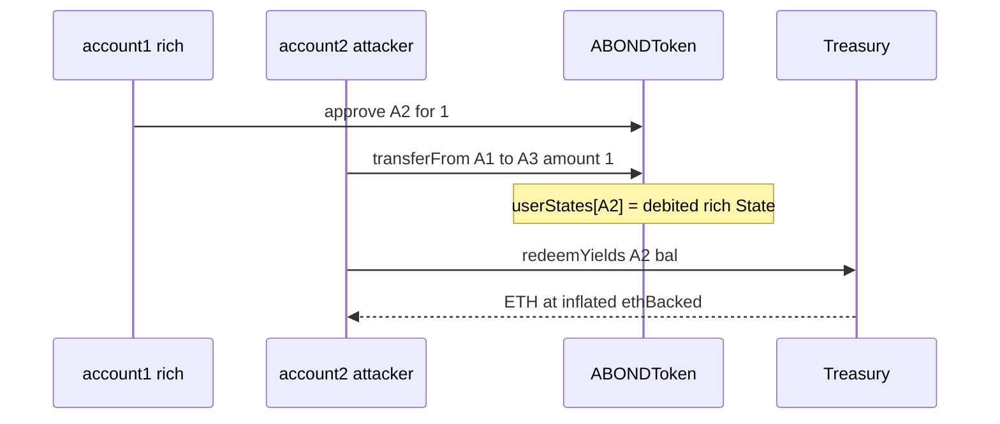

# Autonomint — `ABONDToken::transferFrom` corrupts `userStates` and enables Treasury ETH theft

> **Vulnerability classes:** vuln/accounting/state-key · vuln/token/erc20-inconsistency · vuln/logic/direct-drain

> **Reproduction:** a self-contained Foundry PoC that compiles & runs in an
> isolated project with **only `forge-std`** — no fork, no RPC, no `anvil_state`.
> Full trace: [output.txt](output.txt). PoC:
> [test/45462-h-9-abondtokentransferfrom-does-not-work-as-intended-and-all_exp.sol](test/45462-h-9-abondtokentransferfrom-does-not-work-as-intended-and-all_exp.sol).

<!-- non-defihacklabs -->
<!-- source-auditvault: https://github.com/Auditware/AuditVault/blob/main/findings/45462-h-9-abondtokentransferfrom-does-not-work-as-intended-and-all.md -->
<!-- date: 2024-11 -->

**AuditVault taxonomy:** `lang/solidity` · `sector/lending` · `sector/stable` · `sector/token` · `platform/sherlock` · `has/github` · `has/poc` · `severity/high` · `impact/loss-of-funds/direct-drain` · genome: `missing-modifier` · `direct-drain` · `liquidation-underwater` · `reentrancy-guard` · `timestamp-dependence`

---

## Key info

| | |
|---|---|
| **Impact** | **HIGH** — duplicated high-`ethBacked` State on the spender lets them redeem inflated ETH from Treasury |
| **Protocol** | [Autonomint Colored Dollar V1](https://github.com/sherlock-audit/2024-11-autonomint) — `ABONDToken.transferFrom` |
| **Vulnerable code** | `userStates[msg.sender] = fromState` after `_debit` (should be `userStates[from]`) |
| **Bug class** | Wrong mapping key / dual-ledger ERC20 |
| **Finding** | Sherlock — 2024-11-autonomint · #45462 (H-9) · reporter **tjonair** |
| **Report** | [2024-11-autonomint-judging](https://github.com/sherlock-audit/2024-11-autonomint-judging) |
| **Source** | [AuditVault](https://github.com/Auditware/AuditVault/blob/main/findings/45462-h-9-abondtokentransferfrom-does-not-work-as-intended-and-all.md) |
| **Status** | Audit finding. Reproduced here as a standalone local PoC. |
| **Compiler** | `^0.8.24` (PoC) |

---

## TL;DR

1. `transferFrom` debits the `from` State, then writes it to **`msg.sender`**.
2. The true `from` keeps their full `ethBacked` State; the spender inherits a
   quasi-copy of the rich State.
3. `redeemYields` pays `aBondAmount * ethBacked / PRECISION` using the
   duplicated State against the spender's ERC20 balance.
4. A poor account can redeem ~2× ETH after transferFrom-ing 1 wei from a rich account.

---

## The vulnerable code

```solidity
fromState = Colors._debit(fromState, uint128(value));
userStates[msg.sender] = fromState; // @> VULN: should be userStates[from]
super.transferFrom(from, to, value);
```

**Fix:**

```diff
-       userStates[msg.sender] = fromState;
+       userStates[from] = fromState;
```

---

## Root cause

Dual accounting (ERC20 balances + colored `userStates`) updates the wrong
address key after debit, breaking EIP-20 semantics and yield redemption.

## Preconditions

- Account with high `ethBacked` approves the attacker.
- Attacker holds some ABOND with lower `ethBacked`.
- Treasury has ETH to pay redemptions.

## Attack walkthrough

1. account1: 100 ABOND, ethBacked=2e18. account2: 10 ABOND, ethBacked=1e18.
2. account1 approves account2 for 1 wei; account2 `transferFrom` → account3.
3. account2's `userStates` now carries ethBacked=2e18.
4. account2 redeems 10 ABOND → ~20 ETH instead of ~10 ETH.

## Diagrams



## Impact

Treasury ETH theft; broken ABOND accounting; EIP-20 non-compliance for colored state.

## Sources

- [AuditVault finding #45462](https://github.com/Auditware/AuditVault/blob/main/findings/45462-h-9-abondtokentransferfrom-does-not-work-as-intended-and-all.md)
- [Sherlock 2024-11-autonomint judging #636](https://github.com/sherlock-audit/2024-11-autonomint-judging/issues/636)
- Reduced source: [sherlock-audit/2024-11-autonomint@0d324e0](https://github.com/sherlock-audit/2024-11-autonomint/blob/0d324e04d4c0ca306e1ae4d4c65f0cb9d681751b/Blockchain/Blockchian/contracts/Token/Abond_Token.sol#L147-L170)
