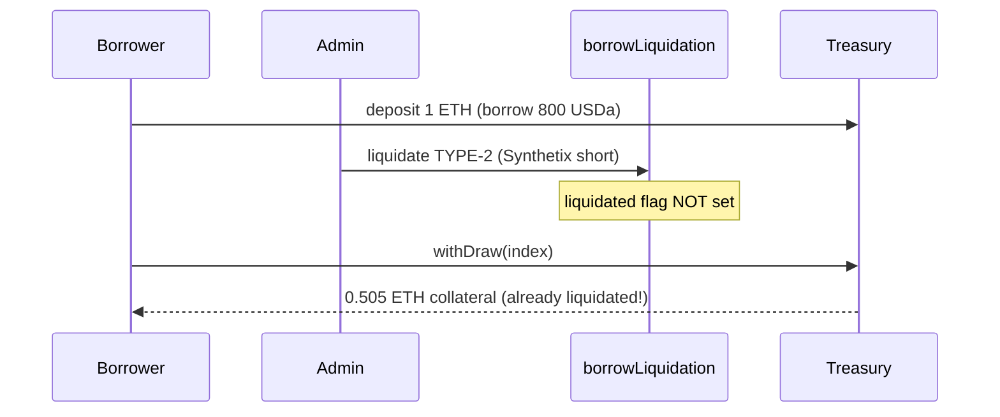

# Autonomint: a Type-2 liquidated borrower can still withdraw its collateral

> **Vulnerability classes:** liquidation-logic · direct-drain · missing-state-update
>
> **Reproduction:** deploys the REAL audited Autonomint protocol (the full
> `Core_logic` + `lib` set at Sherlock snapshot
> `0d324e04d4c0ca306e1ae4d4c65f0cb9d681751b`) with minimal real doubles only for the
> opaque external venues (Ionic lending, WETH, Synthetix, RedStone oracle) and the
> repo's own `EndpointV2Mock` LayerZero stack. No mainnet fork.

<!-- source-auditvault: https://github.com/sherlock-audit/2024-11-autonomint-judging/issues/696 -->
<!-- date: 2024-11 -->

## Root cause

`borrowLiquidation.liquidationType2` (used when the position is hedged with a 1x
Synthetix short instead of being covered by the CDS) omits every state change that
`liquidationType1` performs. Critically it never sets `depositDetail.liquidated = true`
and never calls `treasury.updateDepositDetails`.

The withdraw path guards on exactly that flag:

```solidity
// lib/BorrowLib.sol  (withdraw)
if (depositDetail.liquidated) revert IBorrowing.Borrow_AlreadyLiquidated();
```

After a Type-1 liquidation this guard blocks the borrower. After a Type-2 liquidation
the flag is still `false`, so the borrower can withdraw collateral that was already
seized — the withdrawn collateral is taken from other borrowers' deposits.

Vulnerable source: [`src/Core_logic/borrowLiquidation.sol`](src/Core_logic/borrowLiquidation.sol) (`liquidationType2`).

## Exploit walkthrough (real numbers)

1. Seed the CDS with 6,000 USDT so a borrow can be opened.
2. A borrower deposits **1 ETH** at $1,000 and borrows ~800 USDa.
3. The admin liquidates the borrower via **`LiquidationType.TWO`** (opens the Synthetix
   short). `getBorrowing(...).liquidated` is asserted to still be **`false`**.
4. The borrower calls `withDraw` and the treasury pays **0.505 ETH** of collateral to a
   fresh EOA — despite the position having been liquidated.

`test/…_exp.sol` asserts the liquidated borrower's payout balance strictly increases and
that the treasury collateral is drained.



## Reproduction

```bash
_shared/run-poc/run_poc.sh 45463-h-10-users-can-withdraw-liquidated-collateral-sherlock-auton_exp -vvvvv
```
