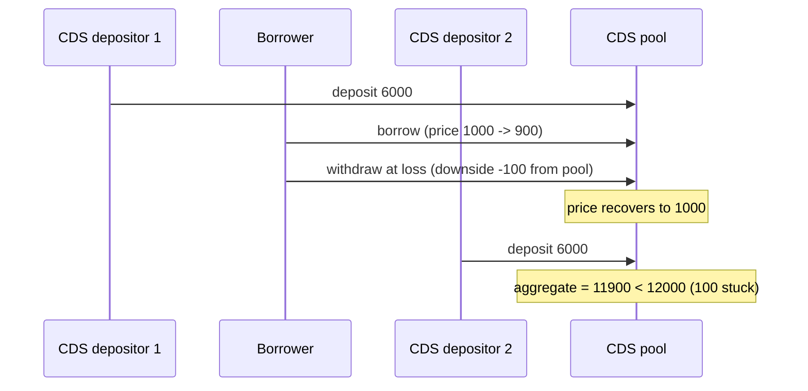

# Autonomint: borrower downside protection is recovered into the whole CDS pool

> **Vulnerability classes:** liquidation-logic · reward-accounting · integer-bounds · locked-funds
>
> **Reproduction:** deploys the REAL audited Autonomint protocol (full `Core_logic` +
> `lib` at Sherlock snapshot `0d324e04d4c0ca306e1ae4d4c65f0cb9d681751b`) with minimal
> real doubles only for the opaque external venues (Ionic, WETH, Synthetix, RedStone
> oracle) and the repo's own `EndpointV2Mock` LayerZero stack. No mainnet fork.

<!-- source-auditvault: https://github.com/sherlock-audit/2024-11-autonomint-judging/issues/734 -->
<!-- date: 2024-11 -->

## Root cause

When a borrower withdraws while underwater, `BorrowLib.withdraw` increases
`omniChainData.downsideProtected` and the CDS realizes that loss by subtracting it from
`totalCdsDepositedAmount` (`CDS.withdraw` / `CDSLib`). When the price later recovers, the
protection is credited back to the pool **at large** (divided by the full
`totalCdsDepositedAmount`) rather than to the specific depositor that funded it. The
aggregate therefore drifts below the sum of the individual deposits and a later depositor
cannot be made whole.

Vulnerable sources: [`src/lib/BorrowLib.sol`](src/lib/BorrowLib.sol) (downside protection
increase) and [`src/Core_logic/CDS.sol`](src/Core_logic/CDS.sol) (`withdraw`, downside
realization + return-amount calculation).

## Exploit walkthrough (real numbers)

1. CDS depositor #1 deposits **6,000 USDT**.
2. A borrower deposits **1 ETH** at $1,000.
3. Price drops to **$900**; the borrower withdraws at a loss — this adds ~100 USDa of
   downside protection that is deducted from the pool aggregate (0.5 ETH is paid to a
   fresh EOA).
4. A second borrower deposits 1 ETH at $900; price recovers to **$1,000**.
5. CDS depositor #2 deposits **6,000 USDT**.
6. Both depositors put in 6,000 each (12,000 total) at the same net price, yet
   `totalCdsDepositedAmount` reads **11,900** — a permanent **100 USDa** shortfall that
   strands the later depositor.

`test/…_exp.sol` asserts `totalCdsDepositedAmount < 12,000e6`.



## Reproduction

```bash
_shared/run-poc/run_poc.sh 45464-h-11-borrower-withdrawing-at-a-loss-will-cause-losses-for-cd_exp -vvvvv
```
