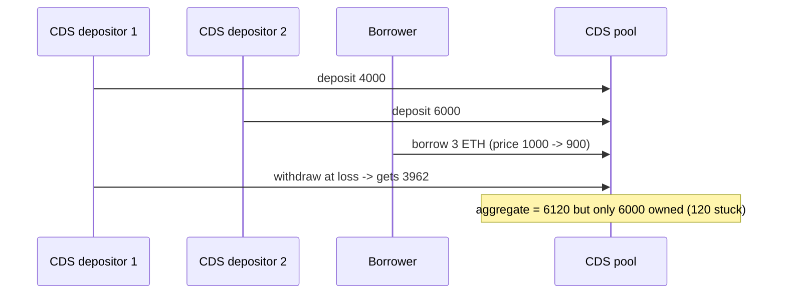

# Autonomint: a lossy CDS withdrawal corrupts totalCdsDepositedAmount

> **Vulnerability classes:** reward-accounting · locked-funds · integer-bounds
>
> **Reproduction:** deploys the REAL audited Autonomint protocol (full `Core_logic` +
> `lib` at Sherlock snapshot `0d324e04d4c0ca306e1ae4d4c65f0cb9d681751b`) with minimal
> real doubles only for the opaque external venues (Ionic, WETH, Synthetix, RedStone
> oracle) and the repo's own `EndpointV2Mock` LayerZero stack. No mainnet fork.

<!-- source-auditvault: https://github.com/sherlock-audit/2024-11-autonomint-judging/issues/738 -->
<!-- date: 2024-11 -->

## Root cause

Before calling the library, `CDS.withdraw` overwrites `cdsDepositDetails.depositedAmount`
with the loss-adjusted return value. `CDSLib.withdrawUserWhoNotOptedForLiq` then decrements
the aggregate by that already-reduced amount:

```solidity
// lib/CDSLib.sol  (withdrawUserWhoNotOptedForLiq)
totalCdsDepositedAmount -= params.cdsDepositDetails.depositedAmount;      // loss-adjusted!
params.omniChainData.totalCdsDepositedAmount -= params.cdsDepositDetails.depositedAmount;
```

Removing a 4,000 position that returned only 3,962 leaves the aggregate too high; all
subsequent cumulative-value math is computed on the wrong total, stranding USDa.

Vulnerable sources: [`src/lib/CDSLib.sol`](src/lib/CDSLib.sol) (`withdrawUserWhoNotOptedForLiq`)
and [`src/Core_logic/CDS.sol`](src/Core_logic/CDS.sol) (`withdraw`).

## Exploit walkthrough (real numbers)

1. CDS depositor #1 deposits **4,000 USDT**; depositor #2 deposits **6,000 USDT**
   (aggregate 10,000).
2. A borrower deposits **3 ETH** at $1,000 (creates protocol volume).
3. Price drops to **$900**; CDS depositor #1 withdraws at a loss and receives **3,962 USDa**.
4. `totalCdsDepositedAmount` now reads **6,120** while the only remaining depositor owns
   just **6,000** — an over-counted / stuck **~120 USDa**.

`test/…_exp.sol` asserts the depositor took a loss (`< 4,000e6`) and the aggregate exceeds
the 6,000e6 the remaining depositor owns.



## Reproduction

```bash
_shared/run-poc/run_poc.sh 45465-h-12-total-cds-deposited-amount-is-incorrectly-modified-when_exp -vvvvv
```
