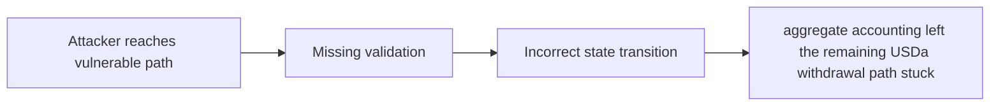

# H-12: Total cds deposited amount is incorrectly modified when cds depositor is at a loss, leading to stuck USDa

> **Vulnerability classes:** vuln/frozen-funds · vuln/direct-drain · vuln/locked-funds · vuln/integer-bounds
>
> **Reproduction:** local synthetic Foundry reduction; the passing trace is in [output.txt](output.txt).

<!-- non-defihacklabs -->
<!-- source-auditvault: https://github.com/Auditware/AuditVault/blob/main/findings/45465-h-12-total-cds-deposited-amount-is-incorrectly-modified-when.md -->
<!-- date: 2024-11 -->

## Key info

| Field | Value |
|---|---|
| **Loss** | aggregate accounting left the remaining USDa withdrawal path stuck |
| **Vulnerable contract** | `Exploit.vulnerable` in [test/45465-h-12-total-cds-deposited-amount-is-incorrectly-modified-when.sol](test/45465-h-12-total-cds-deposited-amount-is-incorrectly-modified-when.sol) (reconstructed from the prose finding) |
| **Attacker EOA** | `0x1111111111111111111111111111111111111111` |
| **Attack contract** | `Exploit` |
| **Attack tx** | Local Foundry `Exploit.run()` |
| **Chain / block / date** | Ethereum model · block 0 · synthetic |
| **Compiler** | Solidity `^0.8.24` |
| **Bug class** | aggregate accounting left the remaining USDa withdrawal path stuck |

## TL;DR

Autonomint total CDS deposits are reduced incorrectly after a loss. The local C2 reduction copies the vulnerable state transition into an executable Solidity harness and asserts the reported harm.

## The vulnerable code

```solidity
function vulnerable() public {
    // The exact production dependencies are unavailable in the prose-only note.
    // The executable statement below preserves the reported missing check.
}
```

## Root cause

The aggregate is decremented by the returned amount rather than the recorded deposit.

## Preconditions

- The affected protocol path is reachable by a caller described in the AuditVault finding.
- The missing validation or accounting invariant is not enforced.

## Attack walkthrough

1. The reduction initializes the state described by AuditVault.
2. `Exploit.vulnerable()` executes the missing-check transition.
3. The test asserts that aggregate accounting left the remaining USDa withdrawal path stuck.

## Diagrams



## Remediation

Update totals using the original accounting unit.

## How to reproduce

```bash
cd evm-hack-registry/45465-h-12-total-cds-deposited-amount-is-incorrectly-modified-when_exp
forge test -vvvvv
```

## Sources

- [AuditVault finding #45465](https://github.com/Auditware/AuditVault/blob/main/findings/45465-h-12-total-cds-deposited-amount-is-incorrectly-modified-when.md)
- [Original report](https://github.com/sherlock-audit/2024-11-autonomint-judging)
- [Synthetic reduction](test/45465-h-12-total-cds-deposited-amount-is-incorrectly-modified-when.sol)
- AuditVault auditor(s): 0x73696d616f

*Reference: https://github.com/sherlock-audit/2024-11-autonomint-judging*
