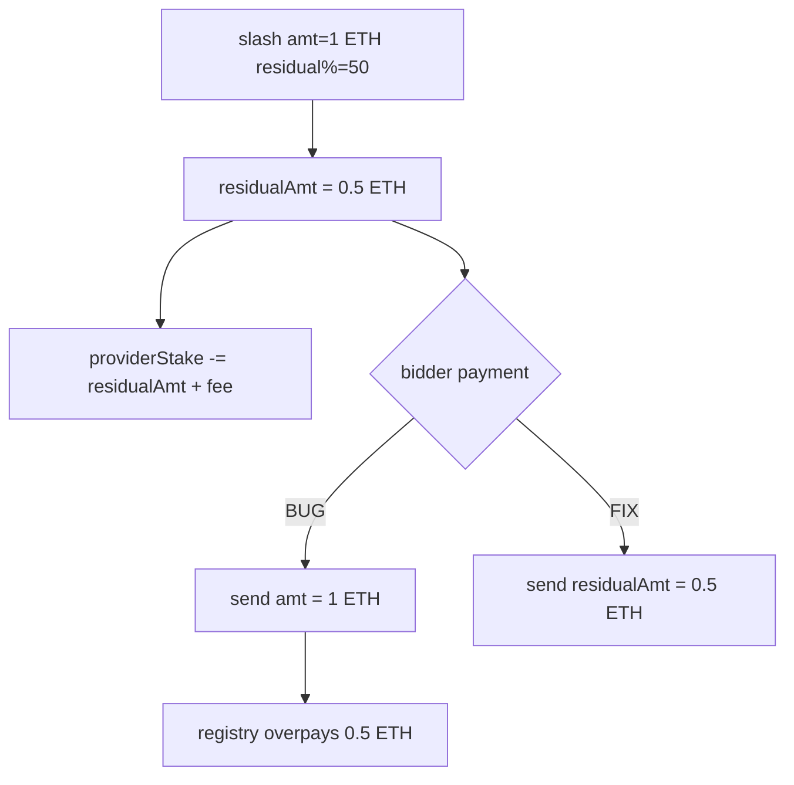

# Primev — Overpayment to bidder in `slash` due to incorrect amount transfer

> **Vulnerability classes:** vuln/logic/wrong-transfer-amount · vuln/accounting/fee · vuln/logic/direct-drain

> **Reproduction:** a self-contained Foundry PoC that compiles & runs in an
> isolated project with **only `forge-std`** — no fork, no RPC, no `anvil_state`.
> Full trace: [output.txt](output.txt). PoC:
> [test/46246-overpayment-to-bidder-in-slash-function-due-to-incorrect-amo_exp.sol](test/46246-overpayment-to-bidder-in-slash-function-due-to-incorrect-amo_exp.sol).

<!-- non-defihacklabs -->
<!-- source-auditvault: https://github.com/Auditware/AuditVault/blob/main/findings/46246-overpayment-to-bidder-in-slash-function-due-to-incorrect-amo.md -->
<!-- date: 2024-11 -->

**AuditVault taxonomy:** `lang/solidity` · `platform/cantina` · `has/poc` · `severity/high` · `sector/staking` · genome: `wrong-condition` · `direct-drain` · `account-signer` · `fee-accounting` · `reward-accounting`

---

## Key info

| | |
|---|---|
| **Impact** | **HIGH** — slash pays full `amt` to the bidder while only debiting `residualAmt + fee` from provider stake; excess drains registry ETH |
| **Protocol** | [Primev](https://cdn.cantina.xyz/reports/cantina_competition_private_primev.pdf) — `ProviderRegistry.slash` |
| **Vulnerable code** | `bidder.call{value: amt}` should be `residualAmt` |
| **Bug class** | Wrong transfer amount after correct residual computation |
| **Finding** | Cantina — Primev · #46246 · reporter **Nexarion** |
| **Report** | [Cantina Primev PDF](https://cdn.cantina.xyz/reports/cantina_competition_private_primev.pdf) |
| **Source** | [AuditVault](https://github.com/Auditware/AuditVault/blob/main/findings/46246-overpayment-to-bidder-in-slash-function-due-to-incorrect-amo.md) |
| **Status** | Audit finding. Reproduced here as a standalone local PoC. |
| **Compiler** | `^0.8.24` (PoC) |

---

## TL;DR

1. `slash` computes `residualAmt = amt * residualBidPercentAfterDecay / 100%`.
2. Provider stake is reduced by `residualAmt + fee` (correct).
3. Bidder is paid **`amt`** instead of **`residualAmt`**.
4. With 50% decay, bidder gets 1 ETH instead of 0.5 ETH — 0.5 ETH excess from the registry.

---

## The vulnerable code

```solidity
uint256 residualAmt = (amt * residualBidPercentAfterDecay) / ONE_HUNDRED_PERCENT;
// ... debit residualAmt + fee from providerStake ...
(bool ok, ) = bidder.call{value: amt}(""); // @> VULN: should be residualAmt
```

**Fix:** transfer `residualAmt` to the bidder.

---

## Root cause

Residual/decay accounting is applied to the provider debit but not to the
bidder credit — asymmetric transfer.

## Preconditions

- Provider has stake ≥ slash amount.
- Caller is authorized preconf manager.
- `residualBidPercentAfterDecay < 100%`.

## Attack walkthrough

1. Provider stakes 2 ETH.
2. Slash 1 ETH with 50% residual → residualAmt = 0.5 ETH.
3. Bidder receives 1 ETH; provider loses only residual+fee.
4. Registry ETH short by the excess payment.

## Diagrams



## Impact

Repeated slashes with decay drain the registry's ETH balance (other providers'
stakes / protocol float).

## Sources

- [AuditVault finding #46246](https://github.com/Auditware/AuditVault/blob/main/findings/46246-overpayment-to-bidder-in-slash-function-due-to-incorrect-amo.md)
- [Cantina Primev report](https://cdn.cantina.xyz/reports/cantina_competition_private_primev.pdf)
- Reduced source: Primev `ProviderRegistry.slash` (Cantina competition codebase)
