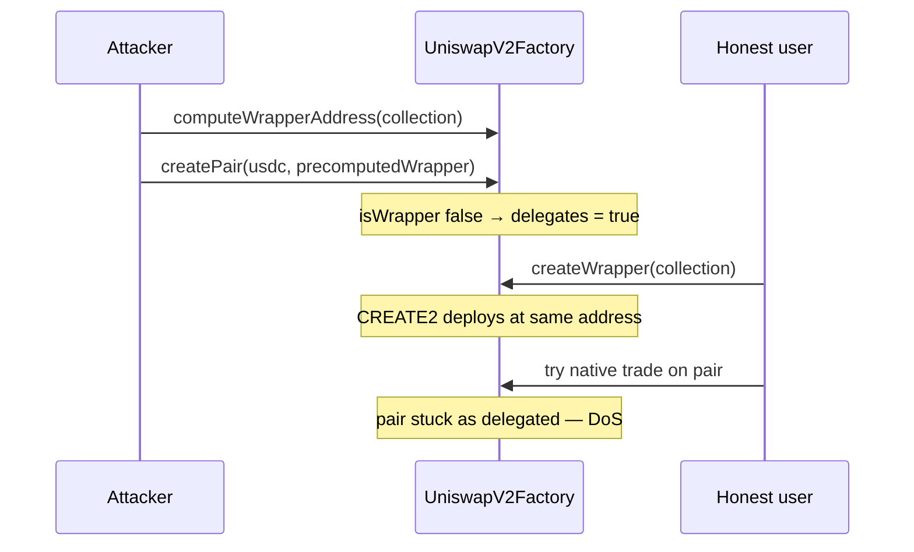

# Sweep n Flip — Premature createPair creates unusable delegated pairs

> **Vulnerability classes:** vuln/logic/missing-check · impact/mev/frontrun · frozen-funds · dos-resistance

> **Reproduction:** self-contained Foundry PoC, offline, forge-std only.
> Full trace: [output.txt](output.txt). PoC:
> [test/46466-premature-createpair-function-call-will-result-in-the-creati_exp.sol](test/46466-premature-createpair-function-call-will-result-in-the-creati_exp.sol).

<!-- non-defihacklabs -->
<!-- source-auditvault: https://github.com/Auditware/AuditVault/blob/main/findings/46466-premature-createpair-function-call-will-result-in-the-creati.md -->
<!-- date: 2024-11 -->

---

## Key info

| | |
|---|---|
| **Impact** | **HIGH** — permanent DoS of legitimate ERC721-wrapper trading pairs |
| **Protocol** | Sweep n Flip (UniswapV2-NFT AMM) |
| **Vulnerable code** | `UniswapV2Factory.createPair` — marks unknown tokens as delegated |
| **Bug class** | CREATE2-precomputable wrapper address front-run → permanent delegated flag |
| **Finding** | Cantina — Sweep n Flip NFT AMM, Nov 2024 · #46466 · reporter **slowfi** |
| **Report** | [cantina_sweepnflip_nft_amm_november2024.pdf](https://cdn.cantina.xyz/reports/cantina_sweepnflip_nft_amm_november2024.pdf) |
| **Source** | [AuditVault](https://github.com/Auditware/AuditVault/blob/main/findings/46466-premature-createpair-function-call-will-result-in-the-creati.md) |
| **Status** | Audit finding — fixed in uniswap-v2-nft PR 5 |
| **Compiler** | `^0.8.24` (PoC) |

---

## TL;DR

1. Wrapper addresses for ERC721 collections are CREATE2-predictable from the factory.
2. Ideal flow is `createWrapper` then `createPair`. An attacker can call `createPair(usdc, precomputedWrapper)` **before** the wrapper exists.
3. Because the address is not yet a registered wrapper, `createPair` marks the pair as **delegated** (external DEX).
4. Later `createWrapper` deploys at the same address, but the delegated flag is never cleared — the pair is permanently unusable on Sweep n Flip.

---

## The vulnerable code

```solidity
if (!isWrapper[token0] && !isWrapper[token1]) {
    delegates[token0][token1] = true; // @> VULN: marks precomputed (unregistered) wrapper as delegated forever
    delegates[token1][token0] = true;
}
```

**Fix:** require a registered wrapper (or matching extcodehash) before creating a native pair; or merge `createWrapper` + `createPair`.

---

## Root cause

`createPair` only checks the `isWrapper` registry, not whether an address is a CREATE2-precomputable future wrapper. Front-running `createWrapper` permanently poisons the pair as delegated.

## Preconditions

- Factory uses CREATE2 for WERC721 with a salt derived from the collection address.
- `createPair` is permissionless.
- Target NFT collections are known / enumerable (top collections are few).

## Attack walkthrough

1. Precompute `wrapper = CREATE2(factory, salt(collection), WERC721 initcode)`.
2. Call `createPair(usdc, wrapper)` — neither side is `isWrapper` yet → `delegates = true`.
3. Legitimate `createWrapper(collection)` deploys at the same address and sets `isWrapper`.
4. **HARM:** `delegates(usdc, wrapper)` remains true — Sweep n Flip native trading is DoS'd for that collection.

## Diagrams



## Impact

Denial of service for legitimate NFT-wrapper trading pairs. A handful of front-runs against top collections can brick the core product surface.

## Sources

- [AuditVault finding #46466](https://github.com/Auditware/AuditVault/blob/main/findings/46466-premature-createpair-function-call-will-result-in-the-creati.md)
- [Cantina report — Sweep n Flip NFT AMM (Nov 2024)](https://cdn.cantina.xyz/reports/cantina_sweepnflip_nft_amm_november2024.pdf)
- Reduced C2 synthetic from finding-quoted `createPair` / CREATE2 wrapper flow (uniswap-v2-nft audited commit / PR 5 fix)
