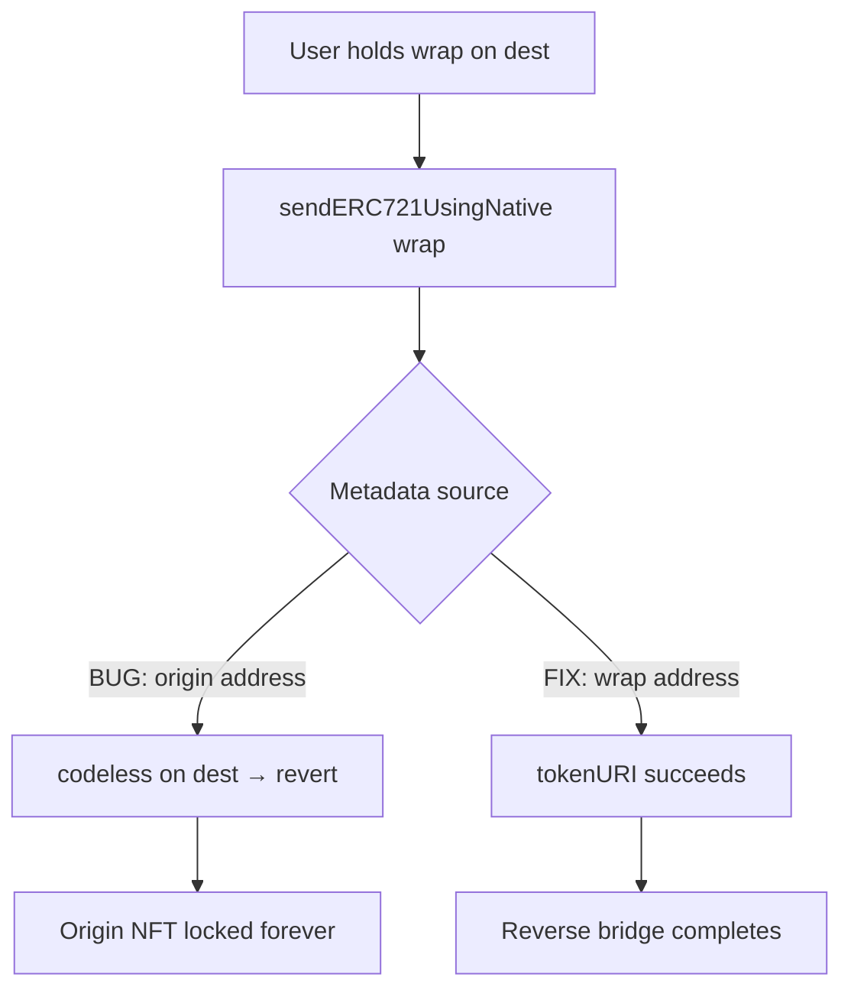

# Sweep n Flip Bridge — Permanent failure to bridge wrapped ERC721

> **Vulnerability classes:** vuln/dos/frozen-funds · locked-funds · bridge-message-validation · royalty-edge-cases

> **Reproduction:** self-contained Foundry PoC, offline, forge-std only.
> Full trace: [output.txt](output.txt). PoC:
> [test/46493-permanent-failure-to-bridge-wrapped-erc721-using-bridgesende_exp.sol](test/46493-permanent-failure-to-bridge-wrapped-erc721-using-bridgesende_exp.sol).

<!-- non-defihacklabs -->
<!-- source-auditvault: https://github.com/Auditware/AuditVault/blob/main/findings/46493-permanent-failure-to-bridge-wrapped-erc721-using-bridgesende.md -->
<!-- date: 2024-11 -->

---

## Key info

| | |
|---|---|
| **Impact** | **HIGH** — original NFT permanently locked; wrap cannot reverse-bridge |
| **Protocol** | Sweep n Flip Bridge |
| **Vulnerable code** | `Bridge._getPayload` / `_getPayloadMessage` — metadata from origin when bridging wrap |
| **Bug class** | Wrong metadata source for wrapped ERC721 → send always reverts on dest |
| **Finding** | Cantina — Sweep n Flip Bridge, Nov 2024 · #46493 · reporter **slowfi** |
| **Report** | [cantina_sweepnflip_bridge_november2024.pdf](https://cdn.cantina.xyz/reports/cantina_sweepnflip_bridge_november2024.pdf) |
| **Source** | [AuditVault](https://github.com/Auditware/AuditVault/blob/main/findings/46493-permanent-failure-to-bridge-wrapped-erc721-using-bridgesende.md) |
| **Status** | Audit finding — fixed in snf-bridge-contracts-v1 PR 10 |
| **Compiler** | `^0.8.24` (PoC) |

---

## TL;DR

1. Bridging an origin NFT locks it on the source bridge and mints a wrap on the destination.
2. Reverse-bridging the wrap must read metadata from the **wrap** (which exists on dest).
3. The bug binds `IERC721Metadata` to the **origin** address, which has **no code** on dest.
4. `sendERC721UsingNative` always reverts on the wrap path → original NFT stays locked forever.

---

## The vulnerable code

```solidity
address originERC721Address =
    w.originAddress == address(0) ? ERC721Address_ : w.originAddress;
IERC721Metadata metadata = IERC721Metadata(originERC721Address); // @> VULN
metadata.name();
metadata.tokenURI(tokenIds_[i]);
```

**Fix:** use `currChainAddress_` (the wrap when bridging a wrap) for metadata.

---

## Root cause

Payload construction confuses origin vs current-chain addresses. Metadata must come from the contract that exists on the current chain.

## Preconditions

- User successfully bridged origin → wrap (origin locked on source).
- User attempts wrap → origin reverse bridge on the destination chain.
- Origin collection address is codeless on the destination.

## Attack walkthrough

1. Origin NFT locked in source bridge; wrap minted to user on dest.
2. User calls `sendERC721UsingNative(originChain, wrap, [id])`.
3. `_getPayload` queries `tokenURI` on the codeless origin address → revert.
4. **HARM:** wrap unredeemable; origin permanently locked in source bridge.

## Diagrams



## Impact

Permanent lock of original NFTs in the source bridge whenever users try to bridge wraps home.

## Sources

- [AuditVault finding #46493](https://github.com/Auditware/AuditVault/blob/main/findings/46493-permanent-failure-to-bridge-wrapped-erc721-using-bridgesende.md)
- [Cantina report — Sweep n Flip Bridge (Nov 2024)](https://cdn.cantina.xyz/reports/cantina_sweepnflip_bridge_november2024.pdf)
- Reduced C2 synthetic from finding-quoted `getPayload` / `getPayloadMessage` fix diff
