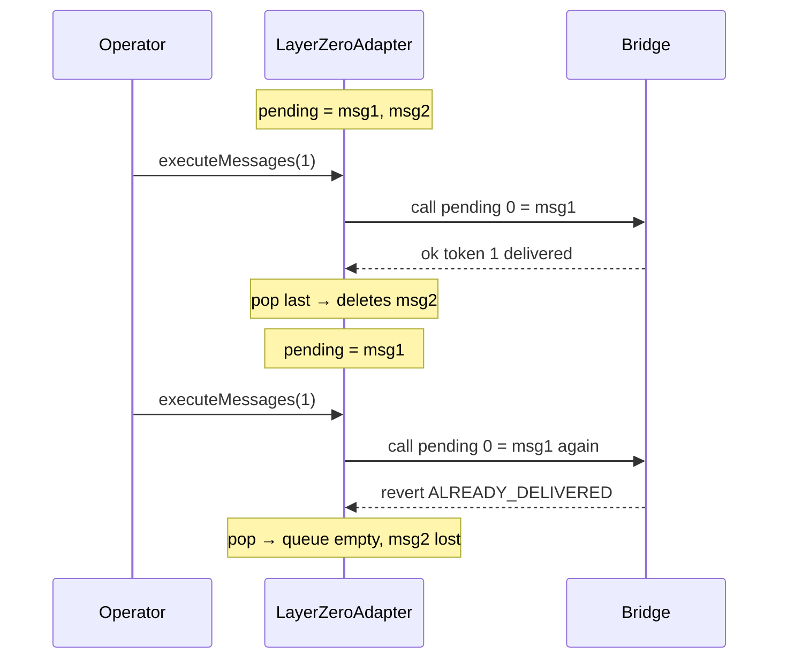

# Sweep n Flip — LayerZeroAdapter.executeMessages irrecoverable state

> **Vulnerability classes:** vuln/dos/frozen-funds · locked-funds · cross-chain-message · bridge-message-validation

> **Reproduction:** self-contained Foundry PoC, offline, forge-std only.
> Full trace: [output.txt](output.txt). PoC:
> [test/46494-layerzeroadapterexecutemessages-could-lead-to-irrecoverable_exp.sol](test/46494-layerzeroadapterexecutemessages-could-lead-to-irrecoverable_exp.sol).

<!-- non-defihacklabs -->
<!-- source-auditvault: https://github.com/Auditware/AuditVault/blob/main/findings/46494-layerzeroadapterexecutemessages-could-lead-to-irrecoverable.md -->
<!-- date: 2024-11 -->

---

## Key info

| | |
|---|---|
| **Impact** | **HIGH** — pending cross-chain NFT delivery permanently lost |
| **Protocol** | Sweep n Flip Bridge / LayerZeroAdapter |
| **Vulnerable code** | `LayerZeroAdapter.executeMessages` — executes index 0, pops last |
| **Bug class** | Array pop mismatch → wrong message deleted, correct one stuck/re-run |
| **Finding** | Cantina — Sweep n Flip Bridge, Nov 2024 · #46494 · reporter **slowfi** |
| **Report** | [cantina_sweepnflip_bridge_november2024.pdf](https://cdn.cantina.xyz/reports/cantina_sweepnflip_bridge_november2024.pdf) |
| **Source** | [AuditVault](https://github.com/Auditware/AuditVault/blob/main/findings/46494-layerzeroadapterexecutemessages-could-lead-to-irrecoverable.md) |
| **Status** | Audit finding — PRs 9/13; residual issues noted by Cantina |
| **Compiler** | `^0.8.24` (PoC) |

---

## TL;DR

1. Failed LZ deliveries are stored in `s_pendingMessagesToExecute`.
2. `executeMessages` runs `pending[0]` but `pop()` removes the **last** element.
3. With `[msg1, msg2]`: first call delivers token 1 and **deletes msg2**.
4. Second call re-runs msg1 (already delivered) and clears the queue — **token 2 is gone forever**.

---

## The vulnerable code

```solidity
bytes memory payload = s_pendingMessagesToExecute[0];
(bool ok,) = address(bridge).call(payload);
// ...
s_pendingMessagesToExecute.pop(); // @> VULN: pops LAST, not the executed index-0 message
```

**Fix:** execute from the last index (swap-and-pop), or assign nonces per message.

---

## Root cause

Mismatch between which message is executed and which is removed from storage.

## Preconditions

- At least two messages queued after failed delivery.
- Operator retries with `limitToExecute_ = 1` (or any partial limit).

## Attack walkthrough

1. Queue failed deliveries for token 1 and token 2.
2. Re-enable deliveries; `executeMessages(1)` → token 1 delivered, msg2 popped.
3. `executeMessages(1)` → re-executes msg1 (reverts ALREADY_DELIVERED), pops msg1.
4. **HARM:** token 2 never delivered, no longer pending — NFT permanently locked.

## Diagrams



## Impact

Permanent lock of bridged NFTs whose delivery messages are silently dropped from the retry queue.

## Sources

- [AuditVault finding #46494](https://github.com/Auditware/AuditVault/blob/main/findings/46494-layerzeroadapterexecutemessages-could-lead-to-irrecoverable.md)
- [Cantina report — Sweep n Flip Bridge (Nov 2024)](https://cdn.cantina.xyz/reports/cantina_sweepnflip_bridge_november2024.pdf)
- Reduced C2 synthetic from finding-quoted `executeMessages` behavior
