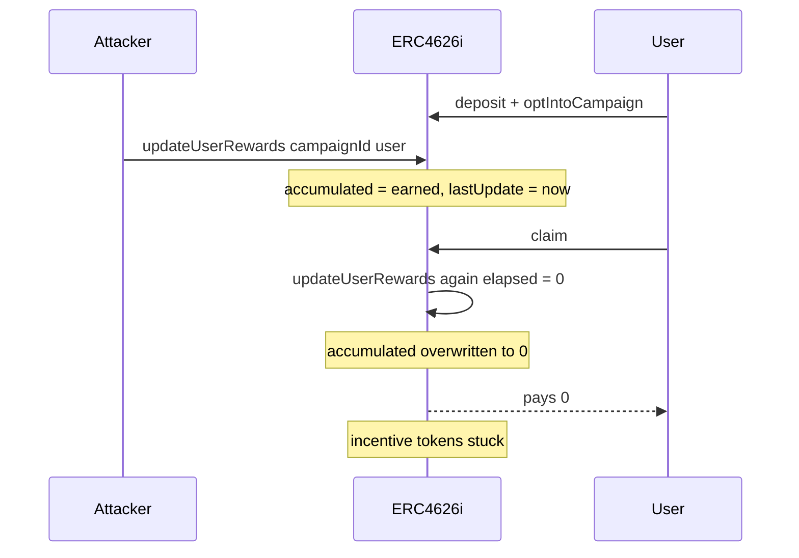

# Royco ERC4626i — User rewards can be permissionlessly erased

> **Vulnerability classes:** vuln/access-control/missing-modifier · reward-theft · reward-accounting

> **Reproduction:** self-contained Foundry PoC, offline, forge-std only.
> Full trace: [output.txt](output.txt). PoC:
> [test/46672-user-rewards-can-be-permissionlessly-erased-cantina-none-roy_exp.sol](test/46672-user-rewards-can-be-permissionlessly-erased-cantina-none-roy_exp.sol).

<!-- non-defihacklabs -->
<!-- source-auditvault: https://github.com/Auditware/AuditVault/blob/main/findings/46672-user-rewards-can-be-permissionlessly-erased-cantina-none-roy.md -->
<!-- date: 2024-08 -->

---

## Key info

| | |
|---|---|
| **Impact** | **HIGH** — user rewards wiped; incentive tokens stuck in vault |
| **Protocol** | Royco — ERC4626i incentivized vault |
| **Vulnerable code** | `ERC4626i.updateUserRewards` — public overwrite of `accumulated` |
| **Bug class** | Permissionless accrual overwrite; same-block second call zeros rewards |
| **Finding** | Cantina — Royco, Aug 2024 · #46672 · reporter **Kurt Barry** |
| **Report** | [cantina_royco_august2024.pdf](https://cdn.cantina.xyz/reports/cantina_royco_august2024.pdf) |
| **Source** | [AuditVault](https://github.com/Auditware/AuditVault/blob/main/findings/46672-user-rewards-can-be-permissionlessly-erased-cantina-none-roy.md) |
| **Status** | Acknowledged — ERC4626i being rewritten |
| **Compiler** | `^0.8.24` (PoC) |

---

## TL;DR

1. `updateUserRewards(campaignId, user)` is **public** and callable for any user.
2. It **overwrites** `userData.accumulated = (balance * elapsed * rate) / WAD` instead of accruing.
3. After a first call sets rewards and `lastUpdate = now`, a second call in the same block has `elapsed = 0` → accumulated = 0.
4. `claim()` always calls `updateUserRewards` first, so a poke + claim pays **zero**; reward tokens stay stuck.

---

## The vulnerable code

```solidity
userData.accumulated = (balanceOf[user] * elapsed * _campaignData.rate) / WAD; // @> VULN
userData.lastUpdate = block.timestamp;
```

**Fix:** use proper reward-index accumulation (`+=`); restrict updates to self / balance-changing hooks.

---

## Root cause

Overwrite-not-accrue math combined with a permissionless entrypoint and shared `lastUpdate`.

## Preconditions

- User opted into a campaign and holds shares.
- Attacker (or any contract) can call `updateUserRewards` for that user.
- A subsequent same-block interaction (e.g. `claim`) re-runs the update.

## Attack walkthrough

1. User deposits and opts into a rewards campaign (`lastUpdate = 0`).
2. Attacker calls `updateUserRewards` → non-zero `accumulated`, `lastUpdate = now`.
3. User (or attacker-triggered path) calls `claim` → second update with `elapsed = 0` → wipe → claim 0.
4. **HARM:** rewards erased; incentive tokens remain locked in the vault.

## Diagrams



## Impact

Any account can erase any user's unclaimed rewards. Tokens corresponding to wiped rewards cannot be recovered by users.

## Sources

- [AuditVault finding #46672](https://github.com/Auditware/AuditVault/blob/main/findings/46672-user-rewards-can-be-permissionlessly-erased-cantina-none-roy.md)
- [Cantina report — Royco (Aug 2024)](https://cdn.cantina.xyz/reports/cantina_royco_august2024.pdf)
- Reduced C2 synthetic from finding-quoted `updateUserRewards` formula and PoC
