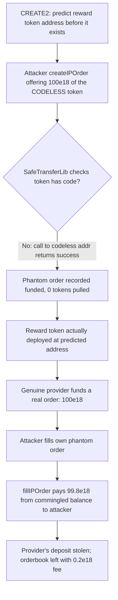
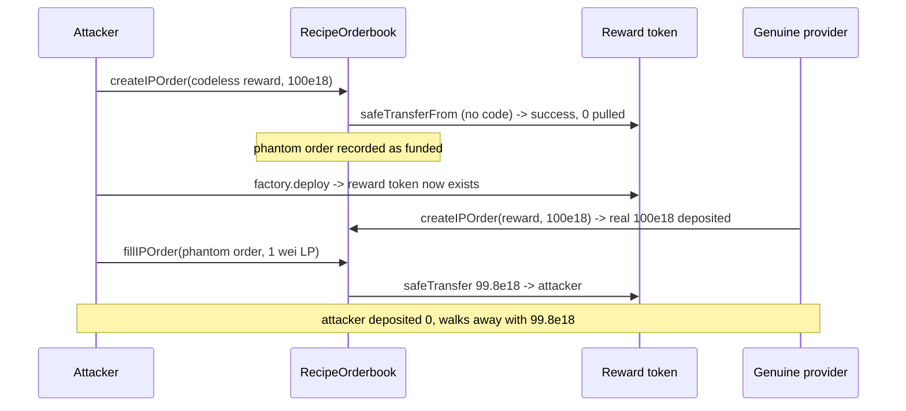

# Royco RecipeOrderbook — successful transfers on non-existent tokens let attackers steal reward tokens

> **Vulnerability classes:** vuln/logic/missing-check · vuln/token/codeless-token-transfer · vuln/loss-of-funds/reward-theft

> **Reproduction:** a self-contained Foundry PoC that compiles & runs in an
> isolated project with **only `forge-std`** — no fork, no RPC, no `anvil_state`
> (everything, including a CREATE2 predicted-address token, is deployed locally).
> Full trace: [output.txt](output.txt). PoC:
> [test/46673-successful-transfers-on-non-existent-tokens-allows-attackers_exp.sol](test/46673-successful-transfers-on-non-existent-tokens-allows-attackers_exp.sol).

<!-- non-defihacklabs -->
<!-- source-auditvault: https://github.com/Auditware/AuditVault/blob/main/findings/46673-successful-transfers-on-non-existent-tokens-allows-attackers.md -->
<!-- date: 2024-08 -->

---

## Key info

| | |
|---|---|
| **Impact** | **HIGH** — direct fund theft: an attacker who deposits nothing drains a genuine incentive provider's reward-token deposit (99.8% of it, minus the frontend fee) |
| **Protocol** | [Royco](https://royco.org) — `RecipeOrderbook` (incentive marketplace) |
| **Vulnerable code** | `RecipeOrderbook.createIPOrder` (L383, pulls offered incentives) — enabled by Solmate `SafeTransferLib` succeeding on a codeless token; drained via `fillIPOrder` (L534) |
| **Bug class** | No code-existence check before pulling reward tokens; `SafeTransferLib` returns success for a CALL to an address with no code |
| **Finding** | Cantina — Royco, Aug 2024 · #46673 · reporter **Kurt Barry** |
| **Report** | [cantina_royco_august2024.pdf](https://cdn.cantina.xyz/reports/cantina_royco_august2024.pdf) |
| **Source** | [AuditVault](https://github.com/Auditware/AuditVault/blob/main/findings/46673-successful-transfers-on-non-existent-tokens-allows-attackers.md) |
| **Status** | Audit finding — caught in review (not exploited on-chain). Reproduced here as a standalone local PoC. |
| **Compiler** | `^0.8.19` (PoC) |

This is an **audit finding**, not a historical on-chain incident. The PoC copies
the vulnerable Solmate assembly verbatim and reproduces the finding's own
CREATE2-based demonstration locally.

---

## TL;DR

1. Solmate's `SafeTransferLib` **does not check that a token has code**. A `CALL`
   to a codeless address returns success with empty returndata, and the library's
   `iszero(returndatasize())` clause treats that as a successful transfer.
2. `RecipeOrderbook.createIPOrder` pulls the offered reward tokens through that
   library **with no code-existence check**.
3. Using a CREATE2 factory, an attacker knows a reward token's address **before it
   is deployed**, and registers a fully "funded" order offering 100e18 of that
   codeless token — depositing **nothing** (the pull silently moves 0).
4. A genuine incentive provider later funds a real order with 100e18 of the
   (now-deployed) reward token; balances are commingled in the orderbook.
5. The attacker fills their own phantom order and `fillIPOrder` pays them out of
   the commingled balance — draining **99.8e18** of the genuine provider's deposit
   (100 minus the 0.2 frontend fee).

---

## The vulnerable code

The pull site (finding's PoC, verbatim) — no code-existence check:

```solidity
// RecipeOrderbook.sol#L383 — createIPOrder
for (uint256 i = 0; i < tokensOffered.length; ++i) {
    ERC20(tokensOffered[i]).safeTransferFrom(msg.sender, address(this), tokenAmounts[i]);
}
```

The enabling root cause — Solmate `SafeTransferLib`, **verbatim**:

```solidity
success := and(
    // returned exactly 1, OR had NO return data:
    or(and(eq(mload(0), 1), gt(returndatasize(), 31)), iszero(returndatasize())),
    call(gas(), token, 0, freeMemoryPointer, 100, 0, 32)
)
```

A `call` to a codeless address returns `success = true` with `returndatasize() == 0`,
so `iszero(returndatasize())` makes the whole expression true — the "transfer"
succeeds while moving nothing.

The payout site drains the commingled balance:

```solidity
// RecipeOrderbook.sol#L534 — fillIPOrder
ERC20(order.tokensOffered[i]).safeTransfer(msg.sender, incentiveAmount);
```

---

## Root cause

`createIPOrder` treats a successful `safeTransferFrom` as proof the incentive was
deposited, but `SafeTransferLib` cannot distinguish a real transfer from a call to
a not-yet-deployed token. There is no `token.code.length > 0` check, so a phantom
order records a full incentive amount while depositing nothing — and the orderbook
commingles reward balances across orders, so the phantom order is later redeemable
against a real deposit.

## Preconditions

- The attacker can predict a token address before it exists (CREATE2, as in the
  finding's PoC) — or front-run/observe an about-to-be-deployed reward token.
- `createIPOrder` and `fillIPOrder` are permissionless (intended entrypoints).
- A genuine provider funds a real order in the same reward token (the value at risk).

## Attack walkthrough

From [output.txt](output.txt):

1. A CREATE2 factory yields the reward token's future address; it has **no code** yet.
2. The attacker calls `createIPOrder` offering 100e18 of the codeless token —
   `safeTransferFrom` succeeds, pulling **0** tokens; the order is recorded funded.
3. The reward token is deployed at the predicted address.
4. A genuine provider funds a real order with 100e18 of the reward token — the
   orderbook now holds exactly **100e18** (proving the phantom order deposited nothing).
5. The attacker fills their own phantom order with 1 wei of LP token; `fillIPOrder`
   pays **99.8e18** out of the commingled balance to the attacker.
6. **HARM:** attacker (deposited 0) holds 99.8e18; the orderbook is left with only
   the 0.2e18 frontend fee. The genuine provider's deposit is stolen.

## Diagrams





## Remediation

Require the offered token has code before pulling it (and prefer a SafeTransferLib
that reverts on codeless tokens):

```solidity
require(tokensOffered[i].code.length > 0, "TOKEN_DOES_NOT_EXIST");
ERC20(tokensOffered[i]).safeTransferFrom(msg.sender, address(this), tokenAmounts[i]);
```

Applying this check makes the PoC revert with `TOKEN_DOES_NOT_EXIST` — the negative
control confirming the fix.

## How to reproduce

```bash
cd ~/RustroverProjects/audits/evm-hack-registry/46673-successful-transfers-on-non-existent-tokens-allows-attackers_exp
forge test --match-test test_NonExistentTokenRewardTheft -vvv
# Fully local — no fork, no RPC, no anvil_state required.
# Expected: [PASS]; attacker ends with 99.8e18 reward tokens, orderbook with 0.2e18.
```

PoC source: [test/46673-successful-transfers-on-non-existent-tokens-allows-attackers_exp.sol](test/46673-successful-transfers-on-non-existent-tokens-allows-attackers_exp.sol)
— verbatim Solmate `SafeTransferLib`, a minimal `RecipeOrderbook` (both blamed call
sites), and the finding's CREATE2 factory.

> Note: the PoC's payout figures (100 / 99.8e18) differ slightly from the original
> finding's (99 / 98.8e18) because the reduction omits Royco's ~1% protocol fee on
> `createIPOrder`; the demonstrated bug is identical.

---

*Reference: finding **#46673** by **Kurt Barry** in the [Cantina Royco review (Aug 2024)](https://cdn.cantina.xyz/reports/cantina_royco_august2024.pdf) · curated by [AuditVault](https://github.com/Auditware/AuditVault/blob/main/findings/46673-successful-transfers-on-non-existent-tokens-allows-attackers.md)*
