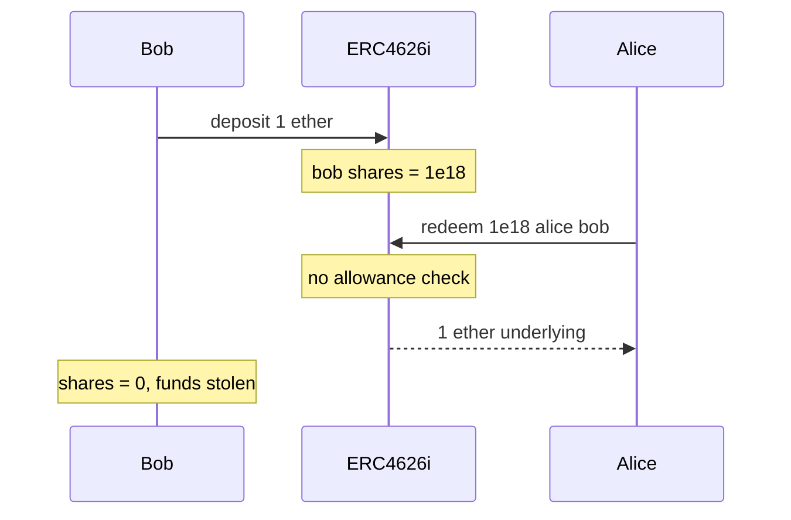

# Royco ERC4626i — Missing permissions check in withdraw and redeem

> **Vulnerability classes:** vuln/access-control/missing-modifier · direct-drain · reward-accounting

> **Reproduction:** self-contained Foundry PoC, offline, forge-std only.
> Full trace: [output.txt](output.txt). PoC:
> [test/46674-missing-permissions-check-in-withdraw-and-redeem-functions-i_exp.sol](test/46674-missing-permissions-check-in-withdraw-and-redeem-functions-i_exp.sol).

<!-- non-defihacklabs -->
<!-- source-auditvault: https://github.com/Auditware/AuditVault/blob/main/findings/46674-missing-permissions-check-in-withdraw-and-redeem-functions-i.md -->
<!-- date: 2024-08 -->

---

## Key info

| | |
|---|---|
| **Impact** | **HIGH** — anyone can redeem any owner's shares and steal underlying |
| **Protocol** | Royco — ERC4626i |
| **Vulnerable code** | `ERC4626i.redeem` / `withdraw` — no owner/allowance check |
| **Bug class** | Missing access control on share burn / asset transfer |
| **Finding** | Cantina — Royco, Aug 2024 · #46674 · reporter **Kurt Barry** |
| **Report** | [cantina_royco_august2024.pdf](https://cdn.cantina.xyz/reports/cantina_royco_august2024.pdf) |
| **Source** | [AuditVault](https://github.com/Auditware/AuditVault/blob/main/findings/46674-missing-permissions-check-in-withdraw-and-redeem-functions-i.md) |
| **Status** | Acknowledged — ERC4626i being rewritten |
| **Compiler** | `^0.8.24` (PoC) |

---

## TL;DR

1. ERC-4626 `redeem(shares, receiver, owner)` must require `msg.sender == owner` or sufficient allowance.
2. Royco's `ERC4626i` omits that check entirely.
3. An attacker calls `redeem(bobShares, attacker, bob)` and receives Bob's underlying assets.
4. Bob's shares are burned; vault is drained of Bob's deposit.

---

## The vulnerable code

```solidity
function redeem(uint256 shares, address receiver, address owner) public returns (uint256 assets) {
    balanceOf[owner] -= shares; // @> VULN: no msg.sender==owner / allowance check
    totalSupply -= shares;
    assets = shares;
    asset.transfer(receiver, assets);
}
```

**Fix (solmate ERC4626):**

```solidity
if (msg.sender != owner) {
    uint256 allowed = allowance[owner][msg.sender];
    if (allowed != type(uint256).max) allowance[owner][msg.sender] = allowed - shares;
}
```

---

## Root cause

Share-burn path lacks the standard ERC-4626 authorization check.

## Preconditions

- Victim holds vault shares (deposited assets).
- Attacker has no allowance from victim (or any role).

## Attack walkthrough

1. Bob deposits 1 ether of underlying → 1 ether shares.
2. Alice calls `redeem(1 ether, alice, bob)` with no allowance.
3. Vault burns Bob's shares and transfers 1 ether underlying to Alice.
4. **HARM:** full deposit stolen.

## Diagrams



## Impact

Direct theft of any depositor's underlying assets by any external account.

## Sources

- [AuditVault finding #46674](https://github.com/Auditware/AuditVault/blob/main/findings/46674-missing-permissions-check-in-withdraw-and-redeem-functions-i.md)
- [Cantina report — Royco (Aug 2024)](https://cdn.cantina.xyz/reports/cantina_royco_august2024.pdf)
- Reduced C2 synthetic from finding PoC (`iVault.redeem(amount, alice, bob)`)
