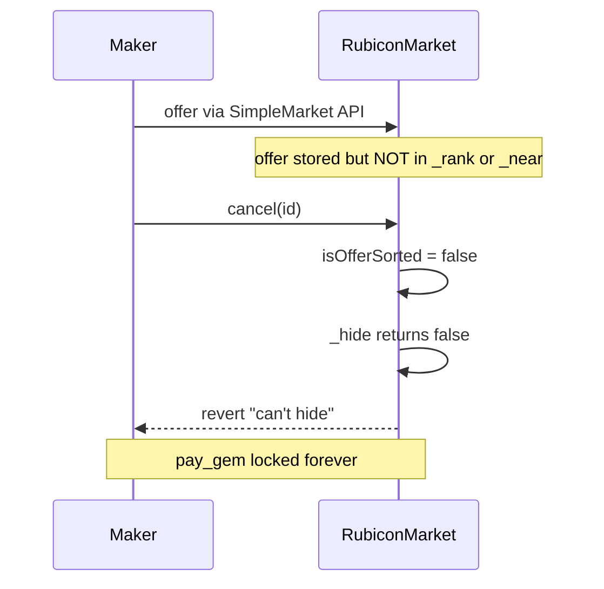

# Rubicon — Some offers can't be cancelled

> **Vulnerability classes:** wrong-condition · locked-funds · cross-contract-state-consistency

> **Reproduction:** self-contained Foundry PoC with **only `forge-std`** — no fork, no RPC.
> Full trace: [output.txt](output.txt). PoC:
> [test/48949-h-10-some-offers-cant-be-cancelled-code4rena-rubicon-rubicon_exp.sol](test/48949-h-10-some-offers-cant-be-cancelled-code4rena-rubicon-rubicon_exp.sol).

<!-- non-defihacklabs -->
<!-- source-auditvault: https://github.com/Auditware/AuditVault/blob/main/findings/48949-h-10-some-offers-cant-be-cancelled-code4rena-rubicon-rubicon.md -->
<!-- date: 2023-04 -->

---

## Key info

| | |
|---|---|
| **Impact** | **HIGH** — maker's `pay_gem` locked forever; cancel reverts with `"can't hide"` |
| **Protocol** | [Rubicon](https://rubicon.finance) — `RubiconMarket` / `SimpleMarket` |
| **Vulnerable code** | `SimpleMarket.offer` (6-arg) never inserts into `_rank`/`_near`; `RubiconMarket.cancel` requires sorted or hidden |
| **Bug class** | Wrong condition / cross-contract state consistency — cancel assumes book insertion that SimpleMarket.offer never performs |
| **Finding** | Code4rena 2023-04-rubicon · #48949 · H-10 · reporter **carrotsmuggler** |
| **Report** | [code4rena.com/reports/2023-04-rubicon](https://code4rena.com/reports/2023-04-rubicon) |
| **Source** | [AuditVault](https://github.com/Auditware/AuditVault/blob/main/findings/48949-h-10-some-offers-cant-be-cancelled-code4rena-rubicon-rubicon.md) |
| **Status** | Confirmed by sponsor. Reproduced as a standalone local synthetic. |
| **Compiler** | `^0.8.24` (PoC) |

---

## TL;DR

1. `SimpleMarket.offer(pay, payGem, buy, buyGem, owner, recipient)` creates an offer **without** inserting it into the sorted `_rank` list or the unsorted `_near` list.
2. `RubiconMarket.cancel` overrides the base cancel and requires the offer to be sorted **or** successfully `_hide`d from `_near`.
3. For a SimpleMarket offer, `isOfferSorted` is false and `_hide` returns false → `require(_hide(id), "can't hide")` reverts.
4. Maker cannot cancel; `pay_gem` stays locked in the market.

---

## The vulnerable code

```solidity
function cancel(uint256 id) external returns (bool success) {
    require(offers[id].owner == msg.sender, "not owner");
    if (isOfferSorted(id)) {
        // unsort path…
    } else {
        // @> VULN: SimpleMarket offers are neither sorted nor on the unsorted list
        require(_hide(id), "can't hide");
    }
    // refund pay_gem…
}
```

**Fix:** override the 6-arg `offer` in `RubiconMarket` to route through the sorted `offer(..., pos, rounding, owner, recipient)` path that inserts into `_rank`.

---

## Root cause

Cancel was upgraded in `RubiconMarket` to maintain the order book, but the SimpleMarket 6-arg `offer` API was left un-overridden. Offers created through that API never enter `_rank` or `_near`, so the cancel bookkeeping invariants always fail.

---

## Preconditions

- User places an offer via the SimpleMarket 6-arg `offer` (used in protocol tests / legacy API).
- User later calls `cancel` on that offer id.

---

## Attack walkthrough

1. Maker approves and calls `market.offer(90e18, pay, 100e18, buy, maker, maker)`.
2. Offer id is created; `pay` tokens sit in the market; no `_rank`/`_near` entry.
3. Maker calls `cancel(id)` → `"can't hide"` → tokens remain locked.

---

## Diagrams



---

## Impact

Makers who use the SimpleMarket `offer` API permanently lock their `pay_gem`. Confirmed by Rubicon (`daoio`).

---

## Taxonomy

- `genome: wrong-condition`, `locked-funds`, `cross-contract-state-consistency`
- `severity/high` · `sector/token` · `platform/code4rena`

---

## Sources

- [AuditVault finding #48949](https://github.com/Auditware/AuditVault/blob/main/findings/48949-h-10-some-offers-cant-be-cancelled-code4rena-rubicon-rubicon.md)
- [Code4rena report 2023-04-rubicon](https://code4rena.com/reports/2023-04-rubicon)
- Repo@commit: [code-423n4/2023-04-rubicon](https://github.com/code-423n4/2023-04-rubicon) · `contracts/RubiconMarket.sol` (offer L511, cancel L871)
