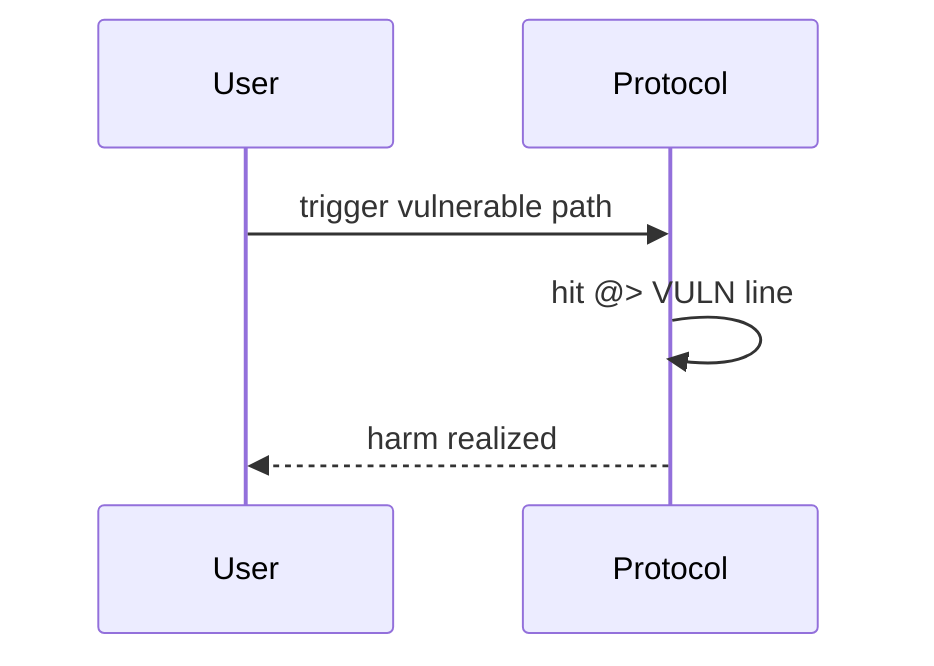

# Rubicon — RubiconMarket checks slippage incorrectly

> **Vulnerability classes:** fee-calculation · fot-slippage · direct-drain

> **Reproduction:** self-contained Foundry PoC with **only `forge-std`** — no fork, no RPC.
> Full trace: [output.txt](output.txt). PoC:
> [test/48950-h-11-rubiconmarket-checks-slippage-incorrectly-code4rena-rub_exp.sol](test/48950-h-11-rubiconmarket-checks-slippage-incorrectly-code4rena-rub_exp.sol).

<!-- non-defihacklabs -->
<!-- source-auditvault: https://github.com/Auditware/AuditVault/blob/main/findings/48950-h-11-rubiconmarket-checks-slippage-incorrectly-code4rena-rub.md -->
<!-- date: 2023-04 -->

---

## Key info

| | |
|---|---|
| **Impact** | **HIGH** — User receives less than min_fill_amount after fees because slip check is pre-fee |
| **Protocol** | [Rubicon](https://rubicon.finance) |
| **Bug class** | fee-calculation · fot-slippage · direct-drain |
| **Finding** | Code4rena 2023-04-rubicon · #48950 · H-11 · reporter **zhuXKET** |
| **Report** | [code4rena.com/reports/2023-04-rubicon](https://code4rena.com/reports/2023-04-rubicon) |
| **Source** | [AuditVault](https://github.com/Auditware/AuditVault/blob/main/findings/48950-h-11-rubiconmarket-checks-slippage-incorrectly-code4rena-rub.md) |
| **Status** | Confirmed. Reproduced as a standalone local synthetic. |
| **Compiler** | `^0.8.24` (PoC) |

---

## TL;DR

sellAllAmount requires fill_amt >= min_fill_amount before calcAmountAfterFee, so a post-fee floor can be violated.

---

## The vulnerable code

See synthetic `test/48950-h-11-rubiconmarket-checks-slippage-incorrectly-code4rena-rub.sol` (`@> VULN` markers).

**Fix:** Apply calcAmountAfterFee before the min_fill_amount require.

---

## Root cause

sellAllAmount requires fill_amt >= min_fill_amount before calcAmountAfterFee, so a post-fee floor can be violated.

---

## Preconditions

Protocol deployed with the vulnerable code paths from the Code4rena contest.

---

## Attack walkthrough

See PoC `run()` and [output.txt](output.txt).

---

## Diagrams

---

## Impact

User receives less than min_fill_amount after fees because slip check is pre-fee

---

## Taxonomy

- `genome: fee-calculation · fot-slippage · direct-drain`
- `severity/high` · `platform/code4rena`

---

## Sources

- [AuditVault finding #48950](https://github.com/Auditware/AuditVault/blob/main/findings/48950-h-11-rubiconmarket-checks-slippage-incorrectly-code4rena-rub.md)
- [Code4rena report 2023-04-rubicon](https://code4rena.com/reports/2023-04-rubicon)
- Repo@commit: [code-423n4/2023-04-rubicon](https://github.com/code-423n4/2023-04-rubicon) · contracts/RubiconMarket.sol sellAllAmount ~L1028-L1067
