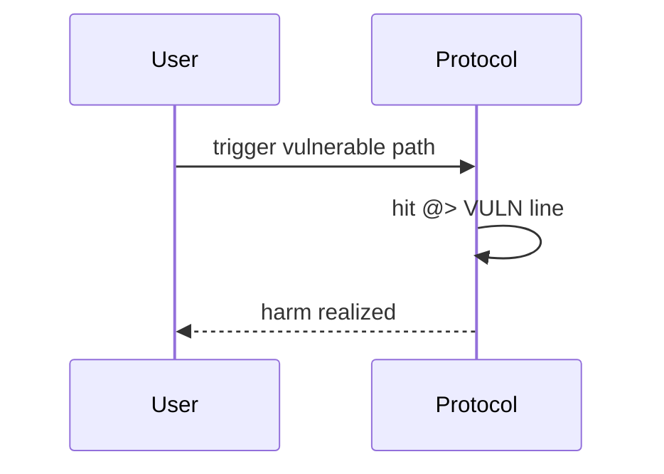

# Rubicon — DOS of market operations with malicious offers

> **Vulnerability classes:** frozen-funds · permanent · dos-resistance

> **Reproduction:** self-contained Foundry PoC with **only `forge-std`** — no fork, no RPC.
> Full trace: [output.txt](output.txt). PoC:
> [test/48951-h-12-dos-of-market-operations-with-malicious-offers-code4ren_exp.sol](test/48951-h-12-dos-of-market-operations-with-malicious-offers-code4ren_exp.sol).

<!-- non-defihacklabs -->
<!-- source-auditvault: https://github.com/Auditware/AuditVault/blob/main/findings/48951-h-12-dos-of-market-operations-with-malicious-offers-code4ren.md -->
<!-- date: 2023-04 -->

---

## Key info

| | |
|---|---|
| **Impact** | **HIGH** — Best-priced offer with recipient=address(0) bricks buyAllAmount/sellAllAmount (and Position) |
| **Protocol** | [Rubicon](https://rubicon.finance) |
| **Bug class** | frozen-funds · permanent · dos-resistance |
| **Finding** | Code4rena 2023-04-rubicon · #48951 · H-12 · reporter **popular00** |
| **Report** | [code4rena.com/reports/2023-04-rubicon](https://code4rena.com/reports/2023-04-rubicon) |
| **Source** | [AuditVault](https://github.com/Auditware/AuditVault/blob/main/findings/48951-h-12-dos-of-market-operations-with-malicious-offers-code4ren.md) |
| **Status** | Confirmed. Reproduced as a standalone local synthetic. |
| **Compiler** | `^0.8.24` (PoC) |

---

## TL;DR

offer() accepts owner/recipient=0; OZ ERC20 reverts on transfer to zero, DoSing market fills.

---

## The vulnerable code

See synthetic `test/48951-h-12-dos-of-market-operations-with-malicious-offers-code4ren.sol` (`@> VULN` markers).

**Fix:** Disallow zero owner/recipient; skip unfillable offers in fill loops.

---

## Root cause

offer() accepts owner/recipient=0; OZ ERC20 reverts on transfer to zero, DoSing market fills.

---

## Preconditions

Protocol deployed with the vulnerable code paths from the Code4rena contest.

---

## Attack walkthrough

See PoC `run()` and [output.txt](output.txt).

---

## Diagrams

---

## Impact

Best-priced offer with recipient=address(0) bricks buyAllAmount/sellAllAmount (and Position)

---

## Taxonomy

- `genome: frozen-funds · permanent · dos-resistance`
- `severity/high` · `platform/code4rena`

---

## Sources

- [AuditVault finding #48951](https://github.com/Auditware/AuditVault/blob/main/findings/48951-h-12-dos-of-market-operations-with-malicious-offers-code4ren.md)
- [Code4rena report 2023-04-rubicon](https://code4rena.com/reports/2023-04-rubicon)
- Repo@commit: [code-423n4/2023-04-rubicon](https://github.com/code-423n4/2023-04-rubicon) · contracts/RubiconMarket.sol offer/buyAllAmount
