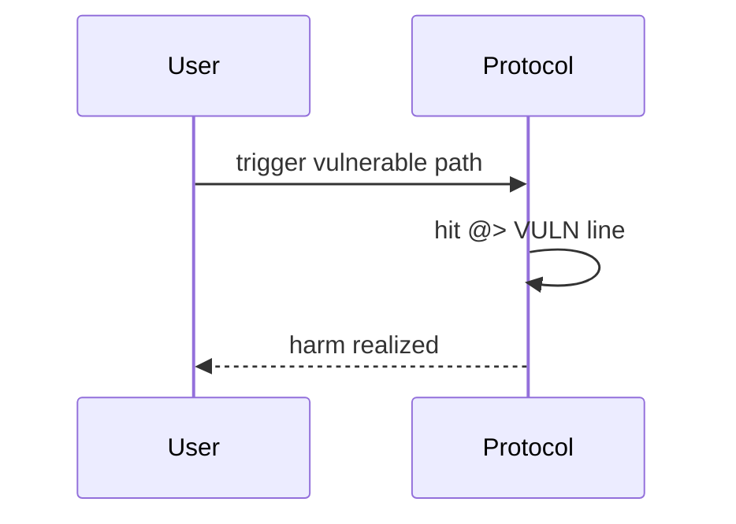

# Rubicon — Opening a position reuses prior collateral for borrowing

> **Vulnerability classes:** liquidation-logic · direct-drain · account-ownership

> **Reproduction:** self-contained Foundry PoC with **only `forge-std`** — no fork, no RPC.
> Full trace: [output.txt](output.txt). PoC:
> [test/48952-h-13-when-opening-a-position-the-collateral-of-the-previous_exp.sol](test/48952-h-13-when-opening-a-position-the-collateral-of-the-previous_exp.sol).

<!-- non-defihacklabs -->
<!-- source-auditvault: https://github.com/Auditware/AuditVault/blob/main/findings/48952-h-13-when-opening-a-position-the-collateral-of-the-previous.md -->
<!-- date: 2023-04 -->

---

## Key info

| | |
|---|---|
| **Impact** | **HIGH** — Second openPosition consumes residual borrow room and can hit liquidation threshold |
| **Protocol** | [Rubicon](https://rubicon.finance) |
| **Bug class** | liquidation-logic · direct-drain · account-ownership |
| **Finding** | Code4rena 2023-04-rubicon · #48952 · H-13 · reporter **cccz** |
| **Report** | [code4rena.com/reports/2023-04-rubicon](https://code4rena.com/reports/2023-04-rubicon) |
| **Source** | [AuditVault](https://github.com/Auditware/AuditVault/blob/main/findings/48952-h-13-when-opening-a-position-the-collateral-of-the-previous.md) |
| **Status** | Confirmed. Reproduced as a standalone local synthetic. |
| **Compiler** | `^0.8.24` (PoC) |

---

## TL;DR

openPosition borrow budget uses _maxBorrow which includes residual capacity from prior positions on the shared Position account.

---

## The vulnerable code

See synthetic `test/48952-h-13-when-opening-a-position-the-collateral-of-the-previous.sol` (`@> VULN` markers).

**Fix:** Do not use prior-position residual capacity when sizing a new open.

---

## Root cause

openPosition borrow budget uses _maxBorrow which includes residual capacity from prior positions on the shared Position account.

---

## Preconditions

Protocol deployed with the vulnerable code paths from the Code4rena contest.

---

## Attack walkthrough

See PoC `run()` and [output.txt](output.txt).

---

## Diagrams

---

## Impact

Second openPosition consumes residual borrow room and can hit liquidation threshold

---

## Taxonomy

- `genome: liquidation-logic · direct-drain · account-ownership`
- `severity/high` · `platform/code4rena`

---

## Sources

- [AuditVault finding #48952](https://github.com/Auditware/AuditVault/blob/main/findings/48952-h-13-when-opening-a-position-the-collateral-of-the-previous.md)
- [Code4rena report 2023-04-rubicon](https://code4rena.com/reports/2023-04-rubicon)
- Repo@commit: [code-423n4/2023-04-rubicon](https://github.com/code-423n4/2023-04-rubicon) · contracts/utilities/poolsUtility/Position.sol ~L537-L550
